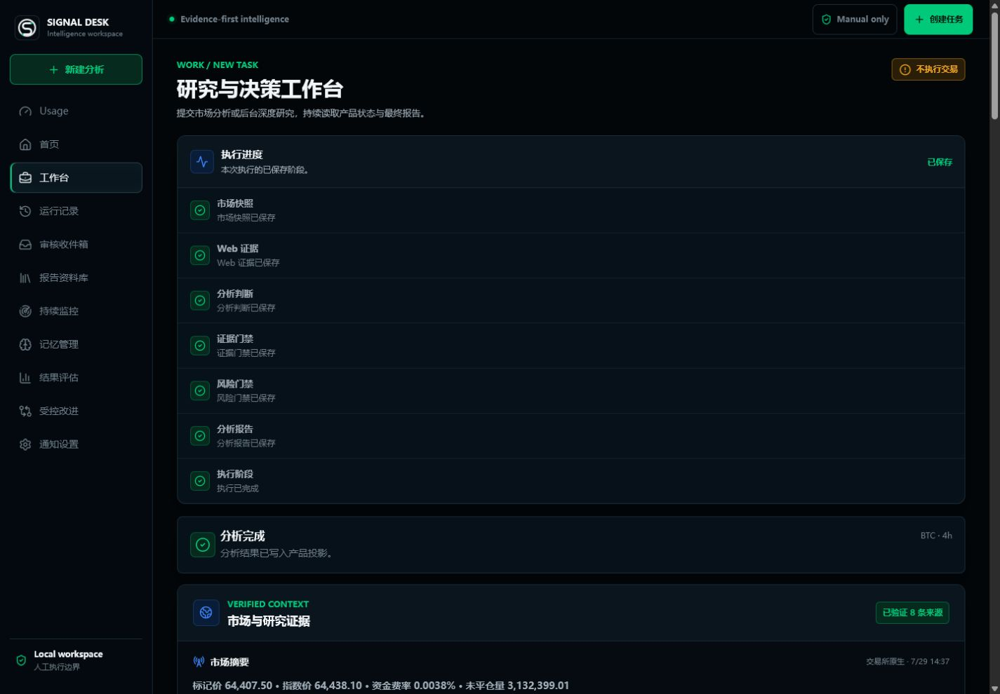
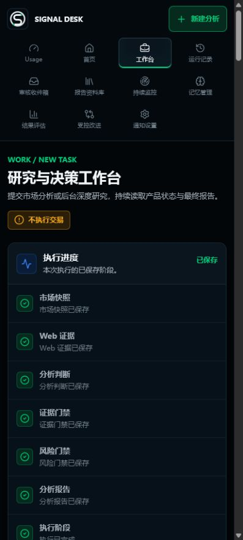
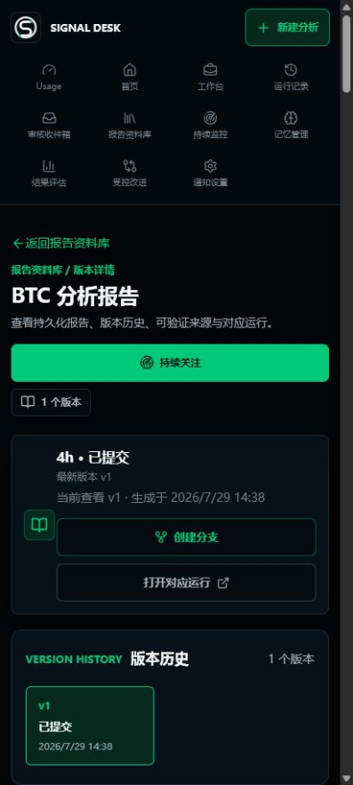
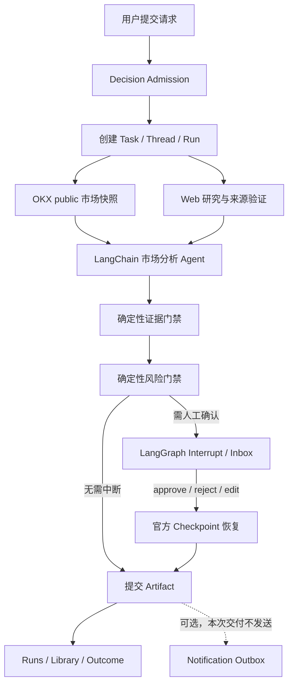
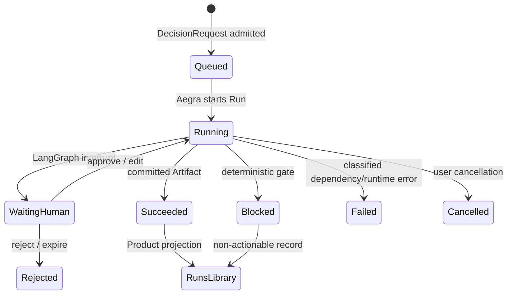
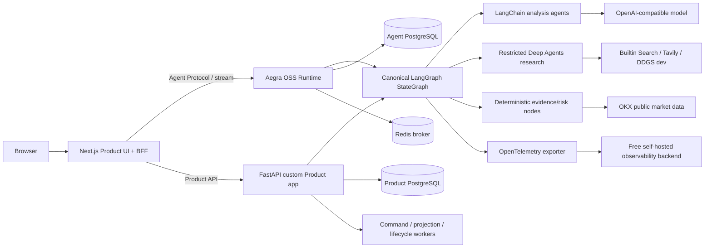

# Signal Desk

面向人工决策的加密市场 Agent 工作台。系统采集交易所原生行情与公开来源，使用
LangChain/LangGraph Agent 生成结构化分析，再由确定性证据门禁、风险门禁和人工审核
决定结果能否提交。它不会自动下单、撤单、转账或提现。

[English](README.en.md) | [部署指南](docs/deployment.md) | [架构设计](docs/v2/01-v2-product-and-architecture.md) | [当前状态](docs/v2/15-v2-implementation-status.md) | [交付裁决](docs/formal/37-真实多Agent对抗审查与交付方向裁决.md)

> **交付状态：V2 PARTIAL / Production Ready: NO**
>
> 2026-07-29 已通过一次完整的本地真实主链验收：OKX public 行情、Tavily、OpenAI-compatible
> 模型、Aegra、LangGraph interrupt、人工批准、checkpoint 恢复、Artifact、Runs 和 Library。
> 这只是本地实时 Provider 证据；托管 HTTPS、真实 OIDC、生产 HA/DR/SLO 与发布门禁仍需在
> 目标环境完成。
> 外部通知发送不属于本次交付范围。

正式方向与历史迁移约束见
[`37-真实多Agent对抗审查与交付方向裁决.md`](docs/formal/37-真实多Agent对抗审查与交付方向裁决.md)。
其中的 `legacy_prompt` 是旧主链迁移背景，不是当前 canonical Product Graph 的运行入口。

## 产品能力

- **市场分析**：BTC、ETH、SOL 永续合约，多周期请求，OKX public 行情和 Web 研究证据。
- **证据优先**：来源 URL、发布时间、抓取时间、Provider、匹配关系和数据新鲜度可追溯。
- **确定性门禁**：模型只生成候选分析；证据充分性、风险预算和副作用授权由代码裁决。
- **Human-in-the-loop**：支持 approve、reject、edit、多 interrupt 合并和 first-writer 语义。
- **耐久执行**：官方 LangGraph checkpoint/interrupt/stream 协议，Aegra 开源自托管运行时，
  PostgreSQL 持久化，Redis 协调，可取消、重试、恢复和 fork。
- **深度研究**：受限 Deep Agents 研究链、后台运行、报告草稿审核和正式 Artifact 提交。
- **产品工作区**：Home、Work、Runs、Inbox、Library、Monitors、Memory、Outcomes、
  Improvement、Usage 和 Settings。
- **多用户边界**：Next.js BFF 注入服务端身份，租户/Workspace 隔离，内部短时 JWT，
  默认开发身份与生产 OIDC 钩子分离。
- **安全观测**：OpenTelemetry 作为正式观测出口，支持免费自托管 backend；LangSmith/Langfuse
  仅为可选适配器，同时保留字段脱敏、受控诊断路由和不可变审计引用。

## 最新演示

以下画面来自 2026-07-29 的真实本地 Compose walkthrough，不是 fixture。Agent 使用 OKX public
行情、Tavily 和配置的 OpenAI-compatible `gpt-5.5`，经人工批准后从 LangGraph checkpoint
恢复，最终因证据冲突提交“暂不操作”报告。这个结果证明本机主链可运行，不代表 hosted
production 已通过。



<details>
<summary>查看 Pixel 7 结果与报告详情</summary>





</details>

不准备任何密钥也可以运行确定性的 UI 回归；它覆盖排队、运行、结构化结果、门禁、响应式、
无障碍和敏感字段不渲染，但只属于 fixture 证据：

```powershell
npm.cmd --prefix frontend ci
npm.cmd --prefix frontend run test:e2e -- `
  tests/e2e-product/work-product.spec.ts `
  --grep "renders the normal Product projection from queue through success" `
  --project=fixture-desktop --project=fixture-pixel-7
```

macOS/Linux 把 `npm.cmd` 换成 `npm`，并使用 `\` 续行。截图输出到
`frontend/artifacts/playwright/`。该命令是 UI walkthrough，不会访问真实模型、交易所私有
API 或通知服务。

## 系统要求

推荐的完整本地环境：

- Git。
- Docker Desktop 或 Docker Engine，支持 Compose v2。
- 至少 8 GB 可用内存，建议 12 GB 以上。
- 默认可用端口：前端 `3001`、Agent API `8123`。
- 只做前端开发：Node.js 22 + npm。
- 只做后端开发：Python 3.12 + `uv`。

完整实时分析还需要：

- 一个 OpenAI 或 OpenAI-compatible 模型端点，且同时支持 Chat Completions tool calling、
  structured output、streaming 和 usage metadata。
- 搜索方式三选一：模型原生 Responses Web Search、Tavily，或仅限开发/受控环境的 DDGS
  metasearch。
- OKX 只使用 public market data，不需要也不接受交易 API Key。

## 5 分钟 Docker 安装

### 1. 获取代码

```bash
git clone https://github.com/luguochang/crypto-manual-alert.git
cd crypto-manual-alert
```

### 2. 创建本地配置

Windows PowerShell：

```powershell
Copy-Item backend/.env.example backend/.env
```

macOS/Linux：

```bash
cp backend/.env.example backend/.env
chmod 600 backend/.env
```

这是运行时唯一需要用户填写的 dotenv 文件：`backend/.env`。绝对不要提交。最小必填项：

| 变量 | 说明 |
| --- | --- |
| `APP_ENVIRONMENT` | 本地可用 `development`；Compose 会为服务设置生产式运行边界。 |
| `MODEL_NAME` | Provider 实际开放且具备所需能力的模型 ID。 |
| `OPENAI_BASE_URL` | OpenAI 为官方 API；兼容网关通常必须包含 `/v1`。 |
| `OPENAI_API_KEY` | 模型密钥。 |
| `SEARCH_PROVIDER` | `builtin_web_search`、`tavily` 或受限的 `ddgs_metasearch`。 |
| `TAVILY_API_KEY` | 仅当 `SEARCH_PROVIDER=tavily` 时必填。 |
| `MARKET_DATA_HTTP_PROXY` | 可选；容器访问宿主 Clash 通常使用 `http://host.docker.internal:7890`。 |
| `SEARCH_HTTP_PROXY` | 可选；格式同上。 |

如果兼容网关不支持 OpenAI Responses Web Search，请显式使用 `SEARCH_PROVIDER=tavily`，
不要保留默认 builtin 后再把检索失败误判成页面问题。

使用 Clash 等宿主机代理时，容器配置必须写 `host.docker.internal`，不能写 `127.0.0.1`：

```dotenv
SEARCH_PROVIDER=tavily
MARKET_DATA_HTTP_PROXY=http://host.docker.internal:7890
SEARCH_HTTP_PROXY=http://host.docker.internal:7890
```

### 3. 启动

Compose 的本地 secret store 即使不发送通知也需要一个临时加密键。只放在当前终端环境：

```powershell
$env:NOTIFICATION_CREDENTIAL_KEY = python -c "import secrets; print(secrets.token_urlsafe(32))"
docker compose -p signal-desk up -d --build
```

macOS/Linux：

```bash
export NOTIFICATION_CREDENTIAL_KEY="$(python3 -c 'import secrets; print(secrets.token_urlsafe(32))')"
docker compose -p signal-desk up -d --build
```

启动后访问 [http://127.0.0.1:3001/work](http://127.0.0.1:3001/work)。

### 4. 检查状态

```bash
docker compose -p signal-desk ps
docker compose -p signal-desk logs -f langgraph-api command-worker frontend
```

Agent API 健康端点：`http://127.0.0.1:8123/health`。

完整就绪还应满足：`langgraph-api`、`langgraph-api-readiness`、`command-worker`、`frontend`、
PostgreSQL 与 Redis 均为 healthy。readiness 使用同一个可选 `backend/.env` 引用验证实际选择的
搜索 Provider；不会把任何值打包进镜像。

### 5. 停止

```bash
docker compose -p signal-desk down
```

默认不会删除数据卷。只有明确不再需要本地数据时才使用 `down -v`。

## 业务架构与使用流程

1. 打开 `/work`，选择市场分析或深度研究。
2. 选择 BTC/ETH/SOL、分析周期并输入关注问题。
3. 系统通过统一 Decision Admission 校验意图、复杂度和副作用边界。
4. Agent 采集 OKX public 行情、Web 来源并生成结构化候选分析。
5. 证据门禁和风险门禁独立裁决；失败时页面显示分类原因，不返回伪成功。
6. 需要人工决定时，任务进入 `/inbox`；审核后从官方 checkpoint 恢复。
7. 完成结果进入 `/library` 和 `/runs`，可重试、取消、fork，并由后续 outcome 复盘。



业务状态始终从可持久事实投影，页面不会仅凭流事件宣称成功：



## 技术架构



关键原则：

- 只保留一个 canonical Product Graph；不自研 Agent loop、checkpoint、interrupt、SSE 或
  stream 去重。
- Checkpoint 保存执行恢复状态，Product PostgreSQL 保存可查询的业务投影，两者职责分离。
- 模型负责分析，不拥有风险规则、最终副作用授权或交易工具。
- Next.js BFF 持有服务端身份，浏览器不直接接触内部 JWT 或 Provider 密钥。
- Aegra 是 Apache-2.0 自托管 Agent Protocol 运行时，不依赖商业 Agent Server 授权。
- LangSmith/Langfuse 只能作为可选观测适配器，不能成为安装或生产交付前提。

## 页面导航

| 页面 | 用途 |
| --- | --- |
| `/home` | 市场简报、Watchlist、活动任务和待处理事项。 |
| `/work` | 市场分析、深度研究和统一请求入口。 |
| `/runs` | Run 状态、阶段历史、恢复、取消、重试和 fork。 |
| `/inbox` | HITL 审批、后台完成、失败和恢复事项。 |
| `/library` | 已提交分析/研究 Artifact 和证据。 |
| `/monitors` | 周期监控与触发历史。 |
| `/memory` | 可控记忆和禁用/清理。 |
| `/outcomes` | 历史判断成熟窗口复盘。 |
| `/improvement` | 受控改进候选、评审和发布治理。 |
| `/usage` | 用量、额度和治理状态。 |
| `/settings` | 数据生命周期、集成和通知配置状态。 |

## 开发与验证

后端：

```bash
uv sync --project backend --frozen
uv run --project backend pytest backend/tests/unit backend/tests/contract tests/deployment tools/v2/tests -q
```

前端：

```bash
npm --prefix frontend ci
npm --prefix frontend run test:unit
npm --prefix frontend run typecheck
npm --prefix frontend run lint
npm --prefix frontend run build
```

Product UI walkthrough：

```bash
npm --prefix frontend run test:e2e -- \
  tests/e2e-product/work-product.spec.ts \
  --grep "renders the normal Product projection from queue through success" \
  --project=fixture-desktop --project=fixture-pixel-7
```

所有 fixture、mock、skip 和本地结果只能证明对应测试边界，不能写成生产完成。完整证据阶梯、
真实 Provider、durability、HA、备份恢复和 hosted gate 见 [部署指南](docs/deployment.md)。

## 常见问题

### Agent API unhealthy，日志显示 capability probe failed

确认模型 ID 与密钥有效，`OPENAI_BASE_URL` 指向真正的 API 根路径，并且网关支持 tool
calling、structured output、streaming 和 usage metadata。普通文本聊天成功并不足够。

### `builtin_web_search` 返回 403 或没有来源

兼容网关往往不实现 OpenAI Responses Web Search。配置有效的 `TAVILY_API_KEY` 并使用
`SEARCH_PROVIDER=tavily`；受控开发环境也可使用 `ddgs_metasearch`，但不能把它写作生产
Provider 证明。

### 容器无法访问宿主 Clash

容器内不要使用 `127.0.0.1:7890`，它指向容器自身。Docker Desktop 通常使用
`http://host.docker.internal:7890`，分别配置市场和搜索代理。

### 为什么仓库仍有 `crypto_alert_v2`、`tools/v2` 和 `docs/v2`

对外测试目录和 CI 已使用稳定的 Product 命名。内部 Python namespace、数据库/协议契约、
发布门禁脚本和历史设计文档已经形成兼容边界；机械重命名会破坏迁移、checkpoint、审计证据
和大量测试，因此在独立迁移版本前保留。它们不是第二套运行主线。

## 安全边界

- 永远保持 manual-only；没有下单、撤单、转账或提现工具。
- 不需要 OKX 私有 Key，不要向本项目提供交易或提现凭证。
- 不把模型输出直接当作可执行金融建议。
- 默认不向浏览器、日志或普通 API 返回 secret、raw prompt、raw completion 或私有
  chain-of-thought。
- 通知必须经过 Outbox 和独立授权；本次交付不执行外部通知发送。
- 生产声明必须来自 hosted HTTPS、真实身份、真实 Provider、真实持久化和对应 gate，不能由
  fixture/mock/local 结果替代。

## 仓库结构

```text
backend/                 Product Agent、Aegra 配置、API、Graph、Worker、Alembic
frontend/                Next.js UI、BFF、schema 和 Product Playwright
deploy/                  生产 Compose、HA/ingress 和告警配置
docs/                    部署、架构、状态、ADR 和自动化截图
tools/v2/                已锁定的内部交付/耐久/安全门禁（兼容路径）
tests/                   跨模块部署、结构和供应链契约
src/crypto_manual_alert/ 迁移期 legacy 包；不属于 canonical Product Graph
```

## License 与风险说明

当前仓库未提供自动交易能力，也不构成投资建议。部署者需自行完成适用司法辖区、数据源条款、
模型条款、风险披露和运维安全评审。第三方依赖遵循各自许可证；Aegra 采用 Apache-2.0。
