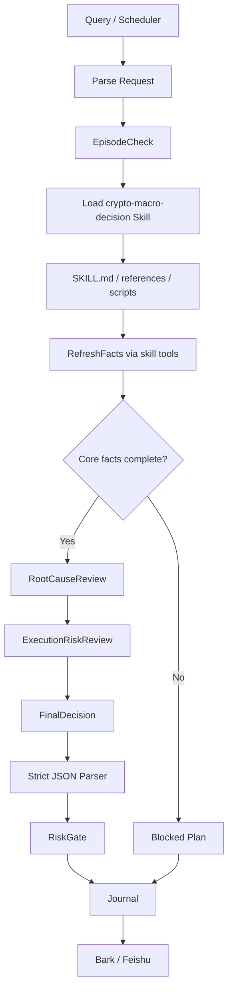

# 架构优化与对抗审查结论

## 结论

当前最需要做的不是继续增加 agent，而是先把 v1 收敛成一条可靠的直线流程。

多 agent 的价值是：

- 强制事实先行
- 强制反方审查
- 强制根因链
- 强制数据缺口降置信度

但如果一开始就上完整 7-agent、动态 skill registry、长期记忆、web search 全量兜底，复杂度会超过收益。

v1 最稳路线：

```text
Query / Scheduler
  -> Parse
  -> EpisodeCheck
  -> Load crypto-macro-decision Skill
  -> RefreshFacts
  -> RootCauseReview
  -> FinalDecision
  -> StrictParser
  -> RiskGate
  -> Journal
  -> Notify
```

## 目前设计里需要收缩的点

### 1. Agent 数量过多

原设计：

```text
MarketFactAgent
MacroEventAgent
DerivativesAgent
BullReviewer
BearReviewer
ExecutionRiskAgent
FinalDecisionAgent
```

v1 建议收敛为 4 个逻辑阶段：

```text
EvidenceCollector
RootCauseReviewer
ExecutionRiskReviewer
FinalDecisionAgent
```

说明：

- `EvidenceCollector` 可以内部按模块收集行情、宏观、衍生品，但不要一开始拆成多个独立 LLM agent。
- `RootCauseReviewer` 一次性生成主链和反链，不需要 bull/bear 两个模型进程。
- `ExecutionRiskReviewer` 保留，因为入场、止损、RR、过期时间必须独立检查。
- `FinalDecisionAgent` 只负责收敛成唯一计划。

### 2. 记忆层不能扩张

v1 只保留：

- `SessionContext`
- `ActiveEventPool`
- `AuditJournal`
- 静态 `LessonRules`

先不要做：

- 向量记忆
- 自由聊天式长期记忆
- 自动写入长期 lesson
- 从 journal 检索旧结论参与 live decision

理由：

历史结论最容易污染后续判断。系统可以记住“用户在问什么”，但不能记住“昨天看多所以今天也该看多”。

### 3. SkillRegistry 不要过早动态化

v1 不需要完整动态工具注册平台。

建议：

- 保留 skill hash 校验。
- 固定加载 `crypto-macro-decision`。
- 固定读取必要 references。
- 固定调用 skill 内的 `scripts/okx_snapshot.py` 或等价受控工具。
- 固定调用少数工具：
  - `okx_snapshot`
  - `read_skill_reference`
  - `read_event_pool_active`
  - 可选 web fallback

不要一开始做：

- 任意 skill 自动发现
- 任意脚本暴露为工具
- 动态工具白名单编辑

理由：

动态 registry 会扩大攻击面和故障面。当前项目范围固定，固定技能和固定工具更稳。

注意：

这不是“不用 skill”。v1 仍然以 `crypto-macro-decision` 作为规则来源，只是不做任意 skill 自动发现和动态工具平台。

### 4. Packet 层级需要减少

原设计里有：

- `EvidencePacket`
- `DataQualityGate`
- `AdversarialReviewPacket`
- `DecisionPlan`
- `RiskVerdict`

v1 建议保留三类核心对象：

```text
MarketSnapshot / EvidenceSnapshot
DecisionPlan
RiskVerdict
```

其中数据质量字段直接放在 `EvidenceSnapshot` 内：

```json
{
  "facts": {},
  "sources": [],
  "unavailable": [],
  "stale": [],
  "confidence_cap": 0.58,
  "hard_blocks": [],
  "soft_downgrades": []
}
```

理由：

太多 packet 会导致 stale、cap、source 状态在多个对象间不同步。

### 5. Prompt 约束必须下沉到代码

以下规则不能只写在 prompt：

- `main_action` 枚举
- 必须手动执行
- 禁止自动下单
- 新开仓必须有 stop
- plan 必须有过期时间
- probability 不能超过 confidence cap
- 核心数据缺失时不能给高置信度
- JSON 必须严格合法

prompt 可以解释原因，代码必须裁决结果。

## 根因对抗链最小实现

用户的目标不是保守地说“我不知道”，而是在可得事实基础上做尽量大胆但可验证的预测。

所以根因链应采用固定模板：

```text
客观事实 -> 机制解释 -> 路径预测 -> 反向链 -> 失效条件
```

### 最小字段

```json
{
  "observed_fact": "fresh fact only",
  "mechanism": "why this fact can move price",
  "predicted_path": "most likely path if mechanism continues",
  "counter_chain": "strongest opposite explanation",
  "confirmation": "what would confirm the path",
  "invalidation": "what would invalidate the path",
  "confidence_effect": "raise|cap|block"
}
```

### 规则

- 每轮只保留 1 条主链和 1 条反链。
- 每条链最多 3 层，不无限展开。
- 只能使用：
  - fresh facts
  - active events
  - 静态 lesson rules
- 不允许使用：
  - old conclusion
  - old market data
  - journal 中的历史方向

### 哪些可以大胆预测

可以预测：

- 数据已经新鲜且方向一致
- 机制链完整
- 有明确确认/失效条件
- 反向链被正面处理
- 风控上可定义止损和失效点

必须保守：

- 核心价格/mark/index 缺失
- funding/OI 缺失且是杠杆方向判断
- 宏观事件状态不明
- 消息只有传言
- 反向链同样强但没有确认信号
- 无法给出 stop 或 invalidation

## 多轮对话状态机

v1 使用线性状态机：

```text
Parse
  -> EpisodeCheck
  -> RefreshFacts
  -> Deliberate
  -> Guard
  -> JournalNotify
```

只允许两种回跳：

```text
facts stale -> RefreshFacts
episode changed -> EpisodeCheck
```

任何硬阻断都进入：

```text
Blocked -> JournalNotify
```

不要让失败的流程继续复用旧结论。

## Episode 强制切换条件

以下情况必须开启新 episode：

- symbol 变化
- horizon 明显变化
- 持仓方向或状态变化
- 合约/交易所变化
- 任务类型变化，例如从“评估”变成“执行复核”
- 重大事件窗口变化，例如 FOMC、CPI、ETF flow、清算瀑布、交易所事故
- 上一轮已产出结论，这一轮是新的独立判断，不是继续同一决策复核

## 工程可靠性优先级

### 最高优先级

先做异常边界，而不是先加 agent。

必须处理：

- `PlanRunner.run_once()` 总异常边界
- 失败也要写 journal
- scheduler job 异常不能打断循环
- SQLite lock 要避免并发竞态
- LLM 输出必须严格 JSON，不要宽松修复
- 日志写不进去要 fail closed
- 通知失败不能影响 verdict

### 生产 v1 不建议保留

- `CommandDecisionEngine` 的 `shell=True`
- 任意动态脚本工具
- 自动 long-term lesson 写入
- journal 默认检索回灌
- 7-agent 并行平台

## v1 推荐运行路径

```text
1. Scheduler 或手动 query 进入。
2. 拿锁，拿不到就跳过。
3. 解析 symbol / horizon / position。
4. 判断 episode，必要时新建。
5. 固定加载 `crypto-macro-decision` skill，读取 `SKILL.md`、必要 references 和 skill hash。
6. 通过 skill script / 受控工具拉最小必要市场事实。
7. 缺核心事实则 block 并 journal。
8. 构造 skill-aware prompt。
9. 调用唯一决策引擎。
10. 严格解析 JSON。
11. 计算 confidence cap 和 risk verdict。
12. 先写 journal，记录 skill hash、references、sources。
13. 再发 Bark / 飞书。
14. 通知失败只记录，不改变 verdict。
```

## v1 架构图



## 后续再扩展的条件

只有当以下情况出现，再扩展完整 agent-skill 平台：

- 一个 skill 不够，需要多个 skill 编排
- 单次 finalizer 经常漏掉反向链
- 事实采集工具超过 5 个，必须分角色管理
- 需要比较多个币种或多个交易所
- 需要 read-only account position 接入
- 需要回放和统计 reviewer 命中率

## 最终建议

v1 不要追求“复杂的 swarm”。

v1 要追求：

- 事实刷新
- 固定加载 `crypto-macro-decision` skill
- 使用 skill references 和 scripts
- 根因链模板
- 反链审查
- 严格解析
- 代码级 confidence cap
- fail closed
- 审计完整
- 手动提醒

这样既保留了多 agent 思想里的核心价值，又不会让系统复杂度压过实际收益。
