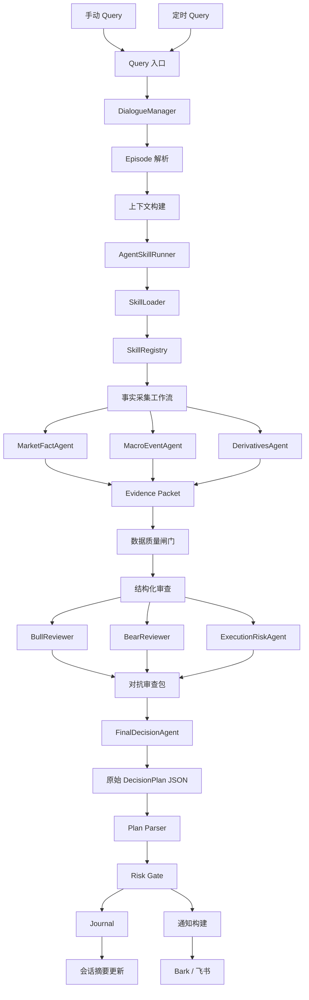
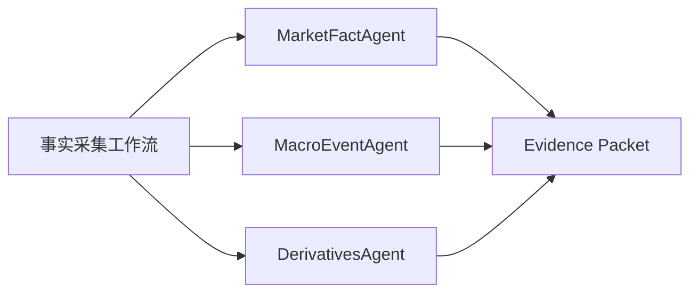
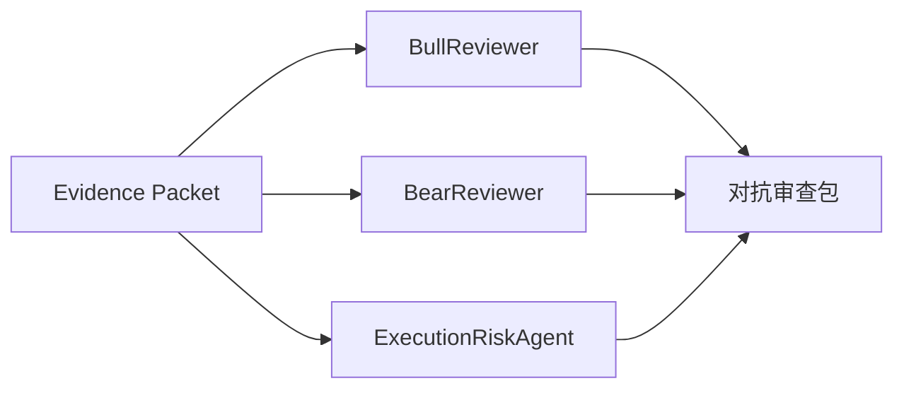

# 端到端业务流程

## 适用范围

本文描述从以下入口开始的完整业务流：

- 手动用户输入 query
- 定时任务触发 query

直到：

- skill 驱动的事实采集
- 结构化多 agent 审查
- 产出唯一手动操作计划
- 风控校验
- 通知
- 审计记录

当前版本仍然是手动提醒模式，不自动下单。

## 总体流程图



## 入口说明

### 1. 手动 Query

示例：

```text
ETH 当前持有多单，重新评估 6 小时和 1 天，现在怎么操作？
```

需要识别或补齐的字段：

- symbol
- 当前持仓
- horizon
- 用户意图
- 是否需要手动操作计划

如果缺少关键字段且无法安全推断，系统最多问一个澄清问题。

### 2. 定时 Query

示例配置：

```yaml
scheduled_queries:
  - name: eth_intraday_manual_plan
    symbol: ETH-USDT-SWAP
    horizon: 6h
    position_source: session_or_manual_config
    prompt: "评估 ETH 手动操作计划"
    interval_seconds: 1800
```

定时任务必须显式指定，不要隐式推断仓位。

v1 里仓位只能来自：

- 会话上下文
- 手工配置

暂时不要默认依赖真实账户读取。

## 详细业务流

### 1. Query 入口

职责：

- 统一手动输入和定时任务输入
- 生成 request id
- 分配 session id
- 识别 symbol、horizon、输出目标
- 早期拒绝不支持的 symbol

输出示例：

```json
{
  "request_id": "uuid",
  "source": "manual|scheduled",
  "symbol": "ETH-USDT-SWAP",
  "horizon": "6h",
  "user_intent": "manual_operation_plan",
  "raw_query": "..."
}
```

失败处理：

- symbol 不支持 -> 直接 block 并写日志
- symbol 缺失 -> 手动模式下问一个问题，定时模式下 block
- horizon 缺失 -> 如果有默认值就用默认值，否则 block

### 2. DialogueManager

职责：

- 判断当前请求是否延续一个已有 episode
- 读取会话记忆
- 读取当前持仓状态
- 避免复用旧市场事实

输入：

- request
- session memory
- 可选的手工持仓配置

输出：

```json
{
  "session_id": "uuid",
  "episode_id": "uuid",
  "symbol": "ETH-USDT-SWAP",
  "horizon": "6h",
  "position_state": "long",
  "episode_mode": "continue|new"
}
```

规则：

- symbol 变了 -> 新 episode
- horizon 明显变了 -> 新 episode
- 持仓状态变了 -> 新 episode
- 重大事件改变上下文 -> 新 episode
- 旧价格、funding、OI、清算数据绝不能当成当前事实复用

### 3. 上下文构建

职责：

- 构建非市场事实上下文
- 放入当前会话摘要
- 放入 active events
- 放入经验记忆

允许放入的内容：

- 当前用户意图
- 当前 symbol / horizon
- 当前持仓
- 未解决事件
- 流程经验

禁止放入的内容：

- 旧价格当作实时价格
- 旧方向结论当作证据
- 旧 funding/OI/清算数据当作 live fact
- 审计日志直接参与下一轮方向判断

输出：

```json
{
  "request": {},
  "session_context": {},
  "active_events": [],
  "lessons": []
}
```

### 4. AgentSkillRunner

职责：

- 负责完整 AI 编排
- 加载 skill
- 初始化允许的工具
- 跑事实采集 agent
- 跑结构化审查 agent
- 调用 finalizer

它才是真正的控制面。
Hermes、CLI、scheduler 只调用它。

### 5. SkillLoader

职责：

- 读取 `SKILL.md`
- 解析 frontmatter
- 计算 skill hash
- 按需加载 references
- 将 skill scripts 暴露为受控工具

输出示例：

```json
{
  "skill_name": "crypto-macro-decision",
  "skill_path": "third_party/skills/crypto-macro-decision",
  "skill_hash": "...",
  "references": {
    "data_sources": "...",
    "exchange_derivatives": "...",
    "templates": "..."
  }
}
```

### 6. SkillRegistry

职责：

- 注册可调用工具
- 为不同 agent 配置白名单
- 强制超时
- 记录 tool call
- 统一工具错误格式

示例工具：

```text
read_skill_reference
read_event_pool_active
okx_snapshot
web_search_crypto_market
web_search_macro_events
web_search_derivatives_fallback
```

安全规则：

- 不允许交易 key
- 不允许提现 key
- 不允许直接下单工具
- 不允许绕过白名单的隐式网络调用

### 7. 事实采集工作流

事实采集必须先于任何方向性结论。



#### MarketFactAgent

采集内容：

- last price
- mark price
- index price
- 1H candles
- 4H candles
- order book
- funding
- open interest

优先路由：

- skill script
- 交易所公开 API 工具

兜底路由：

- Binance / Bybit / Deribit 公共数据
- 开启后使用 web-derived / search-derived fallback

所有结果必须标注来源质量：

- `exchange-native`
- `aggregator-api`
- `web-derived`
- `search-derived`
- `unavailable`

#### MacroEventAgent

采集内容：

- active event pool
- 宏观事件窗口
- 地缘 / 油价风险
- ETF flow 状态
- 稳定币和流动性上下文
- 官方新闻或权威新闻状态

输出必须区分：

- known fact
- inference
- scenario

#### DerivativesAgent

采集和分析：

- funding
- OI 及其变化
- long/short
- liquidation
- taker flow / CVD
- basis
- options（如相关）

输出必须包含：

- minimum tradable data pack 是否完成
- 哪些数据缺失
- 哪些数据过期
- confidence cap

### 8. Evidence Packet

证据包是事实层和审查层之间的边界。

```json
{
  "request_id": "uuid",
  "symbol": "ETH-USDT-SWAP",
  "created_at": "2026-06-25T00:00:00Z",
  "skill": {
    "name": "crypto-macro-decision",
    "sha256": "..."
  },
  "facts": {},
  "sources": [],
  "unavailable": [],
  "stale": [],
  "tool_calls": [],
  "data_quality": {
    "minimum_pack_complete": false,
    "core_execution_complete": true,
    "confidence_cap": 0.58,
    "cap_reasons": []
  }
}
```

finalizer 不能绕过这个证据包。

### 9. 数据质量闸门

职责：

- 强制 freshness 规则
- 强制 minimum fact pack
- 强制 confidence cap
- 当核心执行事实缺失时，阻止新开仓

示例规则：

- 缺少 last / mark / index -> 置信度低于 60%
- 缺少 funding / OI -> 杠杆方向调用低于 60%
- 事件窗口内缺少 active event status -> 置信度低于 55%
- market/high leverage entry 缺少 order book -> 不允许新开仓，改为 recheck 或 trigger

输出示例：

```json
{
  "allowed_to_review": true,
  "hard_blocks": [],
  "soft_downgrades": [],
  "confidence_cap": 0.58
}
```

### 10. 结构化审查

审查阶段在事实采集之后运行。



v1 不做自由聊天式辩论。

#### BullReviewer

必须回答：

- 最强多头链路是什么
- 需要什么确认
- 什么会让多头失效
- 什么情况下多头变危险

#### BearReviewer

必须回答：

- 最强空头链路是什么
- 需要什么确认
- 什么会让空头失效
- 什么情况下空头变危险

#### ExecutionRiskAgent

必须回答：

- 入口是否可执行
- 止损是否有效
- RR 是否可接受
- 是否应该避免跨事件持有
- 手动执行是否存在风险

### 11. 对抗审查包

```json
{
  "bull": {
    "strongest_chain": "...",
    "trigger": 3500,
    "invalidation": 3440,
    "blockers": []
  },
  "bear": {
    "strongest_chain": "...",
    "trigger": 3420,
    "invalidation": 3510,
    "blockers": []
  },
  "execution_risk": {
    "orderable": true,
    "risk_reward_ok": true,
    "manual_execution_notes": []
  }
}
```

### 12. FinalDecisionAgent

职责：

- 读取证据包
- 读取对抗审查包
- 选择唯一主操作
- 输出严格的 `DecisionPlan`

必须包含：

- main action
- instrument
- horizon
- reference price
- entry trigger
- stop price
- T1 / T2
- subjective probability
- confidence cap reason
- why not opposite
- unavailable data
- manual execution required
- expiry

不能做的事：

- 输出多个主操作
- 输出交易所下单 payload
- 输出真实仓位数量
- 无视 hard block
- 超过 confidence cap

### 13. Plan Parser

职责：

- 解析严格 JSON
- 拒绝非法枚举
- 拒绝缺失字段
- 拒绝混合动作字符串
- 拒绝非法数值字段

输出示例：

```json
{
  "plan_id": "uuid",
  "instrument": "ETH-USDT-SWAP",
  "main_action": "trigger long",
  "manual_execution_required": true
}
```

### 14. Risk Gate

职责：

- 校验 manual-only
- 校验允许的 symbol
- 校验最大杠杆
- 校验最大风险
- 校验新开仓是否有 stop
- 校验计划是否过期
- 校验数据质量是否足够
- 校验是否存在禁止的交易密钥

结果：

- allowed
- blocked
- allowed with warnings

即使被 blocked，也要写入日志，并可按配置触发提醒。

### 15. Journal

日志必须是追加式记录。

记录内容：

- request
- session context summary
- skill hash
- evidence packet
- agent outputs
- review packet
- final raw output
- parsed decision
- risk verdict
- notification 结果

不要写入：

- 完整 API key
- 完整 Bark key
- trade / withdraw 凭证

### 16. 通知

通知渠道：

- Bark
- 后续可接飞书

通知内容：

- action
- instrument
- entry
- stop
- T1 / T2
- probability
- 有效时间窗
- blocked / allowed 状态
- 最强理由
- 缺失数据警告

通知必须明确写：

```text
手动操作必需，系统没有下单。
```

### 17. 会话摘要更新

每次运行后都要：

- 更新 episode summary
- 更新最新 symbol / horizon
- 更新最新用户意图
- 更新最新结论元数据

不要把实时市场事实变成可复用的“历史事实”。

## 失败与降级路径

### LLM 不可用

```text
记录失败
如配置允许则发失败提醒
不要伪造计划
```

### OKX 不可用

```text
尝试配置好的 fallback
按来源类型标注恢复的数据
对结果施加 confidence cap
如果核心事实仍缺失，则阻止新开仓
```

### Web search 关闭

```text
记录 web_search_disabled
不要假装已经尝试过兜底
按缺失数据处理
```

### Reviewer 失败

```text
记录 reviewer failure
finalizer 必须降置信度或 block
不能静默成功
```

### Final JSON 非法

```text
重试一次修复 prompt，或直接 block
记录 raw output
不要把它当作有效交易计划通知
```

### Risk Gate 拒绝

```text
把 blocked plan 写入 journal
如配置允许则发送 blocked 提醒
不要把它描述成可执行计划
```

## 主要优化点

### 1. Agent 数量

当前 v1 建议：

- MarketFactAgent
- MacroEventAgent
- DerivativesAgent
- BullReviewer
- BearReviewer
- ExecutionRiskAgent
- FinalDecisionAgent

可选简化：

- 将 MarketFactAgent 和 DerivativesAgent 合并为 `MarketEvidenceAgent`
- 保留 MacroEventAgent
- 保留 BullReviewer / BearReviewer
- 保留 ExecutionRiskAgent
- 保留 FinalDecisionAgent

权衡：

- 更少的 agent -> 更低延迟和成本
- 更细的 agent -> 更强的审计和隔离

### 2. Web Search 触发时机

方案 A：

- 每次都跑 web search

方案 B：

- 只在 API 失败或事件窗口内跑 web search

建议：

- v1 先用方案 B，减少噪声和耗时

### 3. 记忆范围

v1 只保留：

- session memory
- event memory
- lesson memory
- audit journal

不要在 v1 引入向量记忆或自由聊天式长期语义记忆。

### 4. Finalizer 的模型调用次数

方案 A：

- 每个 agent 都调用一次 LLM

方案 B：

- 事实层尽量确定化，只有 reviewer / finalizer 调 LLM

建议：

- v1 尽量靠方案 B，减少成本和漂移

### 5. Confidence Cap 的执行方式

必须是代码层执行，不是 prompt 层执行。

如果 finalizer 输出的 probability 高于 cap，risk gate 必须 block 或 clamp 并标记。

### 6. 定时任务的仓位状态

定时任务需要可靠的仓位状态。

v1 先用：

- 手工配置
- 最新会话上下文

在设计好只读账户接入之前，不要默认假设真实交易所仓位可用。

### 7. 通知噪声

定时任务很容易刷屏。

可优化为：

- 只在 action 变化时提醒
- 只在风险状态变化时提醒
- 只在 confidence 跨阈值时提醒
- 每次都写 journal

## 需要评审的问题

1. v1 是否保留 7 个 agent，还是合并 MarketFactAgent 和 DerivativesAgent？
2. 定时任务是否每次都通知，还是只在重大变化时通知？
3. web search 是否只在 API 失败或事件窗口触发？
4. 被 block 的计划是否也要发 Bark / 飞书？
5. 飞书是否要在 v1 就作为一级通道，还是先只保留 Bark？
6. `FinalDecisionAgent` 是否允许一次 JSON 修复重试？
7. 在正式用定时任务前，是否先接只读账户仓位读取？

