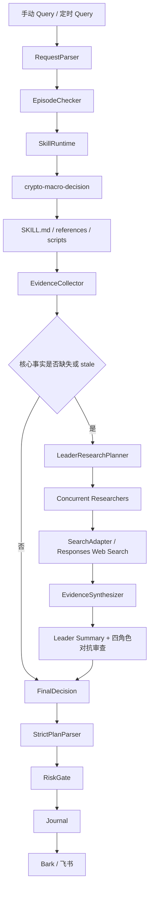

# v1 架构设计

## 核心架构原则

`crypto-macro-decision` 是规则来源，项目代码是执行编排层。

也就是说：

- `SKILL.md` 定义策略规范、数据要求、根因链要求、输出格式。
- `references/` 提供数据源优先级、衍生品检查、模板和 SOP。
- `scripts/` 提供可控的数据采集脚本。
- 项目代码负责真实执行：加载 skill、刷新事实、调用模型、校验输出、执行风控、通知和审计。

## v1 架构图



## 模块边界

### 1. RequestParser

职责：

- 解析手动 query 或定时 query。
- 标准化 symbol、horizon、position_state。
- 生成 `DecisionRequest`。

不负责：

- 市场判断。
- skill 调用。
- 风控。

### 2. EpisodeChecker

职责：

- 判断当前请求是否延续已有 episode。
- 加载最小 `SessionContext`。
- 根据 episode 切换规则决定是否新建 episode。

不负责：

- 复用旧市场数据。
- 从 journal 检索旧结论参与当前判断。

### 3. SkillRuntime

职责：

- 固定加载 `third_party/skills/crypto-macro-decision`。
- 读取 `SKILL.md`。
- 读取必要 references。
- 计算 skill hash。
- 运行受控 skill script，例如 `scripts/okx_snapshot.py`。

v1 不做：

- 任意 skill 自动发现。
- 任意脚本暴露为工具。
- 动态工具平台。

### 4. EvidenceCollector

职责：

- 使用 skill script / 受控工具刷新实时事实。
- 收集 last、mark、index、funding、OI、candles、order book。
- 标注 source、timestamp、freshness、unavailable、stale。
- 计算初步 confidence cap。

核心事实缺失或 stale 时，进入受控研究降级链：

- `LeaderResearchPlanner` 根据 skill 约束和缺口拆分研究任务。
- `execute_research` 使用线程池并发执行多个 researcher 查询。
- `SearchAdapter` 可以是 `responses_web_search`、`duckduckgo_html`、`fixture` 或 `disabled`。
- `EvidenceSynthesizer` 只增加 `web_*` 补充事实，不覆盖交易所原生 mark/index/order book。

### 5. LeaderResearchSynthesizer / AdversarialReview

职责：

- 汇总并发 researcher 返回的证据、冲突、缺口和来源质量。
- 输出 `leader_summary`。
- 至少包含四个 reviewer：
  - `bull_reviewer`
  - `bear_reviewer`
  - `data_quality_reviewer`
  - `execution_risk_reviewer`
- LLM reviewer 失败时允许回落静态 reviewer，但必须在 audit 中记录 fallback 原因。

### 6. RootCauseReview

职责：

- 根据 fresh facts 和 active events 生成主根因链。
- 生成最强反向根因链。
- 明确 confirmation 和 invalidation。

固定模板：

```text
客观事实 -> 机制解释 -> 路径预测 -> 反向链 -> 失效条件
```

### 7. ExecutionRiskReview

职责：

- 检查 entry / stop / target 是否可执行。
- 检查 RR、过期时间、事件风险、手动执行风险。
- 输出 hard block / soft downgrade。

### 8. FinalDecision

职责：

- 基于 evidence、root cause review、execution risk review 生成唯一 `DecisionPlan`。
- 不能绕过 confidence cap。
- 不能输出多个主操作。
- 不能输出交易所下单 payload。

### 9. StrictPlanParser

职责：

- 只接受严格 JSON。
- 校验字段类型。
- 校验 action enum。
- 不做宽松默认补全。

### 10. RiskGate

职责：

- 执行代码级 hard block。
- 执行 confidence cap。
- 校验 manual-only。
- 校验风险参数。
- 对开仓/触发/翻仓动作，缺失 mark、index、order book 时 hard block。

### 11. Journal

职责：

- 追加写入完整运行记录。
- 记录 skill hash、sources、research plan、leader_summary、unavailable、raw output、parsed plan、risk verdict、notification result。

### 12. Notification

职责：

- 发送 Bark / 飞书提醒。
- 通知失败只记录，不改变 verdict。
- 管线失败时如果 `send_failure_alerts=true`，也发送 blocked failure alert。

## v1 设计取舍

### 保留

- 固定 skill。
- skill references。
- skill script。
- Leader 规划研究任务。
- researcher 并发执行。
- 四角色对抗审查。
- 根因链模板。
- 反向链审查。
- 风控硬闸门。
- 审计日志。
- 手动通知。

### 暂缓

- 7-agent swarm。
- 动态 skill registry。
- 多 skill 编排。
- 长期向量记忆。
- 自动交易。

## 后续扩展条件

只有出现以下情况才扩展完整 agent-skill 平台：

- 一个固定 skill 不够用。
- 单次 finalizer 经常漏掉反向链。
- 数据工具超过 5 个且需要角色权限管理。
- 需要多币种、多交易所对比。
- 需要 read-only 账户仓位接入。
- 需要统计 reviewer 命中率。
