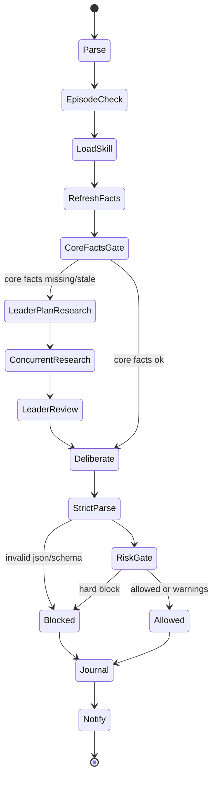

# 业务流程与状态机

## 总体流程

```text
Query / Scheduler
  -> Parse
  -> EpisodeCheck
  -> Load crypto-macro-decision Skill
  -> RefreshFacts
  -> CoreFactsGate
  -> if missing/stale: LeaderPlanResearch
  -> if missing/stale: ConcurrentResearch
  -> if missing/stale: LeaderSummary + 4-role AdversarialReview
  -> FinalDecision
  -> StrictParser
  -> RiskGate
  -> Journal
  -> Notify
```

## 手动 Query 流程

1. 用户输入 query。
2. 系统解析 symbol、horizon、position_state。
3. 如果关键字段缺失，最多问一个澄清问题。
4. 判断是否继续当前 episode。
5. 固定加载 skill。
6. 刷新市场事实。
7. 如果核心事实缺失或 stale，由 Leader 规划研究任务。
8. 并发执行 researcher 查询并合成 `web_*` 补充证据。
9. Leader 汇总证据并执行 bull / bear / data-quality / execution-risk 四角色审查。
10. 最终模型基于 skill、行情、研究审计输出唯一计划。
11. 风控校验。
12. 写入 journal。
13. 发送通知。

## 定时 Query 流程

1. scheduler 到点触发。
2. 获取 job lock。
3. 读取配置中的 scheduled query。
4. 构造 `DecisionRequest`。
5. 判断 episode。
6. 固定加载 skill。
7. 刷新市场事实。
8. 如果核心事实缺失或 stale，执行 Leader 研究降级链。
9. 生成计划。
10. 写入 journal。
11. 根据通知策略判断是否发送提醒。

## 状态机



## 允许的回跳

只允许两种回跳：

```text
facts stale -> RefreshFacts
episode changed -> EpisodeCheck
```

不允许：

- 从 journal 回跳到当前决策。
- 从旧结论直接跳过 RefreshFacts。
- reviewer 失败后继续假装成功。

## Episode 切换规则

以下情况必须新建 episode：

- symbol 变化。
- horizon 明显变化。
- 持仓方向或状态变化。
- 合约或交易所变化。
- 任务类型变化，例如从“评估”变成“执行复核”。
- 重大事件窗口变化，例如 FOMC、CPI、ETF flow、清算瀑布、交易所事故。
- 上一轮已产出结论，而本轮是新的独立判断。

以下情况可以继续当前 episode：

- 用户澄清同一 symbol。
- 用户继续追问同一持仓和同一 horizon。
- 用户要求审查当前决策的反方链路。

## 失败降级

### Skill 加载失败

```text
Blocked -> Journal -> Failure Notification
```

### 市场事实缺失

```text
Leader 规划研究任务
并发执行 researcher 查询
合成 search-derived 证据
Leader 四角色审查
最终模型输出计划
RiskGate 对缺核心执行事实 / confidence cap / stale 数据做 hard block 或降级
```

### LLM 超时或不可用

```text
Blocked -> Journal -> Failure Notification
```

### JSON 非法

v1 默认不做宽松修复。

可配置允许一次 repair retry，但 retry 后仍不合法必须 block。

### RiskGate 拒绝

```text
Blocked -> Journal -> Notification by config
```

### 通知失败

```text
Journal notification failure
verdict 不改变
```
