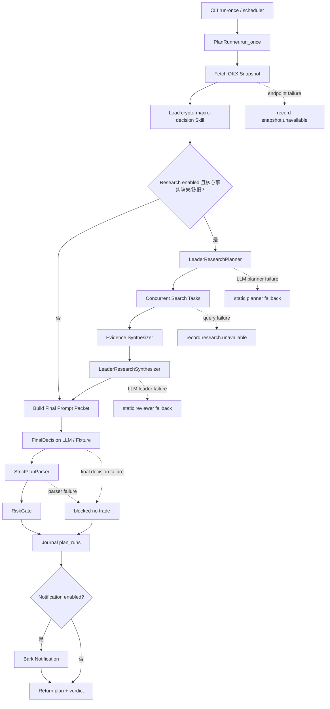
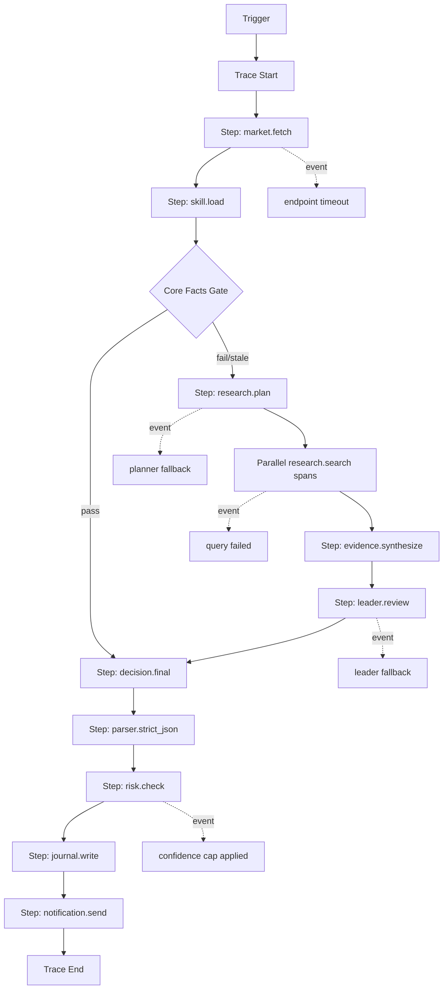

# 可执行工作流与异常边界说明

## 1. 结论

当前实现不是 ReAct，也不是真正的“多个独立 agent 进程互相协作”。

当前实现是一个单进程确定性编排器：

```text
固定主流程
  + research 阶段 Plan-and-Execute
  + search 子任务线程池并发
  + 单次 Leader LLM 汇总四角色审查
  + FinalDecision LLM 输出计划
  + 代码层 StrictParser / RiskGate 强约束
```

关键边界：

- `PlanRunner.run_once()` 是当前唯一主编排入口。
- research 阶段会先规划多个查询任务，再并发执行。
- `leader_finalizer`、`bull_reviewer`、`bear_reviewer`、`data_quality_reviewer`、`execution_risk_reviewer` 当前是一次 LLM 调用中的结构化角色输出，不是五个真正独立 agent。
- 当前没有模型 ReAct 循环；模型不能在执行中自主追加工具调用。
- 当前没有统一工作流引擎，也没有 trace/span 级观测；只有 `plan_runs.payload_json` 大 JSON 留档。

## 2. 当前代码模块对应关系

| 责任 | 当前模块 | 说明 |
|---|---|---|
| CLI 入口 | `cli.py` | `run-once`、`scheduler`、`show-config`、`test-bark`、`record-outcome` |
| 主编排 | `runner.py` | `PlanRunner.run_once()` 串起行情、skill、research、决策、解析、风控、通知 |
| 配置 | `config.py` | YAML + env override + 安全校验 |
| 行情 | `market_data.py` | OKX public endpoints 或 fixture |
| Skill 加载 | `skill_runtime.py` | 加载 `crypto-macro-decision` 及必要 references |
| Research 规划与检索 | `research.py` | planner、search adapter、并发查询、leader summary |
| 决策输出解析 | `plan_parser.py` | strict JSON、枚举、数字字段、manual-only 校验 |
| 风控 | `risk.py` | 代码硬规则，模型不能绕过 |
| 通知 | `notifier.py` | Bark 推送与重试 |
| 审计存档 | `journal.py` | SQLite 表：plan_runs、notifications、manual_outcomes、job_locks |
| 定时锁 | `scheduler.py` | 周期执行和 job lock |

文档中曾出现的 `RequestParser`、`EpisodeChecker`、`EvidenceCollector` 等名字，目前更多是目标架构概念；当前代码没有对应独立模块。

## 3. 主流程总览



## 4. 当前实际执行链路

### 4.1 触发入口

入口有两类：

- 手动执行：`crypto-alert run-once --symbol ETH-USDT-SWAP`
- 定时执行：`crypto-alert scheduler --symbol ETH-USDT-SWAP`

定时器流程：

```text
run_scheduler()
  -> acquire JobLock
  -> job() 调 PlanRunner.run_once()
  -> release JobLock
  -> sleep(interval_seconds)
```

当前默认/生产配置：

| 配置项 | 默认 | prod |
|---|---:|---:|
| `scheduler.interval_seconds` | 1800 | 1800 |
| `scheduler.lock_ttl_seconds` | 1800 | 1800 |
| `scheduler.run_on_start` | true | true |
| `scheduler.job_timeout_seconds` | 1800 | 1800 |

重要缺口：

- `scheduler.job_timeout_seconds` 已有配置，但当前 `run_scheduler()` 没有实际使用它中断超时任务。
- 当前只靠各外部请求自己的 timeout 控制耗时。

### 4.2 行情采集

当前 OKX 行情采集是同步串行请求，不是并发：

```text
ticker
mark
funding_rate
open_interest
order_book
candles
```

当前行为：

- 每个 endpoint 独立请求。
- 单个请求失败不会中断整体行情采集。
- 失败 endpoint 写入 `snapshot.unavailable`。
- 成功 endpoint 写入 `snapshot.points`。

配置：

| 配置项 | 含义 | 默认 |
|---|---|---:|
| `market_data.request_timeout_seconds` | 单个 OKX 请求超时 | 8 |
| `market_data.aggregate_timeout_seconds` | 目标设计中的聚合超时 | 25 |

重要缺口：

- `aggregate_timeout_seconds` 当前没有真正包住全部 OKX 请求。
- 行情 endpoint 没有重试。
- 行情 endpoint 当前串行，全部超时时会消耗约 `6 * request_timeout_seconds`。

### 4.3 Skill 加载

`SkillRuntime.load_context()` 会加载：

```text
SKILL.md
references/data-sources.md
references/exchange-derivatives.md
references/templates.md
scripts/okx_snapshot.py
```

当前行为：

- skill 文件不存在：直接异常，整轮 blocked。
- skill name 不是 `crypto-macro-decision`：直接异常，整轮 blocked。
- 必要 references 缺失：直接异常，整轮 blocked。
- 必要 script 缺失：直接异常，整轮 blocked。

这里是 hard fail，因为 skill 是策略规则来源，缺失后不能继续伪造交易计划。

### 4.4 Research fallback 判断

进入 research fallback 的条件：

```text
research.enabled == true
且满足以下任一条件：
  - last / mark / index / funding_rate / open_interest / order_book / candles 缺失
  - 核心数据 stale
  - snapshot.unavailable 包含 timeout / unavailable / connecttimeout
```

如果 `research.enabled=false`，即使行情缺失，也不会执行 web fallback，后续只把缺口交给最终模型和 RiskGate。

### 4.5 LeaderResearchPlanner

当前支持两种 planner：

| planner | 行为 |
|---|---|
| `static` | 代码固定生成 price / derivatives / BTC anchor / macro 查询 |
| `llm` | 调 OpenAI-compatible `/v1/chat/completions` 生成查询计划，失败后 fallback 到 static |

prod 配置为：

```yaml
research:
  enabled: true
  planner: llm
```

LLM planner 输出：

```json
{
  "reason": "...",
  "queries": [
    {
      "name": "...",
      "query": "...",
      "purpose": "...",
      "required": true
    }
  ]
}
```

边界：

- timeout：`research.request_timeout_seconds`，prod 为 300 秒。
- retry：当前 0 次。
- fallback：LLM planner 失败后用 static planner。
- planner 只规划研究任务，不允许给交易结论。

### 4.6 并发 Search Tasks

`execute_research()` 使用 `ThreadPoolExecutor` 并发执行查询。

```text
research_plan.queries
  -> query_1 search
  -> query_2 search
  -> query_3 search
  -> query_4 search
```

并发边界：

- 并发数：`min(research.max_workers, len(queries))`
- prod `max_workers=4`
- 每个 query 调一次 `SearchAdapter.search(query)`

SearchAdapter 类型：

| provider | 行为 |
|---|---|
| `disabled` | 不检索，返回空 |
| `fixture` | 测试用 fixture |
| `duckduckgo_html` | 请求 DuckDuckGo HTML |
| `responses_web_search` | 调 OpenAI-compatible `/v1/responses`，要求使用 `web_search` tool |

prod 配置为：

```yaml
research:
  search_provider: responses_web_search
```

单 query 异常处理：

- 单个 query 抛异常：记录到 `research.unavailable`，不影响其他 query。
- query 返回空且 `required=true`：记录 `no search results`。
- 没有 query 级重试。

### 4.7 Evidence Synthesizer

`synthesize_search_evidence()` 把检索结果写入 `snapshot.points`：

```text
web_<query.name> -> SearchResult[]
```

关键硬边界：

- web/search-derived 证据只能补充上下文。
- web/search-derived 证据不能替代交易所原生 `mark`、`index`、`order_book`。
- 如果 `mark`、`index`、`order_book` 缺失，会追加：

```text
confidence_cap:0.58:检索派生的衍生品数据不能替代交易所原生执行事实
```

这个 cap 会在 RiskGate 中限制最终 probability。

### 4.8 LeaderResearchSynthesizer

当前支持两种 leader：

| leader_mode | 行为 |
|---|---|
| `static` | 代码固定生成保守 summary |
| `llm` | 调 `/v1/chat/completions`，要求输出五个 top-level keys，失败后 fallback 到 static |

prod 配置为：

```yaml
research:
  leader_mode: llm
```

要求输出：

```text
leader_finalizer
bull_reviewer
bear_reviewer
data_quality_reviewer
execution_risk_reviewer
```

重要说明：

- 当前这是一次 LLM 调用里的结构化四角色审查。
- 当前不是四个独立 agent 并行审查。
- 因此它有“同一模型同一上下文自我审查”的同源偏差。

边界：

- timeout：`research.request_timeout_seconds`，prod 为 300 秒。
- retry：当前 0 次。
- fallback：LLM leader 失败后使用 static reviewer。
- leader 不直接输出最终交易动作。

### 4.9 FinalDecision

最终决策由 `DecisionEngine.run(prompt_packet)` 执行。

prod 使用：

```yaml
decision:
  engine: openai_compatible
  timeout_seconds: 1200
```

输入包含：

```text
skill metadata
compact skill context
market_snapshot
research audit
leader_summary
manual-alert-only boundary
strict JSON schema instruction
```

当前边界：

- timeout：prod 为 1200 秒。
- retry：当前 0 次。
- fallback：没有二级 final model fallback。
- 一旦 final LLM 抛异常，整轮进入 blocked no trade。

### 4.10 StrictPlanParser

Parser 强制要求：

- 输出必须是纯 JSON object。
- 不允许 markdown fence。
- `main_action` 必须是固定枚举。
- 数字字段必须是真数字，不能是字符串或带文字的范围。
- `manual_execution_required` 必须为 true。
- 缺少必要字段直接失败。

Parser 失败后：

```text
blocked no trade
```

### 4.11 RiskGate

RiskGate 是代码硬规则，最终模型不能绕过。

当前检查：

- app mode 是否 OFF。
- 是否 manual execution required。
- instrument 是否在允许列表。
- plan 是否过期。
- open/trigger/flip 类动作是否有 stop_price。
- open/trigger/flip 类动作是否缺核心执行行情。
- risk_pct 是否超过最大风险。
- max_leverage 是否超过最大杠杆。
- probability 是否超过 confidence cap。
- snapshot 是否 stale。
- 是否错误打开了 auto_order_enabled。

RiskGate 输出：

```text
RiskVerdict.allowed = true / false
reasons = hard block reasons
warnings = soft warnings
```

如果 `allowed=false`，仍然会写 journal 和通知，但通知会标记风控阻断。

### 4.12 Journal

当前写入：

```text
plan_runs:
  plan_id
  created_at
  status
  payload_json

notifications:
  plan_id
  created_at
  ok
  status_code
  error

manual_outcomes:
  plan_id
  created_at
  outcome
  notes
```

`payload_json` 包含：

```text
plan
snapshot
evidence_snapshot
raw_decision
parsed_plan
verdict
skill
research
error
```

当前缺口：

- 没有 `trace_id` 贯穿所有表。
- 没有 span。
- 没有每阶段开始/结束时间。
- 没有每阶段 token、耗时、重试次数、fallback 类型的标准字段。
- 没有 query 级 search span。

### 4.13 Bark Notification

当前 Bark 行为：

- 如果通知关闭，使用 noop。
- 如果通知开启但没有 Bark key，初始化时异常。
- 发送失败不会改变交易判断，只写 notification 记录。

配置：

| 配置项 | 默认 |
|---|---:|
| `notification.timeout_seconds` | 8 |
| `notification.retry_count` | 1 |
| `notification.max_body_chars` | 900 |
| `notification.send_failure_alerts` | true |

实际尝试次数：

```text
retry_count + 1
```

默认 `retry_count=1` 时，最多尝试 2 次。

## 5. 节点级异常边界表

| 节点 | 是否并发 | 是否 LLM | timeout | retry | 失败策略 | 是否中断主流程 |
|---|---:|---:|---:|---:|---|---:|
| scheduler lock | 否 | 否 | 无 | 0 | 拿不到锁则跳过本轮 | 否 |
| OKX ticker | 否 | 否 | 8s | 0 | 写 unavailable | 否 |
| OKX mark | 否 | 否 | 8s | 0 | 写 unavailable | 否 |
| OKX funding | 否 | 否 | 8s | 0 | 写 unavailable | 否 |
| OKX OI | 否 | 否 | 8s | 0 | 写 unavailable | 否 |
| OKX order book | 否 | 否 | 8s | 0 | 写 unavailable | 否 |
| OKX candles | 否 | 否 | 8s | 0 | 写 unavailable | 否 |
| skill load | 否 | 否 | 无 | 0 | 生成 blocked plan | 是 |
| research fallback gate | 否 | 否 | 无 | 0 | 不适用 | 否 |
| LLM research planner | 否 | 是 | 300s | 0 | fallback static planner | 否 |
| search query | 是 | 取决于 provider | 300s | 0 | 单 query 写 unavailable | 否 |
| evidence synthesize | 否 | 否 | 无 | 0 | 异常会进入 blocked | 是 |
| LLM leader reviewer | 否 | 是 | 300s | 0 | fallback static reviewer | 否 |
| final decision LLM | 否 | 是 | 1200s | 0 | 生成 blocked plan | 是 |
| strict parser | 否 | 否 | 无 | 0 | 生成 blocked plan | 是 |
| RiskGate | 否 | 否 | 无 | 0 | allowed=false | 否 |
| journal write | 否 | 否 | SQLite 默认 | 0 | 抛异常 | 是 |
| Bark notification | 否 | 否 | 8s | 1 | 写通知失败 | 否 |

## 6. 当前不是 ReAct 的原因

ReAct 的典型形态是：

```text
LLM 思考
  -> 选择 tool
  -> 执行 tool
  -> 观察结果
  -> 再决定是否继续 tool
  -> 最终回答
```

当前项目不是这样。

当前项目是代码驱动：

```text
代码决定先拉行情
代码决定是否 research fallback
代码决定 planner 调用
代码决定 search 并发执行
代码决定 leader summary
代码决定 final decision
代码决定 parser / risk / notify
```

模型只在固定位置被调用：

- research planner。
- leader reviewer。
- final decision。
- responses web_search adapter。

模型不能自由决定下一步调用哪个系统工具。

## 7. 当前 Plan-and-Execute 的范围

只有 research 阶段属于局部 Plan-and-Execute：

```text
Plan:
  LeaderResearchPlanner 生成 queries

Execute:
  execute_research 并发跑 queries

Synthesize:
  EvidenceSynthesizer + LeaderResearchSynthesizer 汇总
```

不是整个系统都是 Plan-and-Execute。

## 8. 当前“多 agent”的真实边界

当前多角色审查是“结构化角色输出”，不是“独立 agent 网络”。

当前形态：

```text
一次 leader LLM 调用
  -> leader_finalizer
  -> bull_reviewer
  -> bear_reviewer
  -> data_quality_reviewer
  -> execution_risk_reviewer
```

优点：

- 实现简单。
- 成本较低。
- 输出结构统一。
- 容易 fallback。

问题：

- 同一模型、同一上下文、同一次生成，独立性有限。
- reviewer 之间没有真正隔离上下文。
- 不能并行独立审查。
- 不能分别记录每个 reviewer 的耗时、失败和证据引用。

后续如要提高可控性，可以改成：

```text
leader planner
  -> bull reviewer LLM call
  -> bear reviewer LLM call
  -> data-quality reviewer LLM call
  -> execution-risk reviewer LLM call
  -> leader finalizer LLM call
```

但这会增加成本、耗时和失败面。建议先实现 trace/span，再决定是否拆成真多 agent。

## 9. 当前让人感觉不可控的原因

主要不是流程完全没有控制，而是控制没有被统一显式化。

具体问题：

1. 状态机在文档里，代码里没有统一 Workflow/Step 对象。
2. timeout、retry、fallback 分散在不同模块。
3. `scheduler.job_timeout_seconds` 和 `market_data.aggregate_timeout_seconds` 配置存在，但代码没有真正执行。
4. research query 失败只有字符串记录，没有标准错误类型。
5. leader reviewer 是一次 LLM 多角色输出，不是真独立 agent。
6. journal 是大 JSON，不是 trace/span。
7. 没有每个阶段的耗时、输入摘要、输出摘要、token、fallback、重试次数。
8. 目标架构命名和当前代码模块命名不完全一致。

## 10. 建议的控制面改造顺序

### 先补观测，不急着加更复杂 agent

目标：

- 每次运行生成 `trace_id`。
- 每个阶段生成 span。
- 记录开始时间、结束时间、耗时、status、error、fallback。
- search query 每个 query 单独 span。
- final decision 保存 output hash 和摘要。

优先级最高，因为没有观测就无法判断该不该拆 agent。

### 统一 TaskSpec / StepResult

给每个阶段统一元数据：

```text
step_name
step_type
timeout_seconds
retry_count
fallback_policy
blocking_policy
input_summary
output_summary
```

这样可以从代码直接生成“执行流程表”，避免文档和代码分离。

### 补真正生效的总超时

需要落地：

- `scheduler.job_timeout_seconds`
- `market_data.aggregate_timeout_seconds`
- research 整体最大耗时

注意：Python 线程池里强行杀线程不干净，建议先用超时监控和 cooperative timeout，而不是硬杀。

### 增加重试策略

建议只对外部请求做有限重试：

| 阶段 | 建议 retry |
|---|---:|
| OKX 单 endpoint | 1 |
| LLM planner | 1 |
| search query | 1 |
| LLM leader | 1 |
| final decision | 1 |
| Bark | 保持 1 |

重试必须带：

- 指数退避或固定短延迟。
- 只重试网络类、429、5xx、timeout。
- 不重试 parser/schema 逻辑错误。
- 每次重试写 trace event。

### 再评估是否拆真多 agent

只有当 trace 证明以下问题明显存在时，再拆：

- leader reviewer 经常漏掉 search evidence。
- bull/bear 结论同质化严重。
- data-quality 审查经常没有发现数据缺口。
- execution-risk 审查经常漏止损、滑点、核心行情缺失。

否则先保持当前单次 LLM 多角色，避免复杂度过早上升。

## 11. 推荐的目标工作流图



目标不是立刻重写成复杂平台，而是让每个阶段都可看、可测、可复盘。

## 12. 当前文档与代码需要对齐的事项

需要后续修正：

- 文档中的目标组件名和当前代码模块名要标注清楚，避免误解。
- `scheduler.job_timeout_seconds` 要么实现，要么从配置中移除。
- `market_data.aggregate_timeout_seconds` 要么实现，要么从配置中移除。
- `LeaderResearchSynthesizer` 文档要明确“当前是单次 LLM 结构化多角色，不是真多 agent”。
- `Trace Ledger` 从设计文档推进到代码实现。

## 13. 当前建议冻结的边界

在 trace/span 未落地前，不建议继续扩大以下能力：

- 自动交易。
- 更复杂的多 agent 网络。
- 长期记忆自动回灌 live decision。
- 自动改 prompt。
- 自动根据历史收益调整策略。

原因：

- 现在最大问题不是“agent 不够多”，而是“每个阶段的执行证据不够透明”。
- 先补观测和控制面，才能判断复杂度是否值得增加。
