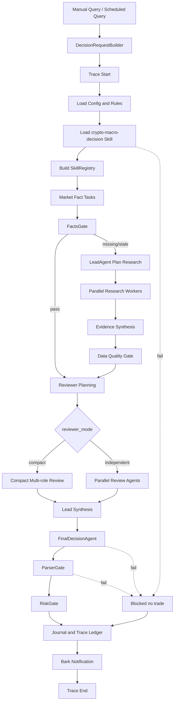

# Agent-Swarm 重构与约束配置化设计

## 1. 结论

当前项目不应该继续在 `runner.py`、`research.py`、`skill_runtime.py` 上补丁式增加逻辑。

当前代码已经能跑通基础链路，但它本质上还是一个单进程固定 pipeline：

```text
PlanRunner.run_once
  -> fetch market snapshot
  -> load skill text
  -> optional research fallback
  -> final LLM decision
  -> strict parser
  -> risk gate
  -> journal
  -> Bark
```

它不是 ReAct，也不是真正的独立多 agent。当前的 `bull_reviewer`、`bear_reviewer`、`data_quality_reviewer`、`execution_risk_reviewer` 只是一次 LLM 输出里的多个 JSON key，或者静态 fallback 字典，不具备独立任务、独立超时、独立失败、独立 trace 和隔离上下文。

推荐重构方向：

```text
保留本项目自研确定性主链路
引入参考医疗助手的 SharedContext / SubTask / Contribution / ConstraintValidator 思想
引入开源 agent 框架中的 state / tool registry / tracing / guardrail 思想
不直接引入 LangGraph、AutoGen、CrewAI 接管主流程
不复制医疗助手的完整通用 swarm
```

目标是做一个受控的 crypto manual alert agent-skill 系统，而不是做一个自由聊天式 agent 平台。

## 2. 多 Agent 审查结论摘要

本方案经过三个独立子任务评估：

| 子任务 | 结论 |
|---|---|
| 参考医疗助手架构 | 借鉴 `LeadAgent`、`SharedContext`、`SkillRegistry`、`ConstraintValidator`；不照搬医疗 agent 分类和自由 tool loop |
| 当前项目代码审计 | 当前是固定 pipeline；硬编码、配置不生效、skill 不是一等工具、journal 没有 trace/span |
| 开源 agent swarm 研究 | 借鉴显式状态、受控工具、trace/span、guardrail、HITL；暂不引入完整框架接管交易提醒链路 |

核心判断：

- 现在最大问题不是 agent 数量不够，而是控制面和观测面不够显式。
- 先把 workflow、task、tool、constraint、trace 拆清楚，再考虑是否把 reviewer 拆成真正独立 LLM call。
- 交易提醒系统的最终决策必须由代码层 `StrictParser` 和 `RiskGate` 兜底，不能交给 agent 框架自由决定。

## 3. 参考项目迁移边界

参考项目：

```text
F:\file\居丽叶简历项目7：医疗助手\medix-agent-swarm
```

### 3.1 借鉴什么

#### LeadAgent 分解与汇总

参考：

```text
swarm/lead_agent.py
```

可迁移思想：

- Lead agent 只做任务分解和结果汇总。
- Worker 执行具体子任务。
- 最终汇总基于 SharedContext 中的贡献。
- Lead 不绕过约束，不直接执行工具，不直接替代风控。

迁移到本项目：

```text
DecisionLeadAgent
  -> plan_research_tasks()
  -> plan_review_tasks()
  -> synthesize_evidence()
  -> prepare_final_decision_input()
```

#### SharedContext 黑板

参考：

```text
swarm/shared_context.py
```

可迁移思想：

- `SubTask` 有 `id/type/description/assigned_agent/status/result/created_at/started_at/completed_at`。
- `Contribution` 记录哪个 agent 对哪个 subtask 产出了什么。
- 事件流记录 task started / completed / failed。

迁移到本项目：

```text
DecisionRunContext
  request
  skill_context
  market_snapshot
  evidence_packets
  research_tasks
  reviewer_contributions
  final_plan
  risk_verdict
  trace_id
```

#### SkillRegistry

参考：

```text
core/skill_registry.py
core/skill_loader.py
agents/base_agent.py
```

可迁移思想：

- skill/tool 注册与执行统一入口。
- 每个工具有 name、description、parameters、handler。
- LLM 可见工具 schema 与实际执行逻辑分离。

迁移到本项目：

```text
SkillRegistry
  okx_snapshot
  responses_web_search
  duckduckgo_html_search
  strict_plan_parse
  risk_check
  bark_notify
```

但本项目不做任意自动发现。所有工具必须在配置和代码中显式注册，且经过 `ToolPolicy` 校验。

#### ConstraintValidator

参考：

```text
constraints/validator.py
constraints/agent_constraints.yaml
constraints/swarm_constraints.yaml
```

可迁移思想：

- 约束放在 YAML 或结构化规则里。
- 工具调用前校验。
- 输出后校验。
- 任务分解后校验。

迁移到本项目：

```text
rules/risk_rules.yaml
rules/agent_constraints.yaml
rules/workflow_steps.yaml
rules/prompt_templates.yaml
```

### 3.2 不照搬什么

不照搬以下内容：

- 医疗领域的 `ConsultationAgent`、`DiagnosticAgent`、`ResearchAgent` 分类。
- 所有 worker 自动注册所有 skills。
- LLM 自由 tool loop 作为主交易决策链。
- 正则抽取 JSON 作为正式 parser。
- 长期记忆自动参与当前 live decision。
- 过大的 swarm 平台抽象。

原因：

- 本项目是高风险交易提醒，不是普通咨询问答。
- 工具权限必须收敛，reviewer 不能随便触发通知或改写行情。
- 当前 v1 明确 manual-only，任何自动交易工具都不能进入注册表。
- live decision 必须从最新事实重建，不能被历史会话结论污染。

## 4. 开源框架借鉴边界

调研对象包括：

- LangGraph
- OpenAI Agents SDK
- AutoGen
- CrewAI
- OpenAI Swarm
- LangGraph Swarm

### 4.1 可借鉴思想

#### 显式状态

LangGraph 的核心是 State、Node、Edge。它强调 workflow 应由共享状态和节点更新组成，而不是全靠 prompt 隐式推进。

迁移到本项目：

```text
DecisionRunContext 是唯一运行状态
每个 Step 只读写声明过的字段
并发 worker 只能追加 evidence/review contribution
核心执行行情不能被 search-derived 覆盖
```

#### Trace / Span

OpenAI Agents SDK 把一次 workflow 表示为 trace，内部由 agent、generation、function、guardrail、handoff 等 span 组成。AutoGen 也强调 OpenTelemetry tracing。

迁移到本项目：

```text
每次 run 生成 trace_id
每个步骤生成 span
search query / reviewer / LLM / risk gate 都能单独定位耗时、错误、fallback
```

#### Tool / Guardrail

OpenAI Agents SDK、AutoGen、CrewAI 都强调工具调用和 guardrail 分层。

迁移到本项目：

```text
ToolPolicy 控制每个工具的权限、timeout、retry、失败策略
RiskGate 是最终硬闸门
ParserGate 不接受宽松 JSON
```

#### Workflow 优先于 Chatroom

CrewAI Flow 和 LangGraph 都能表达结构化 workflow。对本项目而言，这比“多个 agent 在聊天室里讨论”更适合。

迁移到本项目：

```text
固定工作流
可配置步骤
受控并发
最终统一归纳
```

### 4.2 暂不直接引入框架

暂不引入完整 LangGraph / AutoGen / CrewAI 接管主流程。

原因：

- 当前项目规模还没有大到必须引入外部 workflow runtime。
- 外部框架不能天然理解本项目的硬边界：manual-only、confidence cap、search-derived 不能替代 mark/index/order_book。
- 直接迁移会增加调试复杂度。
- 用户当前最关心的是可控、可读、可维护，而不是框架名。

后续触发条件：

- 工作流分支超过当前自研 StepSpec 能承载的复杂度。
- 需要暂停、恢复、人工审批断点。
- 需要多用户多会话长期运行。
- Trace 证明当前自研 workflow 已经成为维护瓶颈。

## 5. 当前项目主要问题

### 5.1 编排集中在少数大文件

当前主要问题文件：

```text
src/crypto_manual_alert/runner.py
src/crypto_manual_alert/research.py
src/crypto_manual_alert/skill_runtime.py
```

问题：

- `runner.py` 同时负责行情、skill、research、LLM、parser、risk、journal、notifier。
- `research.py` 同时包含 planner、search adapter、HTML parser、web_search adapter、evidence synthesize、leader reviewer、fallback。
- `skill_runtime.py` 同时负责 skill 文档加载、prompt packet、OpenAI-compatible final decision engine。

结果：

- 很难定位某个失败发生在什么阶段。
- 很难单测单个步骤的失败边界。
- 很难把 timeout、retry、fallback 配置统一治理。

### 5.2 约束硬编码且分散

当前硬编码示例：

```text
domain.py
  ALLOWED_ACTIONS
  OPENING_ACTIONS

research.py
  CORE_MARKET_POINTS
  SEARCH_CONFIDENCE_CAP
  USER_FACING_LANGUAGE_RULE
  LEADER_REVIEW_KEYS
  static query templates

risk.py
  DERIVATIVES_GAP_CAP
  CORE_EXECUTION_POINTS

skill_runtime.py
  REQUIRED_REFERENCES
  EXPECTED_SKILL_NAME
  OpenAICompatibleDecisionEngine system prompt
```

应该迁移到：

```text
rules/action_rules.yaml
rules/market_fact_rules.yaml
rules/risk_rules.yaml
rules/agent_constraints.yaml
rules/prompt_templates.yaml
```

但不是所有东西都能配置。安全硬边界必须由代码强制。

### 5.3 配置存在但未完全生效

当前风险点：

- `scheduler.job_timeout_seconds` 有配置，但当前没有真正中断超时任务。
- `market_data.aggregate_timeout_seconds` 有配置，但 OKX endpoint 仍是串行请求，没有聚合 deadline。
- `prod.yaml` 没有显式设置 `market_data.provider: okx_public`，可能继承 default fixture。
- `research.request_timeout_seconds` 控制单请求，不代表整轮 research 的总 deadline。

重构要求：

- 每个配置项必须能对应到实际执行逻辑。
- 如果暂不实现，就不能假装可控。
- `show-config` 输出应能看出哪些配置已生效、哪些配置只是保留字段。

### 5.4 Skill 不是一等工具

当前 `SkillRuntime` 主要是把 skill 文档和 references 摘要塞进 prompt。

问题：

- `scripts/okx_snapshot.py` 只检查存在，没有作为受控 tool 执行。
- 代码直接在 `market_data.py` 请求 OKX，绕开 skill script 层。
- 没有 tool schema、tool timeout、tool retry、tool allowlist、tool audit。

目标：

```text
SkillLoader 负责加载 skill 包
SkillRegistry 负责注册该 skill 暴露的受控工具
ToolExecutor 负责按 ToolPolicy 执行工具
TraceRecorder 记录每次 tool call
```

### 5.5 多 Agent 只是结构化角色输出

当前：

```text
LeaderResearchSynthesizer.synthesize()
  -> 一次 LLM 输出:
       leader_finalizer
       bull_reviewer
       bear_reviewer
       data_quality_reviewer
       execution_risk_reviewer
```

问题：

- 不是独立 agent。
- 不能并发。
- 不能单独失败。
- 不能单独计时。
- 不能单独 retry。
- 不能隔离上下文。

目标：

先设计两种模式：

```yaml
agents:
  reviewer_mode: compact      # compact | independent
```

- `compact`：一次 LLM 产生多角色结构化结果，成本低，作为默认。
- `independent`：每个 reviewer 单独 LLM call，可并发，trace 可观测，后续开启。

### 5.6 Journal 不是生产级 Trace

当前 journal 保存大 JSON，但缺少：

- `trace_id`
- `span_id`
- 阶段耗时
- token
- retry
- fallback
- 标准错误类型
- query 级 search 记录
- reviewer 级贡献记录

目标不是马上接外部平台，而是先做本地 Trace Ledger。

## 6. 目标架构

### 6.1 总体结构

```text
src/crypto_manual_alert/
  app/
    cli.py
    scheduler.py

  workflow/
    decision_workflow.py
    executor.py
    steps.py
    result.py
    errors.py

  context/
    run_context.py
    shared_context.py
    trace.py

  skills/
    loader.py
    registry.py
    contracts.py
    tool_executor.py

  agents/
    base.py
    lead_agent.py
    market_fact_agent.py
    derivatives_agent.py
    macro_event_agent.py
    bull_reviewer.py
    bear_reviewer.py
    data_quality_reviewer.py
    execution_risk_reviewer.py
    final_decision_agent.py

  tools/
    okx_public.py
    web_search.py
    llm_client.py
    notifier.py
    journal.py

  rules/
    loader.py
    models.py
    validator.py
    risk_policy.py
    prompt_policy.py

  gates/
    facts_gate.py
    parser_gate.py
    risk_gate.py

  models/
    domain.py
    config.py
    evidence.py
    decision.py
```

### 6.2 模块职责

| 模块 | 职责 | 不负责 |
|---|---|---|
| `workflow` | 确定性步骤编排、timeout、retry、failure policy | 市场判断 |
| `context` | 本轮状态、task、contribution、trace | 外部 API 访问 |
| `skills` | 加载 skill、注册受控 tool、执行 tool | 决策归因 |
| `agents` | LLM 角色职责、prompt 输入输出契约 | 绕过 parser/risk |
| `tools` | OKX、web search、LLM、notifier、journal 适配 | 交易策略 |
| `rules` | YAML 配置加载、规则模型、约束校验 | 运行外部请求 |
| `gates` | facts/parser/risk 硬闸门 | LLM 生成 |
| `models` | 领域对象和结构化数据 | IO |

### 6.3 保留 legacy facade

短期不建议删除 `PlanRunner`。

迁移期做法：

```text
PlanRunner.run_once(symbol)
  -> DecisionWorkflow.run(DecisionRequest(symbol=symbol))
```

这样 CLI、测试、部署入口可以稳定过渡。

## 7. 核心对象模型

### 7.1 DecisionRequest

```text
request_id
run_type: manual | scheduled | replay | eval
symbol
horizon
position_side
position_entry
position_size
user_query_summary
created_at
```

说明：

- 定时任务也必须形成 request。
- 没有用户 query 时，由 scheduled query 模板生成。
- position 信息可以为空，但必须显式表示 unknown。

### 7.2 DecisionRunContext

```text
trace_id
request
config_hash
skill_context
market_snapshot
facts_gate_result
research_plan
research_audit
review_contributions
final_decision_input
raw_decision
parsed_plan
risk_verdict
notification_result
events
```

原则：

- 一轮运行只有一个 `DecisionRunContext`。
- 每个 step 输入输出都从这里读取/写入。
- 并发 worker 只能写入允许的 contribution list。

### 7.3 SubTask

```text
task_id
task_type
assigned_agent
description
required
dependencies
status: pending | running | completed | failed | skipped
created_at
started_at
completed_at
timeout_seconds
retry_count
failure_policy
result
error
```

任务类型必须枚举：

```text
market_fact_fetch
derivatives_check
macro_event_search
research_search
bull_review
bear_review
data_quality_review
execution_risk_review
final_decision
```

### 7.4 Contribution

```text
contribution_id
trace_id
task_id
agent_id
contribution_type: evidence | review | decision_input
summary
claims
sources
confidence
confidence_cap
hard_blocks
soft_downgrades
created_at
metadata
```

要求：

- reviewer 只能写 review contribution。
- research worker 只能写 evidence contribution。
- final decision agent 只能基于 context 生成 raw decision，不能直接改 risk verdict。

### 7.5 EvidencePacket

```text
name
value
source_type: exchange_native | skill_script | responses_web_search | duckduckgo_html | fixture
source_url
timestamp_ms
freshness_seconds
status: ok | stale | unavailable | conflicting
quality: primary | secondary | search_derived | inferred
can_satisfy_execution_fact: true | false
confidence_cap
unavailable_reason
```

硬规则：

```text
mark/index/order_book 只能由 exchange_native 或经过白名单认可的 skill_script 满足
search_derived 永远不能满足核心执行事实
```

### 7.6 StepSpec

```text
step_name
enabled
timeout_seconds
retry_count
retry_on
failure_policy
blocking_policy
max_workers
required_outputs
```

示例：

```yaml
workflow:
  steps:
    market.fetch:
      timeout_seconds: 25
      retry_count: 1
      failure_policy: continue_with_unavailable
      blocking_policy: facts_gate_decides

    skill.load:
      timeout_seconds: 5
      retry_count: 0
      failure_policy: block

    research.search:
      timeout_seconds: 300
      retry_count: 1
      max_workers: 4
      failure_policy: continue_partial

    decision.final:
      timeout_seconds: 1200
      retry_count: 1
      failure_policy: blocked_no_trade
```

## 8. 目标业务流程

### 8.1 总流程图



### 8.2 从 query 开始

手动触发：

```text
crypto-alert run-once --query "我持有 ETH 多单，6小时到3天怎么操作"
```

定时触发：

```yaml
scheduled_queries:
  - id: eth_default
    enabled: true
    symbol: ETH-USDT-SWAP
    interval_seconds: 1800
    query_template: "基于当前最新事实，评估 ETH-USDT-SWAP 6h/12h/1d/3d 手动操作计划"
```

两者都统一转换为 `DecisionRequest`。

### 8.3 LeadAgent 拆分任务

LeadAgent 不自由发明任务，只能从枚举中选择。

默认任务：

```text
market_fact_fetch
derivatives_check
macro_event_search
data_quality_review
bull_review
bear_review
execution_risk_review
final_decision
```

LeadAgent 的价值：

- 根据缺失事实拆 research query。
- 根据事件压缩程度决定是否增加 macro event search。
- 根据 reviewer_mode 决定 compact 或 independent。
- 汇总贡献给 final decision agent。

LeadAgent 不做：

- 不直接给下单结论。
- 不绕过 RiskGate。
- 不读取 secret。
- 不触发 Bark。

### 8.4 并发执行

并发点：

```text
research.search[*]
review_agents[*]  # independent 模式才启用
```

并发原则：

- 每个任务有独立 timeout。
- 整组任务有 group deadline。
- required task 失败会进入 hard block 或 confidence cap。
- optional task 失败进入 unavailable，不静默吞掉。
- 每个并发任务单独写 span。

### 8.5 最终决策

最终决策 agent 只做一件事：

```text
基于 context 生成 strict JSON DecisionPlan
```

它不能：

- 发送通知。
- 修改 risk verdict。
- 覆盖 exchange_native facts。
- 输出多个主操作。
- 输出自动下单 payload。

## 9. Agent 设计

### 9.1 Agent 清单

| Agent | 输入 | 输出 | 是否 LLM | 默认模式 |
|---|---|---|---:|---|
| `DecisionLeadAgent` | request, facts, gaps | subtasks, synthesis | 是 | compact |
| `MarketFactAgent` | symbol, tool registry | exchange-native evidence | 否/低 LLM | 固定执行 |
| `DerivativesAgent` | funding/OI/orderbook/candles | derivatives quality review | 可选 LLM | 固定执行 |
| `MacroEventAgent` | missing facts, event window | web evidence | 是 | research |
| `BullReviewer` | evidence snapshot | strongest long thesis | 是 | compact/independent |
| `BearReviewer` | evidence snapshot | strongest short thesis | 是 | compact/independent |
| `DataQualityReviewer` | all evidence | gaps, cap, conflicts | 是/规则 | compact/independent |
| `ExecutionRiskReviewer` | plan candidates, facts | entry/stop/liquidity risks | 是/规则 | compact/independent |
| `FinalDecisionAgent` | synthesized packet | raw DecisionPlan JSON | 是 | single |

### 9.2 Agent 权限

示例配置：

```yaml
agents:
  market_fact_agent:
    allowed_tools:
      - okx_snapshot
    can_write:
      - market_snapshot
      - evidence_packets

  macro_event_agent:
    allowed_tools:
      - responses_web_search
      - duckduckgo_html_search
    can_write:
      - research_audit
      - evidence_packets

  bull_reviewer:
    allowed_tools: []
    can_write:
      - review_contributions

  bear_reviewer:
    allowed_tools: []
    can_write:
      - review_contributions

  final_decision_agent:
    allowed_tools: []
    can_write:
      - raw_decision
```

禁止：

```yaml
forbidden_tools_for_all_agents:
  - okx_place_order
  - okx_cancel_order
  - okx_withdraw
```

### 9.3 Compact 与 Independent 模式

默认先保留 compact：

```yaml
agents:
  reviewer_mode: compact
```

原因：

- 成本低。
- 耗时可控。
- 当前核心缺口是 trace 和约束，不是 reviewer 数量。

后续启用 independent 的条件：

- trace 显示 compact reviewer 经常同质化。
- data-quality reviewer 经常漏缺口。
- bull/bear 反向链不够强。
- 用户愿意接受 10 分钟以上的运行耗时。

Independent 模式：

```text
parallel:
  BullReviewer
  BearReviewer
  DataQualityReviewer
  ExecutionRiskReviewer
then:
  LeadAgent.synthesize
```

## 10. Skill / Tool 设计

### 10.1 SkillLoader

职责：

- 加载固定 skill。
- 读取 `SKILL.md`。
- 读取必要 references。
- 发现并校验允许的 scripts。
- 计算 skill package hash。

配置：

```yaml
skills:
  active:
    name: crypto-macro-decision
    path: third_party/skills/crypto-macro-decision
    required_references:
      - data-sources.md
      - exchange-derivatives.md
      - templates.md
    optional_references:
      - event-pool.md
      - factors-and-sop.md
      - indicator-sweep.md
      - lessons.md
    allowed_scripts:
      - scripts/okx_snapshot.py
```

### 10.2 SkillRegistry

职责：

- 把 skill scripts 和本项目工具包装成受控 tool。
- 暴露 OpenAI-compatible tool schema。
- 执行前检查 ToolPolicy。
- 执行后校验输出 schema。
- 记录 trace span。

工具元数据：

```text
tool_id
description
input_schema
output_schema
timeout_seconds
retry_count
allowed_agents
can_access_network
can_access_secret
can_write_state
failure_policy
```

### 10.3 ToolPolicy

示例：

```yaml
tools:
  okx_snapshot:
    handler: skill_script
    script: scripts/okx_snapshot.py
    timeout_seconds: 25
    retry_count: 1
    allowed_agents:
      - market_fact_agent
    can_access_secret: false
    can_write_state:
      - market_snapshot
      - evidence_packets
    failure_policy: continue_with_unavailable

  responses_web_search:
    handler: openai_responses_web_search
    timeout_seconds: 300
    retry_count: 1
    allowed_agents:
      - macro_event_agent
    can_access_secret: true
    failure_policy: continue_partial

  bark_notify:
    handler: bark
    timeout_seconds: 8
    retry_count: 1
    allowed_agents:
      - notification_step
    can_access_secret: true
    failure_policy: record_only
```

### 10.4 为什么不动态发现所有 skill

不做动态发现，原因：

- 当前项目范围固定，就是加密货币手动操作提醒。
- 动态发现会扩大工具权限面。
- 交易提醒系统中，一个错误暴露的写工具可能产生真实损失。
- 可维护性优先于“看起来智能”。

## 11. 约束配置化设计

### 11.1 可配置项

应该配置化：

- allowed symbols。
- action enum。
- opening action。
- required market points。
- required execution points。
- confidence cap。
- risk limits。
- step timeout。
- step retry。
- failure policy。
- reviewer roster。
- prompt templates。
- scheduled queries。
- notification policy。

示例：

```yaml
risk_rules:
  allowed_actions:
    - open long
    - open short
    - hold long
    - hold short
    - close long
    - close short
    - flip long to short
    - flip short to long
    - trigger long
    - trigger short
    - no trade

  opening_actions:
    - open long
    - open short
    - trigger long
    - trigger short
    - flip long to short
    - flip short to long

  required_execution_points:
    - mark
    - index
    - order_book

  confidence_caps:
    search_derived_derivatives:
      value: 0.58
      reason: 检索派生的衍生品数据不能替代交易所原生执行事实

  hard_blocks:
    require_manual_execution: true
    require_stop_for_opening: true
    require_entry_for_opening: true
    require_invalidation: true
    block_opening_without_execution_points: true
    block_probability_above_confidence_cap: true
```

### 11.2 不允许配置绕过的硬边界

以下边界必须写死在代码校验里，不能被 YAML 关闭：

```text
auto_order_enabled 必须 false
manual_execution_required 必须 true
禁止读取 OKX trade / withdraw key
禁止注册下单、撤单、提现工具
RiskGate 不能关闭
ParserGate 不能关闭
search-derived 不能满足 mark/index/order_book
缺核心执行事实时开仓类动作 hard block
```

配置可以收紧，不可以放宽这些边界。

### 11.3 配置文件规划

建议拆分：

```text
config/default.yaml
config/prod.yaml
config/local.yaml              # 本地不提交
config/rules/action_rules.yaml
config/rules/market_fact_rules.yaml
config/rules/risk_rules.yaml
config/rules/workflow_steps.yaml
config/rules/agent_constraints.yaml
config/prompts/*.yaml
```

原则：

- `default.yaml` 用于本地安全默认值。
- `prod.yaml` 必须显式声明生产行情源。
- secrets 仍然只走环境变量。
- prompt 文本从 Python 字符串迁到 prompt 配置文件，但 parser/risk 约束仍由代码执行。

## 12. Trace / Observability 设计

### 12.1 Trace Ledger

每次运行：

```text
trace_id
request_id
run_type
symbol
horizon
status
final_plan_id
final_action
allowed
created_at
ended_at
duration_ms
skill_hash
config_hash
prompt_version
risk_rule_version
```

每个阶段：

```text
span_id
trace_id
parent_span_id
span_name
span_type
started_at
ended_at
duration_ms
status
input_summary
output_summary
error_type
error_message
retry_count
fallback_reason
metadata
```

### 12.2 Span 类型

```text
request.build
config.load
rules.load
skill.load
skill.registry
market.fetch
facts.gate
research.plan
research.search
evidence.synthesize
review.compact
review.bull
review.bear
review.data_quality
review.execution_risk
leader.synthesize
decision.final
parser.strict_json
risk.check
journal.write
notification.send
```

### 12.3 不保存隐藏思维链

记录：

- 分析摘要。
- 证据到结论的映射。
- 反向链摘要。
- 风控命中。
- 缺失数据。
- prompt/config/skill hash。

不记录：

- API key。
- Bark key。
- 账户 key。
- 模型隐藏 chain-of-thought。
- 历史结论默认回灌 live decision。

## 13. 错误、重试与失败策略

### 13.1 标准错误类型

```text
config_error
skill_missing
tool_timeout
tool_http_error
tool_schema_error
market_data_missing
market_data_stale
llm_timeout
llm_schema_error
parser_error
risk_rule_block
notification_error
journal_error
unknown_error
```

### 13.2 failure_policy

```text
block
blocked_no_trade
continue_with_unavailable
continue_partial
fallback_static
record_only
skip_optional
```

### 13.3 retry 原则

允许 retry：

- 网络 timeout。
- HTTP 429。
- HTTP 5xx。
- 临时连接失败。

不 retry：

- parser/schema 逻辑错误。
- risk hard block。
- 配置错误。
- skill 必要文件缺失。
- 下单工具存在这种安全错误。

### 13.4 时间上限

不要把整轮任务限制在 60 秒。

用户已经明确：多 agent、根因链、web 检索可以运行 10 分钟甚至十几分钟，准确率和透明度优先。

建议：

```yaml
workflow:
  total_timeout_seconds: 1800
  group_timeouts:
    market_fetch_seconds: 30
    research_total_seconds: 600
    review_total_seconds: 600
    final_decision_seconds: 1200
```

关键点：

- 单任务有 timeout。
- 任务组有 deadline。
- 整轮有最大上限。
- 超时要写 trace，不要静默变成 no trade。

## 14. Prompt 设计

### 14.1 PromptPolicy

Prompt 不再散落在 Python 大字符串中。

建议：

```text
config/prompts/research_planner.zh.yaml
config/prompts/reviewer_bull.zh.yaml
config/prompts/reviewer_bear.zh.yaml
config/prompts/reviewer_data_quality.zh.yaml
config/prompts/reviewer_execution_risk.zh.yaml
config/prompts/final_decision.zh.yaml
```

每个 prompt 包含：

```yaml
version: research_planner_v1
language: zh-CN
system: |
  ...
required_json_schema:
  ...
rules:
  - 不输出交易结论
  - 所有面向用户的解释必须使用简体中文
  - JSON key 和枚举保持协议格式
```

### 14.2 语言规则

后续用户可见内容默认简体中文。

允许保留英文/协议格式：

- JSON key。
- action enum。
- symbol。
- URL。
- source label。
- error class。
- model name。

### 14.3 Prompt 与代码约束关系

Prompt 可以提醒模型。

代码必须强制执行：

- action enum。
- manual-only。
- required fields。
- confidence cap。
- risk limits。
- hard block。
- no auto trading。

不能把安全边界只写在 prompt。

## 15. 迁移计划

### P0：先堵生产不可控点

目标：

- 不改变整体架构，只修正会误导生产判断的缺陷。

内容：

- `prod.yaml` 显式设置 `market_data.provider: okx_public`。
- Parser 严格校验 bool，不接受字符串 `"false"` 变成 true。
- `expires_in_seconds=0` 不再被默认改成 90。
- 校验 probability 范围。
- opening action 必须有 entry、stop、invalidation。
- `job_timeout_seconds`、`aggregate_timeout_seconds` 要么实现，要么从文档中标为未实现。
- `plan_runs.payload_json` 至少加入 `trace_id` 和阶段摘要。

验收：

- 生产配置不会默默用 fixture。
- parser/risk 漏洞有测试覆盖。
- 一次失败能看出失败阶段。

### P1：建立最小 agent-skill 骨架

目标：

- 不追求全量多 agent，先把边界拆出来。

内容：

- 新增 `DecisionRunContext`。
- 新增 `StepSpec` / `StepResult`。
- 新增 `SkillLoader` / `SkillRegistry` / `ToolPolicy`。
- `okx_snapshot.py` 作为受控 tool 执行。
- 新增 `EvidencePacket`。
- 新增 `FactsGate`。
- 新增 `TraceRecorder` SQLite 实现。
- `PlanRunner` 改为 legacy facade。

验收：

- 每个 step 可单测。
- 每个 tool call 有 trace。
- search-derived 不会覆盖 execution facts。

### P2：约束配置化

目标：

- 把策略约束、market facts、risk rules、workflow steps、prompt templates 从代码大字符串迁出。

内容：

- `rules/*.yaml`。
- `prompts/*.yaml`。
- `RulesLoader`。
- `ConstraintValidator`。
- `ToolPolicyValidator`。
- 配置 hash 写入 trace。

验收：

- 修改 confidence cap 不需要改 Python。
- 添加 required market point 不需要改 Python。
- 禁用风险硬边界会被代码拒绝。

### P3：可控 reviewer 并发

目标：

- 在 trace 可观测后，再评估是否启用独立 reviewer。

内容：

- `reviewer_mode=independent`。
- Bull/Bear/DataQuality/ExecutionRisk 并发执行。
- 每个 reviewer 单独 timeout/retry/span。
- LeadAgent 汇总 reviewer 贡献。

验收：

- 单个 reviewer 失败不会伪装成功。
- leader synthesis 能明确标出缺失 reviewer。
- 成本和耗时可统计。

### P4：Eval / Replay / 外部观测

目标：

- 用真实 trace 做回归评估。

内容：

- `trace-show`。
- `trace-to-eval-case`。
- frozen snapshot replay。
- prompt/risk/skill version 对比。
- 可选导出 OpenTelemetry / Langfuse / Phoenix。

验收：

- 改 prompt 前能跑 baseline。
- 改 prompt 后能看到 schema、grounding、risk compliance 差异。

## 16. 测试与验收边界

### 16.1 单元测试

必须覆盖：

- `DecisionRequestBuilder`。
- `RulesLoader`。
- `SkillLoader`。
- `SkillRegistry`。
- `ToolPolicyValidator`。
- `FactsGate`。
- `ParserGate`。
- `RiskGate`。
- `TraceRecorder`。

### 16.2 集成测试

必须覆盖：

- fixture market + fixture LLM happy path。
- OKX 部分 endpoint timeout。
- skill reference 缺失。
- research planner timeout -> static fallback。
- search query 部分失败。
- compact reviewer fallback。
- final decision timeout -> blocked no trade。
- parser invalid JSON -> blocked no trade。
- risk confidence cap block。
- Bark 失败只记录不改变 verdict。

### 16.3 生产配置测试

必须覆盖：

- prod 不允许 fixture market provider。
- secrets 不写入配置文件。
- forbidden env vars 存在时启动失败。
- auto_order_enabled=true 启动失败。
- manual_execution_required=false 启动失败。

### 16.4 回归测试

后续需要：

- golden trace replay。
- missing facts replay。
- no trade 误报回归。
- trigger long/short 边界回归。
- compact vs independent reviewer 对比。

## 17. 与现有文档关系

本文档不是替代所有旧文档，而是把旧文档升级为更明确的实施架构。

关系：

| 文档 | 处理方式 |
|---|---|
| `02-v1架构设计.md` | 保留，本文档细化新的重构目标架构 |
| `05-skill调用契约.md` | 需要后续按 SkillRegistry / ToolPolicy 更新 |
| `13-链路观测与回流优化方案.md` | 保留，本文档把 Trace Ledger 纳入主架构 |
| `15-可执行工作流与异常边界说明.md` | 保留，作为当前 legacy pipeline 的真实说明 |

后续开发前应以本文档为当前重构主文档。

## 18. 最终建议

下一步不要直接大规模写 agent。

建议顺序：

```text
P0 先修生产不可控和 parser/risk 漏洞
P1 拆 workflow/context/skill registry/tool policy/trace
P2 再把硬编码约束迁到配置
P3 最后才启用独立 reviewer 并发
```

这样能保持两件事：

- 业务链路仍然可跑、可测、可回滚。
- 架构逐步从“旧 pipeline + 大 prompt”迁移到“受控 agent-skill workflow”。

## 19. 参考资料

本方案借鉴但不直接依赖以下资料：

- LangGraph Graph API：`https://docs.langchain.com/oss/python/langgraph/graph-api`
- OpenAI Agents SDK Tracing：`https://openai.github.io/openai-agents-python/tracing/`
- AutoGen Tracing and Observability：`https://microsoft.github.io/autogen/stable/user-guide/agentchat-user-guide/tracing.html`
- CrewAI Flows：`https://docs.crewai.com/en/concepts/flows`
- OpenAI Swarm：`https://github.com/openai/swarm`
- LangGraph Swarm：`https://github.com/langchain-ai/langgraph-swarm-py`

