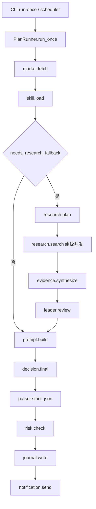

# 逐步业务链路 Eval 测评与可观测设计

## 1. 结论

上一版 Eval 设计的问题是：组件名完整，但没有把“当前业务链路每一步怎么评、怎么观测、失败怎么归因、人工怎么复核”拆开，所以看起来像一个旁路平台清单，不像可以落地的生产方案。

本轮结论：

```text
当前系统不是完全无法评估。
当前可以评最终输出、Parser、RiskGate、部分 trace 耗时和部分 LLM 交互。

但当前还不能做成熟 Eval。
原因是业务层缺少 DecisionRequest、FactsGate、StepSpec、EvidencePacket、FrozenInput、结构化 rule hit、query 级 span 和 eval case。
```

因此下一步不是直接堆 LLMJudge、UI、Langfuse/Phoenix，也不是继续扩大 agent-swarm，而是先把业务链路规范化到“每一步可冻结、可复跑、可评分、可人工复核”。

推荐顺序：

```text
P0 业务语义和观测补齐
  -> DecisionRequest / FactsGate / query 级 span / frozen input / structured rule hit

P1 旁路 RuleJudge Eval
  -> EvalCase / EvalStore / RuleJudge / report / side-effect guard

P2 LLMJudge + HumanReview
  -> grounding / 反向论证 / 数据缺口诚实度 / 执行清晰度 / 过度自信

P3 UI 和发布门禁
  -> Streamlit 查询页 / Review queue / release gate

P4 第三方导出
  -> Langfuse / Phoenix / LangSmith exporter，不作为首版强依赖
```

## 2. 公开实践调研结论

公开 LLM Eval / Observability 工具的共同结构基本一致：

| 来源 | 可借鉴点 | 对本项目的落地含义 |
|---|---|---|
| OpenAI Evals | eval 是 dataset 加 evaluator，可以写自定义 eval，也支持私有工作流数据 | 本项目必须先有 `EvalCase/FrozenInput`，不能只把 badcase 当标签 |
| LangSmith Evaluation | dataset -> evaluator -> experiment；evaluator 可以是人工、代码规则、LLM-as-judge、pairwise | 本项目应区分 RuleJudge、LLMJudge、HumanReview 和实验 run |
| Langfuse Evaluation | evaluator、score、dataset、experiment 是核心对象；LLM-as-judge 用 rubric 给 score | LLMJudge 需要固定 prompt version、score schema、evidence refs，不能只给主观评价 |
| Phoenix | tracing、datasets、experiments、LLM evals 用来比较 prompt/model/retrieval 变化 | 本项目要把 trace 和 eval case 关联，才能比较 baseline/candidate |
| OpenTelemetry GenAI 语义约定 | LLM 调用需要记录 provider、operation、model、token、request/response 等属性 | 本项目的 LLM span 需要补 token、成本、模型、prompt version、timeout、retry |

本项目不能直接照搬通用平台，因为交易提醒有领域硬边界：

- `search-derived` 永远不能替代 OKX `mark/index/order_book`。
- `manual_execution_required=true` 和禁止自动交易必须由代码强制，不能交给 LLMJudge。
- Eval 旁路不能发 Bark，不能写生产 `plan_runs`，不能实时拉行情后冒充当时输入。
- LLMJudge 不能评“能不能赚钱”，只能评证据支撑、风险表达、反证覆盖和过度自信。

## 3. 当前真实业务链路

当前入口是 `PlanRunner.run_once(symbol)`。它不是 ReAct，也不是真正独立多 agent；它是固定 pipeline，加 research 阶段的并发 search 和一次 leader 多角色总结。



当前已有：

- `traces`
- `trace_spans`
- `llm_interactions`
- `badcases`
- `trace-list`
- `trace-show`
- `record-badcase`

当前不足：

- `scheduler` 触发仍在 trace 里写 `run_type=manual`。
- `research.search` 只有组级 span，没有 query 级 span。
- `trace_events` 表存在，但几乎没有事件写入。
- `RiskGate` 输出是中文字符串，没有结构化 `rule_id`。
- `raw_decision` 仍在生产 `plan_runs.payload_json`。
- 没有 frozen input，无法严格 replay。
- 没有 eval case/store/judge/report/UI。

## 4. 业务架构是否必须先优化

答案：必须先做一层业务层规范化，否则 Eval 会出现假精确。

不是说现在完全不能评。现在能评：

- JSON schema 是否合规。
- `manual_execution_required` 是否为 `true`。
- `main_action` 是否在枚举里。
- 开仓动作是否缺 `entry_trigger/stop_price/invalidation`。
- 核心 OKX 执行行情缺失时是否被 RiskGate 阻断。
- confidence cap 是否被命中。
- 一次 run 大概耗时、是否有 LLM 调用记录。

但现在不能成熟评：

- 某个 search query 为什么慢、为什么失败。
- 哪个 reviewer 花了多少时间，因为当前 reviewer 不是独立 agent。
- 模型结论是否被当时证据支持，因为没有 frozen evidence refs。
- prompt 改动前后是否改善，因为没有 prompt version 和可复跑 frozen input。
- 数据缺口导致 `no trade` 是合理保守，还是模型偷懒。
- badcase 是否修复，因为 badcase 现在只是标签，不是可复跑用例。

所以 P0 先补下面几层：

| 缺口 | 影响 | P0 处理 |
|---|---|---|
| 无 `DecisionRequest` | 不知道本轮是手动、定时、什么周期、是否持仓 | 增加结构化 request，写入 trace metadata |
| 无显式 `FactsGate` | 只能从是否出现 research span 反推数据缺口 | 增加 facts gate span 和结果 |
| 无 `StepSpec/StepResult` | timeout/retry/fallback 分散，配置不一定生效 | 统一步骤契约和执行结果 |
| 无 query 级 span | search 黑盒，无法定位哪个 query 慢/错 | 每个 query 一个 child span |
| 无 `EvidencePacket` | 搜索证据和执行事实混在 snapshot 里 | 标记 source_type、quality、freshness、是否可满足执行事实 |
| 无 frozen input | candidate/baseline 不可比 | 生成脱敏 frozen artifact |
| 无结构化 rule hit | RuleJudge 只能解析中文 reason | RiskGate 输出 `rule_id/threshold/actual/input_ref` |

## 5. 每一步怎么观测、评测、复核

原则：

- 每一步都要可观测。
- 不是每一步都要 LLMJudge。
- 硬边界优先 RuleJudge。
- 语义质量才用 LLMJudge。
- 高风险、分歧、低置信样本进入 HumanReview。

| Step | 当前代码位置 | 必须观测 | RuleJudge | LLMJudge | 人工复核触发 |
|---|---|---|---|---|---|
| `request.build` | 目前缺失 | `request_id/run_type/symbol/horizon/position_state/user_query_summary` | symbol 在允许列表；run_type 正确；query 不含自动下单意图 | 不需要 | 用户持仓信息缺失但系统给明确平/开仓建议 |
| `config.preflight` | `config.py` | `config_hash/mode/provider/research_enabled/notification_enabled` | 禁止 `auto_order_enabled=true`；禁止 trade/withdraw env；prod 不用 fixture | 不需要 | 配置 hash 改变但未跑 eval |
| `market.fetch` | `market_data.py` | 每个 endpoint 的 duration/status/error/http_status/result_age/retry_count | `mark/index/order_book` 完整率；stale 阻断；opening action 前核心数据必须存在 | 不需要 | 核心行情缺失但下游仍给开仓/触发/反手 |
| `skill.load` | `skill_runtime.py` | skill hash、reference hash、script hash、缺失文件 | skill 名称正确；required references 齐全；manual-only 规则存在 | 不需要 | skill hash 变化、reference 缺失、script 缺失 |
| `facts.gate` | 目前缺失 | missing_core、stale_points、thresholds、进入 fallback 原因、confidence cap | 核心事实缺失必须触发 fallback 或 hard block | 不需要 | gate 结果和下游 action 冲突 |
| `research.plan` | `research.py` | planner、queries、fallback、error_type、retry_count、duration | query 数不超配置；覆盖 BTC anchor、OI/funding、清算/拥挤度、macro；不得给交易结论 | query 是否覆盖反向假设、关键数据缺口、时效需求 | planner 降级、query 偏题、漏关键风险域 |
| `research.search[*]` | `execute_research()`，需拆分 | query_name、provider、duration、status、result_count、source_urls、error_type、retry_count | required query 失败入 unavailable；search-derived 不得满足执行事实 | source quality、时效、snippet 是否支持 purpose | required query 无结果、来源时间不明、LLMJudge 低分 |
| `evidence.synthesize` | `research.py` | before/after snapshot diff、web point、cap_applied、data_gap | 缺 `mark/index/order_book` 必须加 cap；web 只能写 `web_*` | evidence-to-claim grounding | search 证据被提升为开仓依据 |
| `leader.review` compact | `research.py` | leader keys、duration、fallback、summary hash | 必须有 `leader_finalizer/bull/bear/data_quality/execution_risk` | 反向根因链、数据缺口诚实度、执行风险清晰度 | key 缺失、输出空泛、RuleJudge/LLMJudge 冲突 |
| `review.*` independent | 后续模式 | 每个 reviewer 独立 span、agent_name、token、cost、timeout、retry | reviewer 输出 schema | bull/bear/data_quality/execution_risk 单独评分 | reviewer 超时、互相矛盾、漏证据 |
| `prompt.build` | `skill_runtime.py` | prompt_version、prompt_input_hash、included_sections、badcase_included=false | 必含 skill hash、market snapshot、manual-only boundary；不得注入历史 badcase 当实时事实 | 抽样检查 compact prompt 是否漏关键约束 | prompt hash 变化、history contamination |
| `decision.final` | `skill_runtime.py` | model、endpoint、prompt_version、duration、timeout、retry、tokens、cost、finish_reason、input/output hash | 输出必须 strict JSON；不得暗示自动下单 | evidence grounding、overconfidence、no-trade 是否有依据 | opening action 证据弱、高置信但数据缺口大 |
| `parser.strict_json` | `plan_parser.py` | parse_status、error_type、field_errors | strict JSON、必填字段、数字类型、action enum、TTL、manual=true | 不需要 | parser fail 进入 high/critical badcase |
| `risk.check` | `risk.py` | `rule_hits[]`、allowed、threshold、actual、input_ref | manual-only、entry/stop/invalidation、核心行情、risk/leverage、cap、stale、auto_order | 风险解释是否清楚、不可用数据是否诚实 | Rule pass 但语义证据不足；high badcase 复发 |
| `journal.write` | `journal.py` | write_count、table、payload_hash、artifact_ref | prod run 写一次；eval run 写 prod journal 次数为 0；不保存 secret/raw payload | 不需要 | 覆盖写、缺写、泄露、eval 污染 |
| `notification.send` | `notifier.py` | attempt、status_code、duration、error、message_summary、trace_id | prod retry 不超配置；eval Bark delta=0 | 不需要 | eval 发送 Bark；通知失败无记录 |
| `outcome.feedback` | `record-outcome`/badcase | outcome、manual feedback、badcase category、severity | category 枚举合法；引用 trace/span/llm_id 合法 | badcase 归因摘要 | high/critical、用户明确指出误导 |

## 6. 重试和超时策略

全局原则：

- 不把整轮限制成 60 秒。交易研究和多 agent 审查允许 10-20 分钟。
- 限制的是单任务 timeout、任务组 deadline、整轮 total timeout。
- retry 只对临时性错误生效：timeout、连接错误、HTTP 429、HTTP 5xx。
- parser/schema/risk hard block 不重试，除非明确走一次 JSON 修复步骤。

建议配置：

| Step | timeout | retry | 失败策略 | 备注 |
|---|---:|---:|---|---|
| `request.build` | 5s | 0 | block | 本地逻辑不该重试 |
| `config.preflight` | 5s | 0 | block | 安全配置错误必须失败 |
| OKX endpoint | 8s | 1 | continue_with_unavailable | 每个 endpoint 单独记录 |
| `market.fetch` group | 25s | 0 | facts_gate_decides | 当前配置有字段，但代码还未真正 group deadline |
| `skill.load` | 5s | 0 | blocked_no_trade | skill 是规则来源，缺失不能继续 |
| `facts.gate` | 2s | 0 | block_or_fallback | 本地逻辑 |
| `research.plan` | 300s | 1 | fallback_static | 只重试 transport/5xx/429 |
| `research.search[*]` | 300s | 1 | continue_partial | required query 失败进 unavailable |
| `research.search` group | 600s | 0 | continue_partial | 超时要记录未完成 query |
| `evidence.synthesize` | 10s | 0 | blocked_no_trade | 本地逻辑 |
| `leader.review` compact | 300s | 1 | fallback_static | 失败不吞，写 fallback reason |
| `review.*` independent | 300s | 1 | mark_reviewer_missing | 后续模式 |
| `decision.final` | 900-1200s | 1 | blocked_no_trade | transport 可重试，schema 另走 parser |
| JSON repair | 120s | 1 | blocked_no_trade | 只允许修格式，不允许重写观点 |
| `parser.strict_json` | 5s | 0 | blocked_no_trade | 本地逻辑 |
| `risk.check` | 5s | 0 | allowed=false | 本地硬规则 |
| `journal.write` | 5s | 0 | fail_run | 持久化失败不能装成功 |
| `notification.send` | 8s | 1 | record_only | 不改变 plan/verdict |
| LLMJudge | 300s | 1 | judge_unavailable | 初期 advisory |
| HumanReview | 无自动超时 | 0 | pending | 人工状态机 |

建议整轮上限：

```yaml
workflow:
  total_timeout_seconds: 1800
  group_timeouts:
    market_fetch_seconds: 25
    research_total_seconds: 600
    review_total_seconds: 600
    decision_total_seconds: 1200
```

## 7. 可观测数据模型

### 7.1 Run 级

```text
trace_id
request_id
run_type: manual | scheduled | replay | eval
symbol
horizon
position_state
status
final_plan_id
final_action
allowed
created_at
ended_at
duration_ms
config_hash
skill_hash
prompt_version
risk_rule_version
```

### 7.2 Step / Span 级

```text
span_id
trace_id
parent_span_id
step_name
step_type
agent_name
started_at
ended_at
duration_ms
status
timeout_budget_ms
timed_out
retry_count
fallback_type
fallback_reason
failure_category
input_summary
output_summary
error_type
error_message
metadata
```

### 7.3 Retry 级

```text
attempt_index
max_attempts
retry_reason
backoff_ms
started_at
ended_at
duration_ms
status
error_type
```

### 7.4 LLM 调用级

```text
provider
model
endpoint
component
prompt_version
temperature
max_tokens
input_hash
output_hash
input_chars
output_chars
prompt_tokens
completion_tokens
total_tokens
cached_tokens
cost_usd
pricing_version
finish_reason
duration_ms
status
error_type
metadata
```

当前 `llm_interactions` 已有 hash、summary、request/response 脱敏存储，但还缺 token、cost、finish_reason、prompt_version 和未截断输入 hash。

### 7.5 Side-effect Guard

Eval run 必须记录：

```text
prod_plan_runs_delta
prod_notifications_delta
prod_manual_outcomes_delta
bark_sent
live_market_fetch
live_search
prod_journal_write
```

这些指标在 eval 中必须全为 0，除非命令显式允许某个实验项，并且默认禁止。

## 8. FrozenInput 和 EvalCase

成熟 Eval 的核心不是“重新搜最新数据”，而是冻结当时系统看到的数据。

### 8.1 FrozenInput

```json
{
  "source": {
    "trace_id": "...",
    "plan_id": "...",
    "badcase_id": 1
  },
  "versions": {
    "case_version": "v1",
    "config_hash": "...",
    "skill_hash": "...",
    "prompt_version": "...",
    "risk_rule_version": "...",
    "model": "..."
  },
  "request": {
    "run_type": "manual",
    "symbol": "ETH-USDT-SWAP",
    "horizon": "6h/12h/1d/3d",
    "position_state": "unknown",
    "user_query_summary": "..."
  },
  "input": {
    "market_snapshot": {},
    "facts_gate": {},
    "research_audit": {},
    "evidence_packets": [],
    "skill_summary": {}
  },
  "observed_output": {
    "parsed_plan": {},
    "risk_verdict": {},
    "analysis": {}
  },
  "expected": {
    "behavior_type": "risk_block",
    "behavior": "核心执行行情缺失时不得允许开仓动作"
  }
}
```

### 8.2 EvalCase

```text
case_id
dataset_name
source_trace_id
source_badcase_id
created_at
case_version
symbol
horizon
failure_category
severity
expected_behavior
expected_behavior_type
frozen_input_hash
frozen_input_ref
input_summary_json
metadata_json
status
```

`badcases.eval_dataset_name` 只能作为候选来源，不能替代 `eval_cases`。

## 9. RuleJudge 设计

RuleJudge 是首要硬门禁，负责确定性错误。

| Judge | 输入 | 判定 | Gate |
|---|---|---|---|
| `schema.strict_json` | raw/candidate output | strict JSON、字段、类型、action enum、TTL | hard |
| `manual_only.required` | parsed plan | `manual_execution_required=true`，无自动下单语义 | hard |
| `risk.opening_requirements` | parsed plan | opening action 必须有 entry/stop/invalidation | hard |
| `market.core_execution_points` | snapshot + action | opening action 必须有 OKX `mark/index/order_book` | hard |
| `market.stale_block` | snapshot + config | stale 时不得允许 opening action | hard |
| `confidence.cap` | snapshot + probability | probability 不得超过 cap | hard |
| `risk.limit` | plan + config | leverage/risk_pct 不超配置 | hard |
| `source.search_boundary` | evidence packets | search-derived 不得满足 execution fact | hard |
| `eval.side_effect` | prod DB before/after | eval 不得写 prod journal，不得发 Bark | hard |
| `artifact.secret_scan` | artifacts | 不含 key、Authorization、Bark key、raw_decision | hard |
| `prompt.history_contamination` | prompt packet | live prompt 不得注入历史 badcase 当市场事实 | hard |
| `language.zh_user_text` | plan text | 用户可见解释为简体中文 | advisory -> hard |

RuleJudge 输出：

```json
{
  "judge_name": "market.core_execution_points",
  "judge_type": "rule",
  "passed": false,
  "severity": "critical",
  "failure_category": "okx_core_missing_open_action",
  "reason_summary": "开仓动作缺少 OKX mark/index/order_book，必须阻断。",
  "evidence_refs": [
    "input.market_snapshot.points",
    "observed_output.parsed_plan.main_action"
  ],
  "needs_human_review": false
}
```

## 10. LLMJudge 设计

LLMJudge 纳入目标体系，但不能先于 frozen input 和 RuleJudge 成为硬门禁。

首批 5 个 LLMJudge：

| Judge | 评什么 | 不评什么 |
|---|---|---|
| `evidence_grounding` | 结论是否被 frozen evidence 支撑 | 不评收益 |
| `counter_thesis_coverage` | 是否解释最强反向根因链 | 不评多空输赢 |
| `data_gap_honesty` | 是否诚实表达缺失数据和不确定性 | 不替代 RuleJudge |
| `execution_clarity` | 触发价、止损、失效、复核时间是否清楚 | 不下单 |
| `overconfidence` | 数据不足时是否过度自信 | 不用主观偏好改 action |

LLMJudge 输出：

```json
{
  "judge_name": "evidence_grounding",
  "judge_type": "llm",
  "score": 0.42,
  "passed": false,
  "severity": "high",
  "failure_categories": ["grounding_error"],
  "reason_summary": "结论使用 search-derived 证据支持开仓，但 OKX 核心执行事实缺失。",
  "evidence_refs": [
    "input.evidence_packets[2]",
    "observed_output.parsed_plan"
  ],
  "confidence": 0.72,
  "needs_human_review": true
}
```

防黑盒要求：

- 固定 judge prompt version。
- 固定 model、temperature=0。
- strict JSON 输出。
- 必须给 `evidence_refs`。
- 不保存 hidden chain-of-thought。
- 保存 input/output hash、latency、token、cost。
- LLMJudge 初期只 advisory。
- 通过 human review 校准后，部分高一致性 judge 才能进入 conditional gate。

## 11. HumanReview 设计

HumanReview 不是让人看全部样本，而是看高价值样本。

进入人工复核的条件：

- RuleJudge critical fail。
- LLMJudge high/critical。
- LLMJudge confidence `< 0.65`。
- RuleJudge 和 LLMJudge 冲突。
- 用户手工标 high/critical badcase。
- high/critical badcase 准备进入 golden set。
- release gate 失败样本。

状态机：

```text
pending
  -> confirmed
  -> rejected
  -> needs_arbitration
needs_arbitration
  -> confirmed
  -> rejected
confirmed
  -> closed
rejected
  -> closed
```

人工复核页面必须展示：

- source trace 摘要。
- frozen input summary。
- step timeline。
- LLM interaction summary。
- RuleJudge / LLMJudge score。
- evidence refs。
- expected / actual。
- category、severity、comment。

## 12. Failure Taxonomy

固定枚举，禁止自由漂移。

| Category | 定义 | 自动判定 |
|---|---|---|
| `okx_core_missing_open_action` | 开仓/触发/反手缺 OKX `mark/index/order_book` | Rule hard |
| `stale_market_data_not_blocked` | 行情超时仍允许开仓 | Rule hard |
| `search_promoted_to_execution_fact` | web/search 替代执行事实 | Rule + LLM |
| `manual_only_violation` | 非人工执行或暗示自动下单 | Rule hard |
| `unsafe_entry_stop_plan` | opening action 缺 entry/stop/invalidation | Rule hard |
| `risk_limit_violation` | 杠杆或风险超过配置 | Rule hard |
| `confidence_cap_violation` | 数据缺口下胜率超过 cap | Rule hard |
| `overconfidence_with_gaps` | 缺关键数据仍高置信 | LLM + Human |
| `opposite_thesis_missing` | 反向根因链缺失或空泛 | LLM |
| `grounding_error` | 结论没有 frozen evidence 支撑 | LLM + Human |
| `source_freshness_unknown` | 来源无时间或明显过期 | Rule + LLM |
| `price_level_incoherent` | 多空方向、触发价、止损价逻辑错误 | Rule + Human |
| `planner_error` | research planner 漏关键域或输出交易结论 | Rule + LLM |
| `root_cause_shallow` | 根因链停留在标签，没有传导链 | LLM + Human |
| `model_or_tool_timeout` | LLM/search/OKX 超时造成证据缺口 | Rule advisory/hard |
| `eval_side_effect_violation` | eval 写生产表或发 Bark | Rule hard |
| `secret_or_raw_payload_leak` | artifact 泄露 secret 或 raw payload | Rule hard |
| `history_contamination` | live prompt 把历史 badcase 当市场事实 | Rule + Human |

## 13. Release Gate

首批 hard gate：

| 指标 | 阈值 |
|---|---:|
| eval 期间生产 `plan_runs` 新增/覆盖 | 0 |
| eval 期间生产 `notifications` 新增 | 0 |
| eval Bark 发送次数 | 0 |
| secret/raw payload scan 命中 | 0 |
| manual-only compliance | 100% |
| critical/golden schema valid rate | 100% |
| 全量 schema valid rate | >= 99% |
| opening action 核心 OKX 数据合规 | 100% |
| stale data opening block | 100% |
| high/critical badcase 复发 | 0 |
| eval case 可复跑覆盖率 | >= 95%，低于则本次 gate 无效 |

首批 advisory：

| 指标 | 阈值 |
|---|---:|
| p95 step latency | 不劣于 baseline 20%，除非导致 job timeout |
| token/cost | 不劣于 baseline 20% |
| LLMJudge evidence grounding | 只看趋势 |
| LLMJudge overconfidence fail rate | 只看趋势 |
| LLMJudge 与人工一致性 | 校准后 F1/kappa >= 0.75 才能进入 gate |

## 14. UI 设计边界

首版 UI 推荐 Streamlit，本地查看，不做复杂权限系统。

页面：

1. Overview
   - eval run 数量、通过率、critical/high fail、待人工复核。
2. Runs
   - dataset、candidate、baseline、case_count、pass rate、耗时、成本。
3. Cases
   - dataset、severity、category、status、source trace。
4. Step Timeline
   - 每步耗时、状态、retry、fallback、agent_name。
5. Scores
   - RuleJudge / LLMJudge 分数、原因、evidence refs。
6. Human Review
   - pending 样本、确认/驳回/仲裁、taxonomy、comment。
7. Reports
   - Markdown report 渲染，JSON artifact 下载。

UI 不直接散写 SQL，必须走 `eval/queries.py`：

```text
list_eval_runs(filters)
get_eval_run_detail(eval_run_id)
list_eval_cases(filters)
get_eval_case_detail(case_id)
list_eval_scores(eval_run_id, case_id=None)
list_human_reviews(status=None)
get_source_trace_summary(trace_id)
```

## 15. 第三方工具边界

首版不强依赖 Langfuse/Phoenix/LangSmith。

原因：

- 第三方平台不会自动理解本项目的交易硬边界。
- 当前真正缺的是 frozen input、业务证据语义、RuleJudge、旁路隔离。
- 直接接平台会让数据模型受外部 UI 牵引，反而掩盖业务问题。

后续作为 exporter：

```text
exporters/
  langfuse_exporter.py
  phoenix_exporter.py
  langsmith_exporter.py
  otlp_exporter.py
```

导出对象：

- trace
- span
- LLM interaction summary
- eval case
- eval score
- report summary

Exporter 失败不影响本地 eval。

## 16. 分阶段实施计划

### P0：业务语义和观测补齐

目标：让当前生产链路能被准确复盘。

内容：

- 新增 `DecisionRequest`。
- `PlanRunner.run_once()` 支持 run_type、horizon、position_state。
- 新增 `facts.gate` span。
- `research.search` 拆 query 级 span。
- 修复线程池里 LLM interaction 与 active trace/span 关联。
- 增加 `config_hash/prompt_version/risk_rule_version`。
- 增加 frozen input artifact。
- `RiskGate` 输出结构化 rule hit。
- `raw_decision` 默认降级为 hash + summary。

验收：

- 任意一次 run 能看到完整 step timeline。
- 每个 search query 都有独立耗时和错误。
- 能从 trace 生成 frozen input。
- Rule hit 有稳定 rule_id。

### P1：旁路 RuleJudge Eval

目标：先做确定性评测，不影响生产业务。

内容：

- 新增 `src/crypto_manual_alert/eval/`。
- 新增独立 eval SQLite。
- 新增 `EvalCaseBuilder`。
- 新增 `RuleJudge`。
- 新增 `eval run --mode cheap`。
- 新增 JSON/Markdown report。
- 增加 side-effect guard。

验收：

- 从 trace/badcase 创建 eval case。
- cheap eval 不调用 LLM、不拉实时行情、不发 Bark、不写生产 `plan_runs`。
- 生成报告并标出失败 case。

### P2：ReplayRunner + LLMJudge

目标：比较 baseline/candidate，并引入语义评测。

内容：

- frozen input replay。
- candidate decision engine。
- 5 个 LLMJudge。
- judge prompt version。
- LLMJudge score 写入 eval store。
- 分歧样本进入 HumanReview。

验收：

- 同一 frozen input 可重复评估。
- LLMJudge 输出 strict JSON。
- 每个 LLMJudge 有 evidence refs。
- token/cost/latency 可统计。

### P3：HumanReview + Streamlit UI + Release Gate

目标：不用手查 SQLite，形成可复核闭环。

内容：

- review queue。
- Streamlit 页面。
- report 浏览。
- release gate。
- golden cases。

验收：

- 人工能确认/驳回/仲裁。
- confirmed badcase 能进入 dataset。
- gate 能阻断有 critical regression 的 candidate。

### P4：第三方 Exporter

目标：本地体系稳定后，再对接外部观测平台。

内容：

- Langfuse exporter。
- Phoenix exporter。
- LangSmith exporter。
- OTLP exporter。

验收：

- exporter 失败不影响本地 eval。
- 导出数据不包含 secret/raw payload。

## 17. 多 Agent 对抗审查采纳

本轮启动了三个只读审查 agent：

| Agent | 角色 | 核心结论 | 采纳 |
|---|---|---|---|
| 业务链路拆解 | 按代码审查真实流程 | 当前能做有限评估，但没有成熟 eval；必须补 frozen input、facts gate、query span、rule hit | 已采纳到第 3-8 节 |
| Eval 指标设计 | 指标、LLMJudge、人工复核 | 每步都要可观测；硬边界走 RuleJudge；语义质量走 LLMJudge；release gate 分 hard/advisory | 已采纳到第 5-13 节 |
| 架构反方审查 | 防过度设计 | 不要先堆完整平台；先补业务语义，否则 eval 假精确 | 已采纳到第 4、15、16 节 |

对抗后修正：

- 不把 LLMJudge 作为 P0 hard dependency。
- 不把第三方平台作为首版强依赖。
- 不把当前 compact reviewer 伪装成独立 agent。
- 先做业务语义和 frozen input，再做 replay/LLMJudge/UI。

## 18. 不做事项

当前不做：

- 不做自动交易。
- 不让 eval 发送 Bark。
- 不让 eval 写生产 journal。
- 不把 badcase 注入实时 prompt。
- 不用历史会话结论污染 live decision。
- 不把 Langfuse/Phoenix/LangSmith 作为首版强依赖。
- 不让 LLMJudge 判断收益或替代 RiskGate。
- 不把所有约束都 YAML 化；安全硬边界继续代码强制。

## 19. 参考资料

- OpenAI Evals: https://github.com/openai/evals
- OpenAI Evals build guide: https://github.com/openai/evals/blob/main/docs/build-eval.md
- LangSmith Evaluation: https://docs.langchain.com/langsmith/evaluation
- LangSmith Evaluation concepts: https://docs.langchain.com/langsmith/evaluation-concepts
- Langfuse Evaluation overview: https://langfuse.com/docs/evaluation/overview
- Langfuse LLM-as-a-Judge: https://langfuse.com/docs/evaluation/evaluation-methods/llm-as-a-judge
- Phoenix LLM Evals: https://arize.com/docs/phoenix/evaluation/llm-evals
- Phoenix datasets: https://arize.com/docs/phoenix/datasets-and-experiments/concepts-datasets
- Phoenix tracing: https://arize.com/docs/phoenix/tracing/llm-traces
- OpenTelemetry GenAI semantic conventions: https://opentelemetry.io/docs/specs/semconv/gen-ai/

