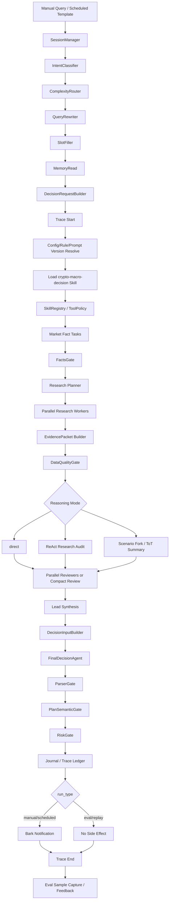

# 完整 Agent 业务流程与自进化评估架构设计

## 1. 结论

本项目不应重构成“高度自治交易 Agent”或自由聊天式 swarm。当前最合适的方向是：

```text
确定性业务状态机
  + 固定 crypto-macro-decision skill
  + 可配置但受控的 Agent 研究/审查层
  + 强制 Parser / Facts / PlanSemantic / Risk gates
  + 全链路 trace / frozen input / eval
  + 人工审批的 prompt / rule / workflow 改进闭环
```

一句话原则：

```text
Agent 负责提出可审查的判断，代码负责边界和门禁，Eval 决定候选能否升级，人决定能否进生产。
```

本设计替代 `16-Agent-Swarm重构与约束配置化设计.md`、`19-成熟Eval旁路测评体系设计.md`、`20-逐步业务链路Eval测评与可观测设计.md`、`21-业务层重构整改方案与架构设计.md` 中互相重叠的方向，作为下一阶段重构总纲。旧文档保留为历史依据和细节参考。

核心判断：

- 交易建议涉及真实资金风险，实时链路必须可回放、可审计、可回滚。
- 自我进化只能是“候选生成 -> 离线评估 -> 人工审批 -> 影子运行 -> 灰度发布 -> 可回滚”，不能在线自改生产。
- 历史结论、badcase、旧行情、旧 ETF 流、旧资金费率、旧新闻不能作为实时市场事实回灌。
- CoT 不作为前端展示物或持久化物；系统只保存结构化摘要、证据引用、根因链、反方链、场景树结论和 gate 命中。
- 不做自动交易，不注册下单/撤单/提现工具，不让前端或 prompt 绕过 hard safety rule。

## 2. 外部方案调研结论

### 2.1 可借鉴但不盲目照搬

| 方案 | 借鉴点 | 本项目落地方式 |
|---|---|---|
| LangGraph | 长运行有状态 workflow、持久化、human-in-the-loop、memory、debug | 借鉴节点化状态机、checkpoint、人工中断点。首版可轻量自研；当分支和恢复复杂到自研难维护时再引入 |
| OpenAI Agents SDK | tools、handoffs、guardrails、tracing、agent workflow eval | 借鉴工具白名单、guardrail、trace span、结构化输出；模型节点不拥有生产控制权 |
| Langfuse | trace、prompt management、datasets、experiments、LLM-as-judge、人工标注 | 后置 exporter 或可选平台；首版先做本地 Trace/Eval 工作台 |
| Phoenix | OpenTelemetry trace、eval、prompt 版本、datasets/experiments、span replay | 后置 exporter；适合后续调试和实验对比 |
| LangSmith | dataset、evaluator、experiment、online/offline eval、human/code/LLM judge | 如果未来选择 LangGraph/LangChain 深绑定，可接入；当前不强依赖 |
| OpenAI Evals / 自建 harness | 私有 eval、dataset、grader、回归门禁 | 采用思想：FrozenInput + RuleJudge + LLMJudge + HumanReview + ReleaseGate |
| DSPy | metrics + optimizers + few-shot/prompt optimization | 只在 eval dataset 和指标稳定后做离线优化；首阶段不进生产链路 |
| ReAct | 受控的“需要什么信息 -> 调工具 -> 观察 -> 再判断” | 只用于 research/tool 步骤，必须有限步、工具白名单、超时预算 |
| Tree-of-Thought / Scenario Fork | 多路径事件推演、反方链、重大事件前场景树 | 用于 deep_research / event_compression 模式；输出结构化分支，不保存隐藏思维链 |
| Reflexion / Self-Refine | 从失败样本生成改进提案和候选 patch | 仅用于离线 candidate 生成，不能直接修改生产 prompt/rule |

依据：

- LangGraph 官方文档强调低层编排、durable execution、human-in-the-loop、persistence 和 memory。
- OpenAI Agents SDK 文档将 agents、tools、guardrails、tracing、workflow eval 作为核心能力。
- Langfuse / Phoenix / LangSmith 都把 trace、dataset、experiment、code evaluator、LLM-as-judge、human review 放在评估闭环中。
- ReAct 论文强调推理与行动交错，行动用于访问外部信息源；Tree of Thoughts 论文强调多路径探索和评估；Reflexion / Self-Refine 更适合作为离线改进机制。

### 2.2 不建议作为首版核心依赖

| 方案 | 不直接引入原因 |
|---|---|
| 完整 LangGraph 平台化重写 | 现在真实缺口是业务语义、证据隔离、gates、trace/eval，不是缺一个大框架 |
| AutoGen 自由 swarm | 多 agent 对话容易流程漂移、成本膨胀、难回放，不适合作为交易提醒主链路 |
| CrewAI 角色扮演式 crews | 可借鉴 flow/crew 思想，但本项目核心是事实门禁和风控，不是角色协作表演 |
| Langfuse/Phoenix/LangSmith 作为首版强依赖 | 外部平台不能替代本项目的交易语义和 hard safety rule；先做本地 ledger，再 exporter |
| DSPy 自动优化生产 prompt | 没有稳定 dataset/metric 时会过拟合 badcase 或短期行情噪声 |

## 3. 目标业务能力

### 3.1 入口能力

系统必须同时支持：

- 手动 query：用户直接输入“我现在持有 ETH 多单，6h/12h/1d/3d 怎么操作”。
- 定时 query：配置好的模板按固定频率或事件窗口触发。
- 复盘 query：对某次 trace、某个 badcase、某个时间段做审查。
- eval query：对 FrozenInput 或 dataset 做回归，不触发 Bark。
- system query：查看配置、运行状态、最近失败、成本和延迟。

所有入口统一转换为 `DecisionRequest`，不能继续只传 `symbol`。

### 3.2 意图分类

首版意图枚举：

```text
live_trade_decision       当前是否多/空/平/触发
position_management       已有仓位的持有、止损、止盈、反手
market_research           不要求操作，只要研究
postmortem                复盘某次判断
config_change             修改定时、模型、通知、规则候选
eval_review               查看评估、badcase、候选版本
system_status             系统运行状态
unknown                   需要澄清
```

意图识别失败时不能臆测为交易建议。对资金相关 query，无法识别就要求澄清或按最保守 `market_research` 处理。

### 3.3 复杂度路由

| 等级 | 触发场景 | 处理方式 |
|---|---|---|
| `simple_fast` | 普通手动提醒、无重大事件、无持仓或低风险持仓 | 核心事实包 + lightweight research + compact review |
| `standard` | 有仓位、杠杆、明确止损止盈、普通定时任务 | 强制 derivatives fact pack + coverage research + compact review |
| `deep_research` | CPI/FOMC/NFP、ETF 异常、地缘冲突、暴涨暴跌、用户要求多 agent 根因链 | 完整 coverage + scenario fork + independent reviewers |
| `eval_replay` | frozen input / badcase / candidate 对比 | 禁止实时 Bark，默认禁止实时行情和 web search |
| `blocked_clarify` | 关键槽位缺失且无法安全默认 | 问用户或输出无法给操作建议的缺失项 |

### 3.4 槽位

必备槽位：

```text
request_id
session_id
run_type: manual | scheduled | eval | replay | postmortem
intent
complexity
symbol
instrument
horizon
position.side: long | short | flat | unknown
position.entry_price
position.size
position.leverage
risk_mode: conservative | normal | aggressive
manual_only: true
alert_channel
query_text
normalized_query
```

缺失策略：

- `symbol` 缺失：默认 BTC，但必须在输出中声明默认假设。
- `horizon` 缺失：默认 `now + next_review`，不输出长期价格承诺。
- `position.side` 缺失：按 unknown，不允许轻易输出 `hold/close/flip`。
- `entry_price/leverage` 缺失：可以输出方向/触发提醒，但必须降置信，不能建议重仓。
- `mark/index/order_book` 缺失：开仓/反手类动作 hard block。

## 4. 目标端到端流程

### 4.1 总流程图



### 4.2 串行控制骨架

以下步骤必须串行：

1. Session 建立。
2. 意图识别。
3. 复杂度路由。
4. Query 改写。
5. 槽位补全。
6. `DecisionRequest` 构建。
7. Config / rule / prompt / model / skill 版本锁定。
8. FactsGate。
9. Lead 汇总。
10. FinalDecision。
11. ParserGate。
12. PlanSemanticGate。
13. RiskGate。
14. Journal 写入。
15. Bark 推送。

原因：这些步骤决定上下文、版本、输入、输出和副作用顺序，任何并发乱序都会破坏可回放性。

### 4.3 并发内核

可以并发的部分：

| 并发组 | worker | 输出 |
|---|---|---|
| Memory read | session memory、user preference、最近未完成澄清、event memory | `MemoryPacket` |
| Market facts | mark/index/order_book、1h/4h candles、funding/OI、long-short、basis、options、ETF/stablecoin/macro | `EvidencePacket[]` |
| Research | macro、derivatives、flows/events、technical guardrail、relative strength、breaking news | `ResearchContribution[]` |
| Review | bull、bear、data-quality、execution-risk | `ReviewContribution[]` |
| Async eval | trace scoring、latency/cost aggregation、candidate comparison | `EvalRecord` |

并发规则：

- 每个 worker 必须有独立 span、timeout、retry、fallback_reason。
- group 必须有 deadline，不能无限等。
- required worker 失败会触发 hard block 或 confidence cap。
- optional worker 失败只能写 unavailable，不能静默吞掉。
- 并发 worker 不得直接写 final decision、risk verdict、notification。

## 5. 记忆设计

### 5.1 短期记忆

短期记忆按 `session_id` 组织，用于当前会话：

```text
当前 query
用户最近澄清
当前持仓声明
当前风险偏好
最近一次系统输出摘要
未解决槽位
临时事件窗口
```

短期记忆只能辅助理解用户问题，不得把上一轮市场结论当成当前事实。

### 5.2 长期记忆

长期记忆分四类：

| 类型 | 内容 | 是否可进入 live decision |
|---|---|---|
| `user_profile_memory` | 通知渠道、默认风险偏好、常看资产、默认周期 | 可作为偏好进入 |
| `strategy_config_memory` | 当前已发布 prompt/rule/workflow/model 版本 | 可作为版本引用进入 |
| `process_lessons` | 稳定流程教训，例如 ETF flows 看 total，不只看单基金 | 可作为检查清单进入 |
| `event_memory` | 活跃事件池，带 TTL、source、last_verified_at | 只有刷新验证后可作为事实 |
| `badcase_memory` | 失败案例、误判类型、修复状态、eval case | 不进入 live prompt，只进入 eval/改进 |

硬规则：

```text
历史结论不能成为实时市场事实。
历史价格、资金费率、OI、ETF 流、新闻状态、旧胜率不能默认回灌。
badcase 只能生成 eval case 或改进候选，不能作为 live few-shot 直接注入。
```

## 6. Skill 与工具架构

### 6.1 固定 Skill

首版只加载：

```text
crypto-macro-decision
```

它提供交易动作枚举、事实门禁、根因链格式、反方链要求、数据源优先级和输出模板。系统不做任意 skill 动态发现。

### 6.2 SkillRegistry

`SkillRegistry` 只注册白名单工具：

```text
okx_public_snapshot
okx_derivatives_snapshot
responses_web_search
duckduckgo_html_search
strict_json_parser
risk_check
bark_notify
```

禁止注册：

```text
okx_place_order
okx_cancel_order
okx_withdraw
trade_api_key_reader
withdraw_api_key_reader
```

### 6.3 ToolPolicy

每个工具必须声明：

```text
tool_id
allowed_agents
input_schema
output_schema
timeout_seconds
retry_count
failure_policy
can_access_network
can_access_secret
can_write_state
side_effect_level: none | journal | notification | forbidden
```

工具返回必须转成 `EvidencePacket` 或 `ToolResult`，不能让原始网页片段和交易所响应直接进入最终 prompt。

## 7. 推理策略层

### 7.1 原则

系统需要支持多种推理策略，但必须把“策略”做成可版本化、可评估、可回滚的 `reasoning_mode`，不能散落在 prompt 里。

```yaml
reasoning:
  mode: direct | react_research | scenario_fork | adversarial_review
  expose_hidden_cot: false
  persist_hidden_cot: false
```

### 7.2 各模式使用边界

| 模式 | 使用场景 | 保存内容 |
|---|---|---|
| `direct` | 普通快速提醒 | 决策摘要、证据引用、反方链摘要 |
| `react_research` | 需要工具逐步补证据 | tool plan、tool call、observation summary、missing facts |
| `scenario_fork` | 重大事件、路径不确定、用户要求大胆预测但要有根因 | base/upside/downside、触发条件、失效条件、概率上限 |
| `adversarial_review` | 用户要求多 agent 或高风险开仓/反手 | bull/bear/data-quality/execution-risk contribution |

### 7.3 不保存隐藏思维链

可以保存：

```text
root_cause_chain
scenario_tree_summary
evidence_to_claim_map
counter_thesis
decision_ladder
confidence_cap_reason
gate_rule_hits
```

不保存：

```text
hidden chain-of-thought
reasoning tokens
完整原始 prompt/completion 默认明文
API key / Bark key / exchange key
```

## 8. 决策与门禁

### 8.1 FinalDecisionAgent

FinalDecisionAgent 只消费 `DecisionInput`：

```text
DecisionRequest
EvidencePacket[]
FactsGateResult
ResearchContribution[]
ReviewContribution[]
AllowedActions
HardBlocks
PromptVersion
RuleVersion
SkillHash
```

它不能调用工具，不能发通知，不能修改 RiskVerdict。

### 8.2 Action Enum

主动作必须且只能是：

```text
open long
open short
hold long
hold short
close long
close short
flip long to short
flip short to long
trigger long
trigger short
no trade
```

禁止把多个动作拼在一个 `main_action` 里。

### 8.3 Gates

| Gate | 职责 | 失败结果 |
|---|---|---|
| FactsGate | 检查 mark/index/order_book、funding/OI、stale、source quality、confidence cap | 缺核心执行事实时阻断开仓/反手 |
| ParserGate | strict JSON、字段类型、action enum、manual_execution_required | 格式修复一次；仍失败则 blocked no trade |
| PlanSemanticGate | 多空价格关系、target 顺序、action-position、TTL-horizon、RR、mark deviation | 明显错误 hard block；低质量 advisory/cap |
| RiskGate | manual-only、风险限额、缺 entry/stop/invalidation、核心事实缺失、置信度上限 | 不允许推送 actionable opening plan |
| SideEffectGate | eval/replay 不发 Bark、不写生产 plan_runs、不拉实时行情 | 违规直接失败 |

## 9. 前端工作台

### 9.1 首版定位

首版不要做 LLMOps 大平台，只做本地/内网轻量工作台，围绕三件事闭环：

```text
看运行链路
跑 eval 回归
审批候选发布
```

### 9.2 页面

1. 总览
   - 手动 query 入口。
   - 定时任务状态。
   - 最近 Bark 状态。
   - 今日运行次数、blocked 次数、失败数、p95 耗时、成本。
   - 最新建议卡片。

2. Runs / Trace
   - run 列表：manual / scheduled / eval / replay。
   - 时间线：request、intent、market.fetch、facts.gate、research、review、decision、parser、semantic、risk、notification。
   - 每步显示 status、duration、retry、fallback、error、input/output summary。
   - LLM 默认只显示摘要、hash、model、prompt version、tokens、cost。

3. Config / Candidates
   - 当前生效版本：config hash、prompt version、rule version、workflow version、skill hash。
   - 低风险配置可直接修改。
   - 高风险配置只能创建 candidate，必须 eval/审批后发布。

4. Eval Runs
   - baseline vs candidate。
   - pass rate、critical/high fail、新增失败、已修复、golden set 复发。
   - p50/p95、token、cost、LLMJudge 成本。
   - release gate：可发布 / 不建议发布 / 需要人工复核。

5. Case / Evidence
   - dataset、severity、category、status 过滤。
   - frozen input、expected、actual、RuleJudge、LLMJudge、证据引用。
   - search-derived 与 exchange-native 必须分开展示。

6. HumanReview / Release
   - pending / confirmed / rejected / needs_arbitration / closed。
   - 操作：确认、驳回、仲裁、加入 golden set、提交改进建议。
   - 发布审批展示 candidate diff、eval report、失败样本、成本变化、审批记录。

### 9.3 配置分级

| 级别 | 示例 | 前端权限 |
|---|---|---|
| L0 | 展示偏好、过滤条件 | 直接修改 |
| L1 | 定时任务启停、symbol、horizon、interval、通知降噪 | 修改并记录审计 |
| L2 | 用户风险偏好、最大提醒强度、review 抽样率 | 需要确认和版本记录 |
| L3 | prompt、judge rubric、risk rule、confidence cap、workflow step、timeout/retry、model 参数 | 只能创建 candidate，必须 eval/审批 |
| L4 | 自动交易、secret、trade/withdraw key、hard safety rule | 当前阶段禁止 |

## 10. Eval 与自我改进闭环

### 10.1 Eval 分层

| 层级 | 目标 | 方式 |
|---|---|---|
| Contract Eval | schema、action enum、字段完整、中文输出 | RuleJudge |
| Safety Eval | manual-only、缺核心行情阻断、stale 阻断、secret/raw payload scan | RuleJudge |
| Business Replay | badcase/golden frozen input 回放 | ReplayRunner + RuleJudge + LLMJudge |
| Grounding Eval | 证据是否支撑结论、反方链是否覆盖、数据缺口是否诚实 | LLMJudge + HumanReview |
| Retrieval Eval | source freshness、source priority、引用质量、search-derived 边界 | RuleJudge + LLMJudge |
| Online Monitor | 线上 trace 抽样评分、耗时、成本、失败归因 | 异步 eval，不影响推送 |

### 10.2 FrozenInput

每个可回放样本必须冻结：

```text
request
session_summary
config_hash
prompt_version
rule_version
skill_hash
model_version
market_snapshot
evidence_packets
research_contributions
review_contributions
facts_gate_result
decision_input
observed_output
risk_verdict
```

禁止在 replay 中重新拉最新行情后声称可复现。需要“线上评估最新行情”时，应创建新的 scheduled online eval run，不混入历史 replay。

### 10.3 自我改进闭环

正确闭环：

```text
Production Trace
  -> Badcase / Feedback 标注
  -> 归因分类
  -> Candidate Prompt/Rule/Workflow 生成
  -> HumanReview
  -> 加入 Eval Dataset
  -> Offline Experiment
  -> Baseline vs Candidate
  -> ReleaseGate
  -> 人工审批
  -> Shadow Run
  -> 灰度发布
  -> 监控与回滚
```

禁止闭环：

```text
线上出错
  -> Agent 自己修改 prompt/rule/skill
  -> 直接影响下一次生产提醒
```

### 10.4 LLMJudge 边界

LLMJudge 可以评：

- evidence grounding。
- counter thesis coverage。
- data gap honesty。
- execution clarity。
- overconfidence。
- source freshness explanation。

LLMJudge 不能评：

- 这笔交易能不能赚钱。
- 是否允许开仓。
- 是否绕过 RiskGate。
- 是否自动发布 candidate。

LLMJudge 初期只做 advisory。只有在与 HumanReview 校准稳定后，部分高一致性指标才可进入 release gate。

## 11. 调度与通知

### 11.1 定时任务

定时 query 模板：

```yaml
scheduled_queries:
  - id: eth_standard
    enabled: true
    symbol: ETH-USDT-SWAP
    interval_seconds: 1800
    horizon: "6h/12h/1d/3d"
    complexity: standard
    query_template: "基于当前最新事实，评估 ETH-USDT-SWAP 手动操作计划"
```

频率建议：

- 普通巡检：30-60 分钟。
- 高波动窗口：10-15 分钟，但只允许触发/风险提醒。
- CPI/FOMC/NFP 前后：事件前 2-4 小时、公布后 5-15 分钟、稳定后复核。
- 深度研究：按需或每日固定，不与快速提醒抢资源。

### 11.2 Bark 推送

Bark 只发送最终人工提醒，不发送原始 LLM 文本。

推送必须包含：

```text
Main action
Trigger / Entry
Stop / Invalidation
T1 / T2
Confidence / Confidence cap
Why / Why not opposite
Next review
Trace id
Manual execution required
```

eval/replay 永远不发 Bark。

## 12. 错误、重试与超时

### 12.1 全局原则

- 不把整轮限制为 60 秒。
- 快速链路和深度研究链路分开。
- 限制单任务 timeout、任务组 deadline、整轮 total timeout。
- 网络类错误可 retry；parser/risk hard block 不 retry。
- 超时必须写 trace，不能静默变成 no trade。

### 12.2 推荐默认值

| 步骤 | timeout | retry | 失败策略 |
|---|---:|---:|---|
| intent.classify | 10s | 1 | unknown -> clarify |
| query.rewrite | 20s | 1 | 使用原 query 并标低置信 |
| market.fetch endpoint | 8s | 1 | unavailable |
| market.fetch group | 30s | 0 | facts_gate_decides |
| skill.load | 5s | 0 | block |
| research.plan | 180s | 1 | fallback_static |
| research.search[*] | 180s | 1 | continue_partial |
| research group | 600s | 0 | continue_partial |
| reviewer compact | 300s | 1 | fallback_static |
| reviewer independent[*] | 300s | 1 | mark_missing |
| final.decision | 900-1200s | 1 | blocked_no_trade |
| parser.repair | 120s | 1 | blocked_no_trade |
| gates | 5s | 0 | hard/advisory |
| notification.send | 8s | 2 | record_only |

整轮：

```yaml
workflow:
  fast_total_timeout_seconds: 300
  standard_total_timeout_seconds: 900
  deep_total_timeout_seconds: 1800
```

## 13. 数据模型草案

### 13.1 DecisionRequest

```text
request_id
session_id
run_type
intent
complexity
symbol
instrument
horizon
position
risk_mode
query_text
normalized_query
created_at
source
```

### 13.2 DecisionRunContext

```text
trace_id
request
config_version
prompt_version
rule_version
skill_hash
memory_packet
market_snapshot
evidence_packets
facts_gate_result
research_contributions
review_contributions
reasoning_artifacts
decision_input
raw_decision_hash
parsed_plan
semantic_verdict
risk_verdict
notification_result
events
```

### 13.3 EvidencePacket

```text
evidence_id
name
value
source_type: exchange_native | skill_script | web_search | fixture | inferred
source_url
published_at
fetched_at
freshness_seconds
quality
status
can_satisfy_execution_fact
claims
conflicts
confidence_cap
unavailable_reason
```

### 13.4 ReviewContribution

```text
reviewer
stance: bull | bear | data_quality | execution_risk
summary
claims
evidence_refs
counter_evidence_refs
confidence_effect
missing_facts
recommended_caps
status
duration_ms
```

## 14. 目标代码分层

建议目录：

```text
src/crypto_manual_alert/
  app/
    cli.py
    scheduler.py
    web.py

  context/
    request.py
    session.py
    memory.py
    run_context.py

  workflow/
    decision_workflow.py
    steps.py
    executor.py
    result.py

  skills/
    loader.py
    registry.py
    tool_policy.py

  tools/
    okx_public.py
    web_search.py
    llm_client.py
    bark.py

  agents/
    intent_classifier.py
    query_rewriter.py
    research_planner.py
    reviewers.py
    lead_synthesizer.py
    final_decision.py

  gates/
    facts_gate.py
    parser_gate.py
    plan_semantic_gate.py
    risk_gate.py
    side_effect_gate.py

  models/
    evidence.py
    decision.py
    review.py
    rule_hit.py
    frozen_input.py

  eval/
    cases.py
    frozen_input.py
    rule_judges.py
    llm_judges.py
    replay.py
    report.py
    release_gate.py

  ui/
    streamlit_app.py
    queries.py
```

兼容原则：

- `PlanRunner` 保留为 legacy facade。
- 旧 CLI/scheduler 入口不立即删除。
- `research.py`、`skill_runtime.py` 可先变 re-export facade。
- DB migration 只做 additive。
- 新 workflow 先 shadow/advisory，再逐步 active。

## 15. 分阶段实施计划

### P0：冻结目标与基线

目标：

- 本文档确认后再编码。
- 补 ADR：目标/非目标、硬边界、legacy facade、FrozenInput、RuleHit taxonomy、快速/深度链路、eval side effect。
- 固化当前 baseline test 和当前 pipeline 行为。

验收：

- 有明确开发顺序和回滚策略。
- 不再继续边写边改架构方向。

### P1：DecisionRequest / Session / Memory 最小闭环

内容：

- 引入 `DecisionRequest`。
- 手动 query 和 scheduled query 统一入口。
- session_id、短期记忆、长期记忆引用。
- run_type 正确写 trace。

验收：

- 已有 `PlanRunner.run_once(symbol)` 仍可用。
- 未知持仓不允许轻易输出 hold/close/flip。

### P2：EvidencePacket / FactsGate / RuleHit

内容：

- 事实和证据分离。
- exchange-native 与 search-derived 分离。
- FactsGate 显式输出。
- RiskGate 输出结构化 `rule_hits`。

验收：

- search-derived 不能满足 mark/index/order_book。
- 开仓缺核心执行事实 100% 阻断。

### P3：Workflow / StepSpec / 并发 research

内容：

- 建立 `DecisionWorkflow`。
- StepSpec 统一 timeout/retry/failure policy。
- research query 级 span。
- coverage research 不再只是 fallback。

验收：

- 每个 research query 有独立 span。
- worker 超时有 unavailable 和 confidence cap。

### P4：DecisionInputBuilder / PlanSemanticGate

内容：

- final decision 只消费结构化 packet。
- 新增 PlanSemanticGate。
- 反方链和根因链结构化。

验收：

- 多空价格关系、action-position、TTL-horizon、target 顺序可被检查。
- 反方链空泛时触发 cap/advisory。

### P5：前端工作台首版

内容：

- 总览、Runs/Trace、Eval Runs、Cases/Evidence、Config/Candidates、HumanReview/Release。
- 首版可用 Streamlit 或轻量内网 Web；查询层与 UI 分离。

验收：

- 不用手查 SQLite。
- 能看 trace、gate、evidence refs、candidate eval。

### P6：Eval / Replay / ReleaseGate

内容：

- FrozenInput。
- EvalCase。
- RuleJudge。
- ReplayRunner。
- LLMJudge advisory。
- HumanReview。
- ReleaseGate。

验收：

- eval 不发 Bark。
- eval 不写生产 plan_runs。
- baseline/candidate 可比较。

### P7：自我改进候选生成

内容：

- 从 badcase 和 eval 失败中生成候选 prompt/rule/workflow patch。
- candidate 必须 human review。
- candidate 必须跑 offline eval 和 shadow run。

验收：

- Agent 不能直接改生产。
- 每个候选有 diff、原因、指标、回滚方式。

### P8：可选外部平台与优化

内容：

- Langfuse/Phoenix/LangSmith exporter。
- DSPy 离线 prompt optimization。
- LangGraph 引入评估。

触发条件：

- 本地 trace/eval 数据模型稳定。
- 自研 workflow 分支和恢复已成为维护瓶颈。
- dataset 和 metrics 足够稳定。

## 16. 多 Agent 对抗审查采纳

本轮启动四个独立审查视角：

| Agent | 核心结论 | 采纳 |
|---|---|---|
| 开源/前沿架构审查 | 方向是确定性状态机 + 可配置审查层 + 强风控门禁 + trace/eval + 人工发布；借鉴 LangGraph/Agents SDK/Langfuse/Phoenix/OpenAI Evals/ReAct/ToT/Reflexion，但不做高度自治交易 Agent | 采纳到第 2、7、10、15 节 |
| 业务流程架构审查 | “串行控制骨架 + 并发研究/审查内核”；session、意图、槽位、leader、gates、Bark 必须串行；facts/research/review/eval 可并发 | 采纳到第 4、11、12 节 |
| 风控红队审查 | 自我进化只能离线辅助治理；前端配置不能直接影响生产；LLMJudge 不能进 hard gate；历史结论不能污染 live decision | 采纳到第 1、5、8、10、15 节 |
| 前端/eval 工作台审查 | 首版只做轻量工作台：看链路、跑 eval、审批候选发布；页面 5-6 个入口，不做重型平台 | 采纳到第 9、10、15 节 |

对抗后修正：

- 不把“自我进化”写成在线自动升级。
- 不把 LLMJudge 写成生产 hard gate。
- 不把前端配置直接连生产 prompt/rule。
- 不把外部 LLMOps 平台作为首版强依赖。
- 不让历史 badcase 注入实时 prompt。
- 把快速提醒和深度研究分开，避免研究越深越过时。

## 17. 禁止事项

当前阶段明确禁止：

- 自动下单。
- 注册交易、撤单、提现工具。
- eval/replay 发 Bark。
- eval/replay 写生产 `plan_runs`。
- badcase 或历史 journal 回灌 live prompt。
- LLM 自动修改生产 prompt/rule/skill。
- LLMJudge 替代 RiskGate。
- 前端直接修改 L3/L4 配置并立即生效。
- 保存隐藏思维链。
- secret 进入 prompt、trace、UI、eval artifact。
- 用一个“AI 准确率”包装未经校准的能力。

## 18. 当前最终架构图

```mermaid
flowchart LR
    subgraph Input[输入层]
      Q1[手动 Query]
      Q2[定时 Query]
      Q3[复盘/Eval Query]
    end

    subgraph Control[串行控制骨架]
      S1[Session]
      S2[Intent]
      S3[Complexity]
      S4[Rewrite/Slots]
      S5[DecisionRequest]
      S6[Version Lock]
    end

    subgraph Work[并发工作层]
      M1[Memory Read]
      F1[Market Facts]
      R1[Research Workers]
      V1[Reviewers]
    end

    subgraph Decision[决策层]
      G1[FactsGate]
      L1[Lead Synthesis]
      D1[DecisionInputBuilder]
      D2[FinalDecisionAgent]
      G2[ParserGate]
      G3[PlanSemanticGate]
      G4[RiskGate]
    end

    subgraph Output[输出层]
      J1[Journal/Trace]
      B1[Bark Manual Alert]
      E1[Eval/FrozenInput]
    end

    subgraph Improve[改进闭环]
      C1[Badcase]
      C2[Candidate]
      C3[Offline Eval]
      C4[Human Approval]
      C5[Shadow/Grey Release]
    end

    Q1 --> S1
    Q2 --> S1
    Q3 --> S1
    S1 --> S2 --> S3 --> S4 --> S5 --> S6
    S6 --> M1
    S6 --> F1
    F1 --> G1
    G1 --> R1
    M1 --> D1
    R1 --> V1
    V1 --> L1
    G1 --> L1
    L1 --> D1 --> D2 --> G2 --> G3 --> G4 --> J1
    J1 --> B1
    J1 --> E1
    E1 --> C1 --> C2 --> C3 --> C4 --> C5
    C5 --> S6
```



## 19. 参考资料

- LangGraph overview: https://docs.langchain.com/oss/python/langgraph/overview
- OpenAI Agents SDK: https://developers.openai.com/api/docs/guides/agents
- Langfuse Evaluation Overview: https://langfuse.com/docs/evaluation/overview
- Phoenix overview: https://arize.com/docs/phoenix
- LangSmith Evaluation: https://docs.langchain.com/langsmith/evaluation
- DSPy documentation: https://dspy.ai/
- ReAct paper: https://arxiv.org/abs/2210.03629
- Tree of Thoughts paper: https://arxiv.org/abs/2305.10601
- Reflexion paper: https://arxiv.org/abs/2303.11366
- Self-Refine paper: https://arxiv.org/abs/2303.17651
