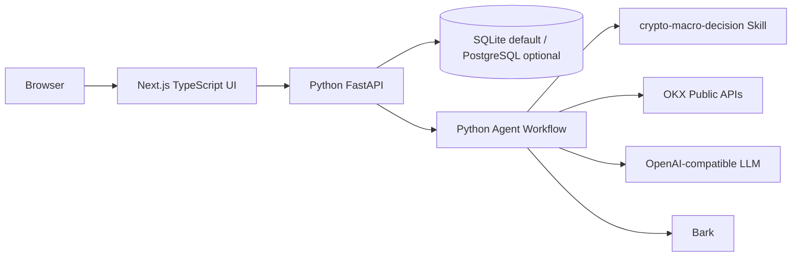

# TypeScript 与 Python 落地技术栈方案

## 1. 结论

本项目后续落地采用：

```text
TypeScript / Next.js
  -> 前端工作台、配置页面、Trace/Eval 可视化、候选审批

Python / FastAPI
  -> Agent workflow、skill 调用、行情检索、LLM 调用、Eval/Replay、Bark 推送

SQLite 默认
  -> 本地和个人服务器直接可用

PostgreSQL 可选
  -> 仅当服务器已有 PG，或后续确实需要更强并发和查询能力时启用
```

首版不引入额外中间件：

```text
不引入 Redis
不引入消息队列
不引入 Temporal
不引入独立 TypeScript BFF
不引入 Langfuse/Phoenix/LangSmith 服务端
不引入向量库
```

原因：

- 当前系统是个人使用的手动交易提醒，不是多租户 SaaS。
- 不涉及向量检索，没有必要引入向量库。
- 定时任务、异步执行、Trace/Eval 都可以先由 Python 进程和数据库完成。
- TypeScript 的价值主要体现在企业招聘常见的前端工程、类型安全、配置工作台和状态管理，不应为了展示技术栈把 Agent 执行层硬改成 TypeScript。

## 2. 目标架构



首版部署形态：

```text
一个 Next.js 前端进程
一个 Python FastAPI / scheduler 进程
一个 SQLite 文件
```

可选服务器形态：

```text
Next.js
Python FastAPI / scheduler
PostgreSQL
```

PostgreSQL 不是默认前置要求。

## 3. 技术栈选择

### 3.1 前端

推荐：

```text
Next.js App Router
TypeScript
React
Tailwind CSS
shadcn/ui
TanStack Query
TanStack Table
Zod
React Hook Form
Recharts
```

用途：

- `Next.js + React`：构建前端工作台。
- `TypeScript`：强化类型约束，体现企业招聘常见栈。
- `Tailwind + shadcn/ui`：快速做出克制、专业、可维护的管理后台。
- `TanStack Query`：管理运行记录、trace、eval、配置候选等服务端状态。
- `TanStack Table`：Runs、Eval Cases、Badcases、Candidates 表格。
- `Zod + React Hook Form`：配置表单校验，避免前端传入不合法配置。
- `Recharts`：延迟、成本、通过率、失败分布等图表。

不建议首版使用：

- Streamlit：快速但不利于 TypeScript 招聘展示。
- 重型低代码后台框架：会遮蔽项目本身的工程能力。
- 独立 Node/NestJS BFF：首版没有必要，会增加服务数量和维护成本。

### 3.2 后端

推荐：

```text
Python 3.11+
FastAPI
Pydantic
httpx
PyYAML
sqlite3 / SQLAlchemy Core 可选
pytest
```

用途：

- `FastAPI`：给 Next.js 提供 HTTP API；也可提供 SSE。
- `Pydantic`：API schema、DecisionRequest、EvidencePacket、EvalCase 等类型。
- `httpx`：OKX、Bark、LLM、Web 检索等 HTTP 调用。
- `PyYAML`：配置和 prompt/rule 文件。
- `sqlite3`：默认存储，减少前置依赖。
- `SQLAlchemy Core` 可选：当需要 SQLite/PostgreSQL 双适配时再引入。

不建议首版引入：

- Celery / RQ / Dramatiq。
- Redis。
- Temporal。
- Kafka / RabbitMQ。
- LangGraph 作为硬依赖。
- Langfuse/Phoenix SDK 作为主链路依赖。

## 4. 职责边界

### 4.1 TypeScript 负责

```text
手动 Query 页面
定时任务配置页面
Runs / Trace 时间线
Evidence / Root Cause 查看
Eval Dashboard
Badcase / HumanReview 页面
Prompt/Rule/Workflow Candidate 页面
发布审批与回滚页面
前端表单校验
前端状态轮询或 SSE 订阅
```

TypeScript 不负责：

```text
LLM 决策
Skill 脚本执行
OKX 数据抓取
风控 hard gate
Eval 判定
Bark 推送
secret 读取
```

### 4.2 Python 负责

```text
DecisionWorkflow
crypto-macro-decision skill 加载
ToolPolicy
OKX public data
LLM 调用
Research workers
Reviewers
ParserGate
FactsGate
PlanSemanticGate
RiskGate
Eval / Replay / LLMJudge
Bark notification
本地 scheduler
Trace / Journal 写入
```

Python 不负责：

```text
复杂前端交互
表格筛选体验
可视化图表
候选 diff 展示
审批操作 UI
```

## 5. API 边界

Next.js 直接调用 Python FastAPI，不加独立 BFF。

首版 API：

```text
POST   /api/runs/manual
GET    /api/runs
GET    /api/runs/{trace_id}
GET    /api/runs/{trace_id}/spans
GET    /api/runs/{trace_id}/llm-interactions

GET    /api/schedules
POST   /api/schedules
PATCH  /api/schedules/{id}

GET    /api/eval/runs
POST   /api/eval/runs
GET    /api/eval/runs/{id}
GET    /api/eval/cases
GET    /api/eval/cases/{id}

GET    /api/config/current
GET    /api/config/candidates
POST   /api/config/candidates
POST   /api/config/candidates/{id}/run-eval
POST   /api/config/candidates/{id}/approve
POST   /api/config/candidates/{id}/rollback

GET    /api/system/health
```

实时状态首版用轮询：

```text
GET /api/runs/{trace_id}
GET /api/runs/{trace_id}/spans
```

后续需要更好体验时加 SSE：

```text
GET /api/runs/{trace_id}/events
```

SSE 由 FastAPI 直接提供，不需要 Redis 或消息队列。

## 6. 存储方案

### 6.1 默认 SQLite

默认使用：

```text
data/jiami.db
```

适合：

- 本地开发。
- 个人使用。
- 单进程或低并发。
- 快速部署到海外服务器。

注意：

- 写入集中在 Python 后端，避免 Next.js 直接写 DB。
- SQLite 开启 WAL。
- 长任务写 trace 时尽量短事务。
- Eval 大结果可以使用 artifact 文件，只在 DB 存路径和摘要。

### 6.2 可选 PostgreSQL

仅在以下条件满足时启用：

- 服务器已有 PostgreSQL。
- 或者 SQLite 查询/并发成为真实瓶颈。
- 或者后续要多人访问和更强筛选。

原则：

```text
不为了“看起来企业级”提前要求 PG。
不为了 PG 引入额外运维复杂度。
```

如果启用 PG，应保持同一套 Repository 接口：

```text
JournalRepository
TraceRepository
EvalRepository
ConfigRepository
```

业务层不直接依赖具体数据库。

## 7. 调度与长任务

首版不引入队列。

Python 进程内实现：

```text
SchedulerLoop
  -> 读取 scheduled_queries
  -> 检查 due jobs
  -> 创建 run
  -> 执行 DecisionWorkflow
  -> 写 trace/journal
  -> Bark
```

手动 query：

```text
Next.js
  -> POST /api/runs/manual
  -> FastAPI 创建后台任务
  -> 返回 trace_id
  -> 前端轮询 trace 状态
```

实现方式：

- 本地开发可用 FastAPI BackgroundTasks 或自建线程池。
- 更稳妥的方式是 Python 内部 `RunExecutor` 管理运行状态。
- 同一 symbol 可加轻量 DB lock，避免定时任务重叠。

暂不做：

- 分布式调度。
- 多 worker 抢任务。
- 任务队列持久化。
- 跨进程恢复运行中的 LLM 调用。

## 8. UI 页面方案

### 8.1 布局

采用管理后台布局：

```text
左侧导航
顶部运行状态条
主内容区域
右侧可选详情抽屉
```

导航：

```text
Dashboard
Manual Run
Runs
Schedules
Evidence
Eval
Candidates
Settings
```

### 8.2 页面职责

1. Dashboard
   - 今日运行次数。
   - Bark 成功/失败。
   - 最新 action。
   - blocked 次数。
   - p95 latency。
   - 今日 LLM 成本。

2. Manual Run
   - Query 输入。
   - Symbol、horizon、position、entry、leverage、risk_mode。
   - 提交后返回 trace_id。
   - 显示运行中状态。

3. Runs
   - run 表格。
   - trace 时间线。
   - span 详情。
   - LLM interaction 摘要。
   - gate 命中。

4. Evidence
   - EvidencePacket 列表。
   - source_type、freshness、quality、can_satisfy_execution_fact。
   - exchange-native 和 search-derived 分开展示。

5. Schedules
   - 定时 query 模板。
   - interval、enabled、last_run、next_run。
   - Bark 降噪配置。

6. Eval
   - eval run 列表。
   - baseline vs candidate。
   - RuleJudge / LLMJudge / HumanReview。
   - failed cases。

7. Candidates
   - prompt/rule/workflow/model 候选。
   - diff。
   - eval report。
   - approve / reject / rollback。

8. Settings
   - 模型 base_url、model 名称只展示脱敏。
   - Bark key 只显示是否配置。
   - 不展示 secret 明文。

## 9. 配置与安全

### 9.1 Secret

secret 只通过环境变量或本地 `.env`：

```text
OPENAI_API_KEY
OPENAI_BASE_URL
OPENAI_MODEL
BARK_DEVICE_KEY
```

前端只能看到：

```text
configured: true/false
masked: sk-****abcd
```

不能在 UI 返回完整 secret。

### 9.2 配置分级

可直接改：

- 定时任务启停。
- interval。
- symbol。
- horizon。
- Bark 降噪。
- UI 展示偏好。

必须走 candidate：

- prompt。
- risk rule。
- confidence cap。
- workflow step。
- timeout/retry。
- model 参数。

禁止修改：

- manual-only hard rule。
- 自动交易开关。
- 下单/撤单/提现工具。
- eval 不发 Bark。
- search-derived 不可替代核心执行事实。

## 10. 目录规划

建议 monorepo：

```text
project/jiami/
  frontend/
    package.json
    next.config.ts
    src/
      app/
      components/
      features/
      lib/api/
      lib/schemas/

  src/jiami_crypto_alert/
    api/
      app.py
      routes_runs.py
      routes_eval.py
      routes_config.py
      schemas.py
    workflow/
    agents/
    gates/
    eval/
    storage/

  config/
  data/
  docs/
  tests/
```

说明：

- `frontend/` 是 TypeScript 主体。
- Python 包仍保留在 `src/jiami_crypto_alert/`。
- FastAPI 放在 Python 包内，不另建复杂服务目录。
- Docker 后续可以一个 compose 起两个服务，但本轮不强制处理。

## 11. 开发顺序

推荐顺序：

1. Python 先提供最小 FastAPI：
   - health。
   - run manual。
   - list runs。
   - trace detail。

2. Next.js 建立基础工作台：
   - Dashboard。
   - Manual Run。
   - Runs/Trace。

3. Python 补 schedules API：
   - list/create/update。
   - scheduler loop 读取 DB。

4. Next.js 补 Schedules 页面。

5. Python 补 eval/candidates API。

6. Next.js 补 Eval/Candidates 页面。

7. 再做 SSE、PG 适配、导出器等后置能力。

## 12. 验收标准

首版验收：

- 本地只安装 Python 和 Node 即可跑起来。
- 默认 SQLite，无需 Redis/PG/队列。
- 前端可以提交手动 query 并拿到 trace_id。
- 前端可以查看 run 列表和 trace 时间线。
- 前端可以配置定时 query。
- Python 可以定时触发并 Bark。
- secret 不在前端明文显示。
- eval/replay 不发 Bark。
- 所有 hard safety rule 仍由 Python 代码强制。

## 13. 和 22 号文档的关系

`22-完整Agent业务流程与自进化评估架构设计.md` 定义业务与 Agent 总架构。

本文定义工程落地技术栈：

```text
22 号文档：做什么、为什么、业务流程如何受控
23 号文档：用什么技术实现、TypeScript/Python 怎么分工、如何避免额外中间件
```

