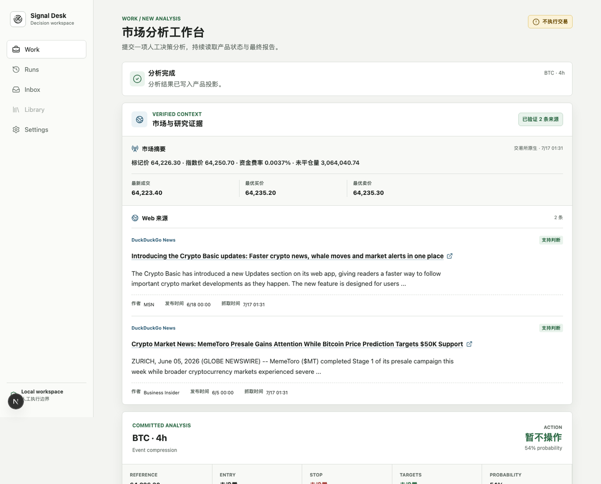
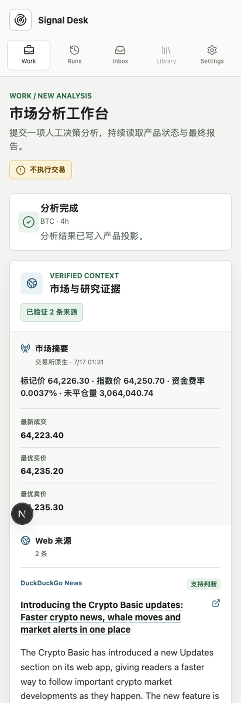
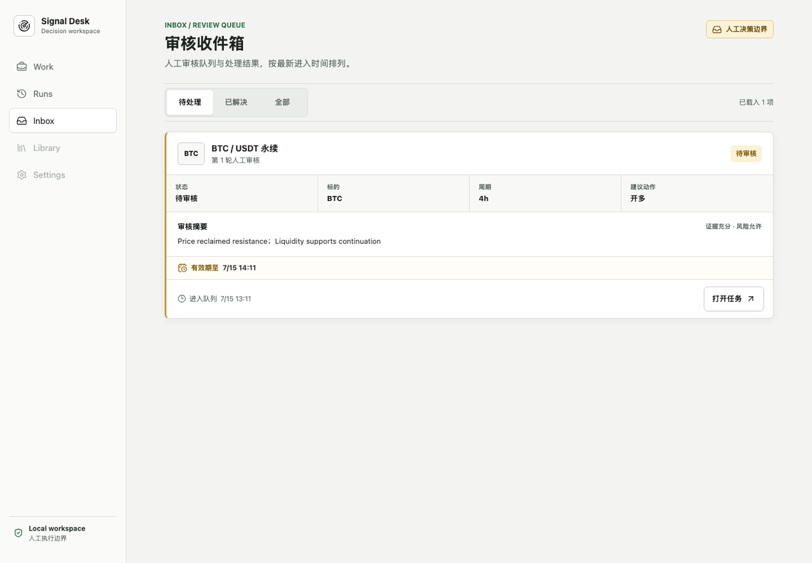
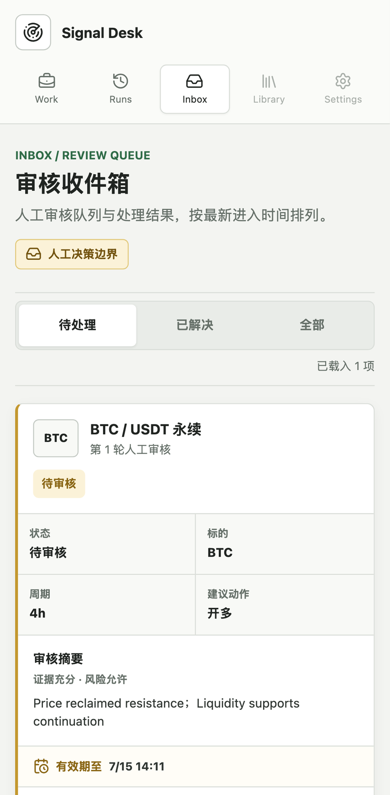
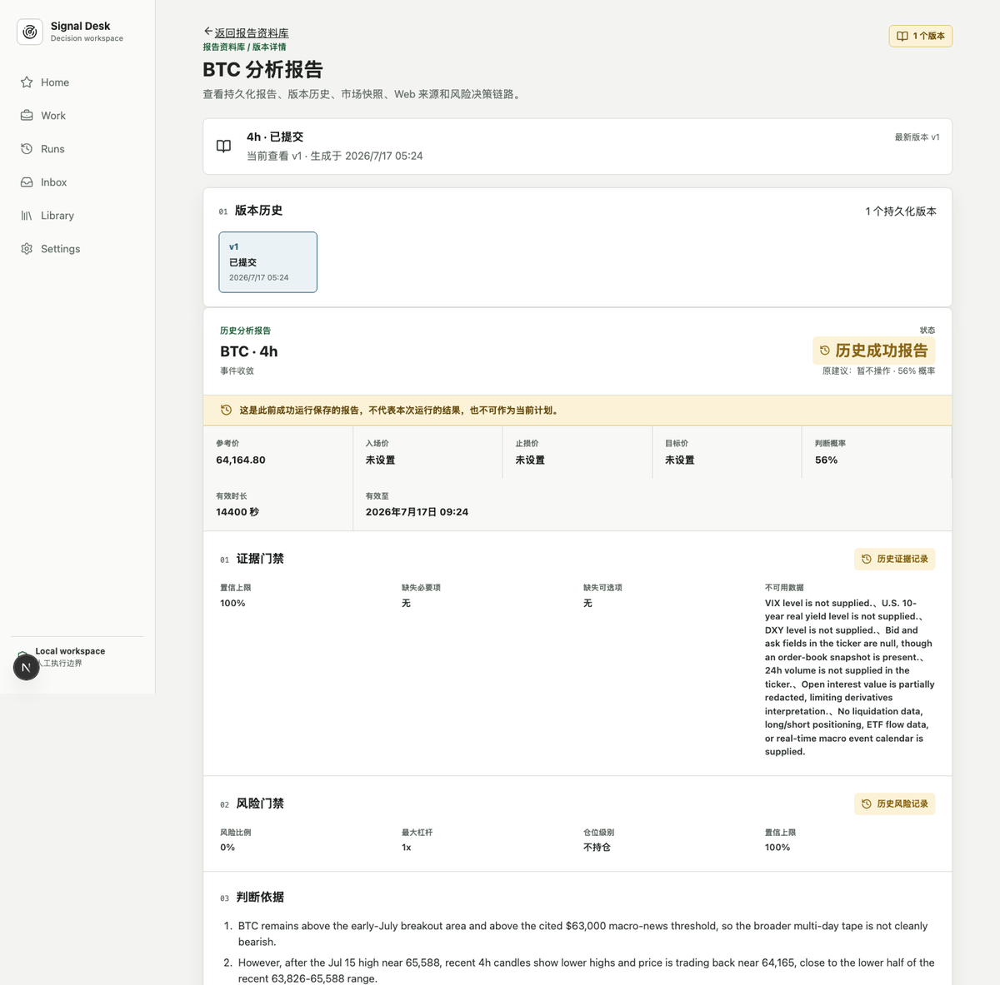
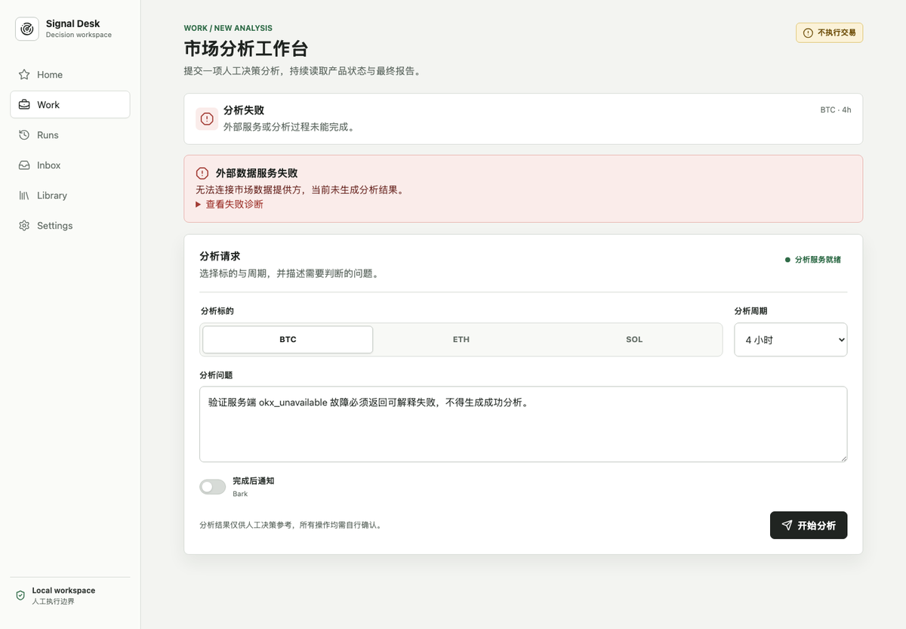
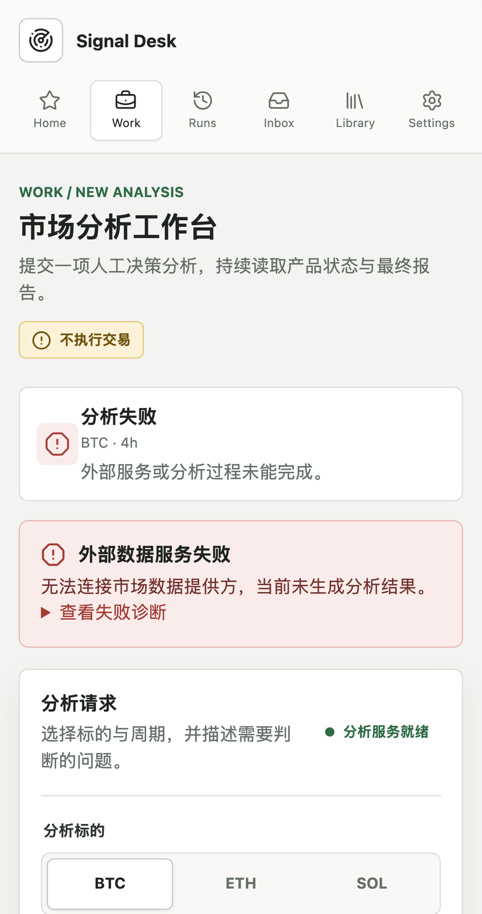

# Signal Desk / Crypto Intelligence Agent V2

## 官网 UI 设计素材包

**版本**：2026-07-17（Asia/Shanghai）  
**用途**：提供给官网 UI、品牌、内容和交互设计团队的产品事实与现状素材  
**审计口径**：以当前工作树中的 `backend/` + `frontend/` V2 实现为当前现状；V1 文档只作为历史约束和演进背景。  
**证据等级**：`代码事实` = 可从当前代码直接核对；`规范设计` = 已批准的 V2 产品/架构文档；`设计建议` = 为官网设计提出的草案；`本地截图` = 本地/fixture/controlled-dependency 运行证据，不等于线上生产证明。

> **给 UI 组的先读结论**：当前仓库包含的是一个面向人工决策辅助的内部工作台，不是已经完成商业化上线的官网。官网设计可以提前进行，但所有对外文案都必须保留 manual-only、只读行情、人工确认、证据可追溯和“当前 V2 仍非 production ready”的边界；不要把本地截图、fixture 数据或开发环境状态写成线上能力承诺。

---

## 1. 产品一句话

### 1.1 当前产品定位

Signal Desk 是一个面向加密市场用户的人工决策辅助工作空间：系统把交易所行情、Web 研究证据、结构化分析、证据门禁和风险门禁组织在同一条可追溯链路中，帮助用户在手动执行前完成复核。

### 1.2 永久边界

- 系统可以研究、分析、提醒、记录和复盘，但**不自动下单、撤单、平仓、转账或提现**。
- 只读接入公开市场数据；不接收交易 API key、提现 key 或私钥。
- 模型可以提出候选判断和解释，不能绕过确定性证据/风险门禁。
- 结果可能是成功、被阻断、失败、过期、等待人工确认或通知未知；这些状态必须在 UI 中区分。
- 普通用户看到的是结构化摘要、证据、来源、规则和审计信息，不展示 raw prompt、raw completion 或模型私有 chain-of-thought。
- “人工确认”不是收益承诺，也不替代适用地区的金融产品、风险披露和法律评审。

### 1.3 面向官网的核心价值表达（设计建议）

> 把行情、证据和风险门禁，放进同一个人工决策工作台。

可作为官网辅助文案的方向：

- 从实时市场事实开始，而不是从一句未经验证的观点开始。
- 每个结论都能回到来源、数据新鲜度、风险规则和运行版本。
- 复杂分析可以继续运行、等待人工确认、恢复、重试和回看。
- 任何不确定性都会被显式标记，而不是包装成确定答案。

以上属于官网文案草案，产品与法务确认前不要使用“投资建议”“自动交易”“保证收益”“实时无误”等表述。

---

## 2. 资料来源与可信度

| 资料层 | 主要文件/目录 | 在本资料包中的用途 | 可信度 |
| --- | --- | --- | --- |
| 当前代码 | `frontend/src/app/`、`frontend/src/features/`、`backend/src/crypto_alert_v2/api/` | 页面、交互、API 和当前可见文案 | 代码事实 |
| V2 产品/架构规范 | `docs/v2/01-v2-product-and-architecture.md`、`06-c-end-agent-product-blueprint.md`、`13-v2-final-rebuild-spec.md`、`14-v2-final-implementation-plan.md` | 最终产品目标、信息架构和核心对象 | 规范设计 |
| V2 状态与证据 | `docs/v2/15-v2-implementation-status.md`、`18-v2-execution-ledger.md` | 判断哪些能力已落地、哪些仍未证明 | 代码/测试审计 |
| 交付验收 | `docs/v2/03-v2-delivery-checklist.md` | UI 状态、移动端、可访问性和安全验收边界 | 规范设计 |
| V1 历史需求 | `docs/formal/01-v1需求边界.md`、`03-业务流程与状态机.md`、`06-风控与置信度规则.md`、`08-通知与调度策略.md` | 说明 manual alert、RiskGate、Bark 的历史来源 | 历史基线 |
| 页面截图 | `frontend/artifacts/playwright-real/`、`frontend/artifacts/playwright/` | 视觉现状、页面层级、响应式和错误态参考 | 本地证据 |

### 2.1 当前状态摘要

截至 2026-07-17，V2 审计结论是 **PARTIAL / Production Ready: NO**。本地 backend、frontend、Product API、PostgreSQL、worker、官方 development Agent Server 和 Playwright 证据已覆盖大量主流程切片，但以下项目仍未形成 hosted production 证明：

- 真实 hosted OIDC、可信 HTTPS 和多主体浏览器状态。
- licensed persistent Agent Server 的重启持久化与灾备恢复。
- 真实 Bark/provider 回执、通知未知态恢复和完整投递闭环。
- LangSmith/Langfuse 官方 SDK 的真实双端 hosted trace 与 outage 证明。
- 负载/SLO、backup/restore、key rotation、SBOM/signing、release attestation。
- Deep Research、Monitors/Cron、Outcome、Memory、Entitlement/Usage 等完整产品模式和 UI。

---

## 3. 产品演进：V1 与 V2

### 3.1 V1 历史基线

V1 是个人使用的“加密货币手动操作提醒系统”，核心链路为：

```text
Query / Scheduler
  -> Parse
  -> Load fixed skill
  -> Refresh market facts
  -> Evidence gate / research
  -> Final decision
  -> Strict parser
  -> Risk gate
  -> Journal
  -> Bark notification
```

V1 已确定的约束：固定 crypto skill、实时事实、严格 JSON、RiskGate、journal、Bark；明确不做自动交易、交易/提现 key、长期向量记忆、自动仓位计算和多交易所执行。

### 3.2 V2 目标

V2 将 V1 的单次提醒升级为多用户 Crypto Intelligence Agent Workspace。用户围绕产品对象操作，而不是直接面对后端 JSON：

- `Workspace`：租户、成员、权限、配额和集成边界。
- `Thread`：长期上下文与可恢复会话。
- `Task`：用户可理解的工作单元。
- `Run`：一次不可变执行尝试。
- `Artifact`：报告、证据集、比较结果和结构化结论。
- `Interrupt`：等待人工决定的正式状态。
- `Checkpoint`：恢复、重试、分叉和 time travel 的执行快照。
- `EventProjection`：将官方流事件转成用户可读的状态和时间线。

规范规划的产品模式：

| 模式 | 用户价值 | 当前状态 |
| --- | --- | --- |
| `interactive_chat` | 追问行情、事件、证据和历史结论 | 未完整落地 |
| `market_analysis` | 生成结构化市场分析，必须人工决策 | **当前主链** |
| `deep_research` | 多来源专题研究、可引用、可中断 | 未开始 |
| `scheduled_monitor` | 周期检查价格、事件和风险条件 | 未开始 |
| `alert_inbox` | 聚合待确认、失败、降级和后台完成提醒 | **部分落地** |
| `outcome_review` | 对历史判断进行成熟窗口复盘 | 未开始 |
| `scenario_compare` | 从历史 checkpoint 分支比较假设 | **部分落地（fork）** |

---

## 4. 当前技术与运行链路

### 4.1 当前实现拓扑

```text
Browser
  -> Next.js frontend / same-origin BFF
  -> Product API (/api/v2/*)
  -> ProductAnalysisService + PostgreSQL
  -> durable TaskCommand / worker
  -> official LangGraph Agent Server / canonical graph
  -> OKX public market data + Web Search + LangChain agents
  -> evidence verdict + risk verdict
  -> ArtifactVersion / Decision / Run projection
  -> optional notification outbox / Bark
```

### 4.2 当前主流程

```text
提交分析请求
  -> 校验 symbol / horizon / query / notify
  -> 建立 Task / Run
  -> 采集行情快照
  -> 读取 Web 证据
  -> 生成结构化分析草稿
  -> 证据门禁
  -> 风险门禁
  -> 必要时等待人工审核（approve / reject / edit）
  -> 提交 Artifact / Decision / Run 状态
  -> 可选通知
  -> 在 Work、Runs、Inbox、Library 中回看
```

### 4.3 当前可核对的 Product API

| API | 功能 | 对应页面 |
| --- | --- | --- |
| `POST /api/v2/analysis` | 创建分析 Task | Work |
| `GET /api/v2/tasks/{task_id}` | 读取 Task、Run、Artifact、Interrupt 和通知摘要 | Work |
| `GET /api/v2/home` | 首页聚合：Watchlist、活跃任务、待处理数、最近报告 | Home |
| `GET /api/v2/runs` | 分析记录列表 | Runs |
| `GET /api/v2/runs/{run_id}` | 单次运行详情和反馈 | Run detail |
| `POST /api/v2/runs/{run_id}/feedback` | 结果反馈 | Run detail |
| `GET /api/v2/inbox` | 人工审核收件箱，支持状态筛选和分页 | Inbox |
| `POST /api/v2/tasks/{task_id}/interrupts/respond` | 单项人工审核 | Work |
| `POST /api/v2/tasks/{task_id}/interrupts/respond-all` | 多项审核整组提交 | Work / Inbox |
| `POST /api/v2/tasks/{task_id}/cancel` | 取消 Task | Work |
| `POST /api/v2/tasks/{task_id}/retry` | 对失败/阻断 Task 重试 | Work |
| `POST /api/v2/tasks/{task_id}/fork` | 从历史 checkpoint 创建分支 | Work / Run detail |
| `GET/PUT/DELETE /api/v2/watchlist/{symbol}` | 管理关注标的 | Home |
| `GET /api/v2/artifacts` | 报告版本列表 | Library |
| `GET /api/v2/artifacts/{artifact_id}` | 报告版本、证据、来源、lineage | Artifact detail |
| `GET /api/v2/tasks/{task_id}/notifications` | 通知状态与尝试记录 | Work |
| `POST /api/v2/notifications/{notification_id}/resend` | 人工请求一次重发 | Work |
| `GET/PATCH /api/v2/settings/notifications` | Bark 用户级通知设置 | Settings |

所有写操作使用 `Idempotency-Key`，UI 需要提供重复提交、网络重试和服务端冲突的可读反馈。

---

## 5. 当前页面信息架构与功能清单

> 当前代码的一级导航与 V2 规范目标不完全一致。官网设计可参考未来产品叙事，但不能把规划页面写成已经上线的功能。

### 5.1 已落地页面

| 页面/路由 | 当前用途 | 主要功能与内容 | 当前证据 |
| --- | --- | --- | --- |
| `/home` | 工作区概览 | 待处理审核、进行中任务、最近报告、BTC/ETH/SOL Watchlist、历史行情快照 | 代码 + 本地 Product/UI slice |
| `/work` | 发起和跟踪市场分析 | 选择标的、分析周期、输入问题、完成后 Bark 开关；实时轮询/官方 stream；结果、证据、风险、通知；取消、重试、恢复、fork、HITL | 代码 + success/failure/HITL 截图 |
| `/runs` | 分析运行记录 | 最近 25 次运行，按标的、周期、attempt、时间、状态、动作查看 | 代码 + fixture/real 截图 |
| `/runs/[runId]` | 单次运行详情 | 状态、运行元数据、完整结果、反馈（有帮助/需要改进）、取消 | 代码 + run detail 截图 |
| `/inbox` | 人工审核收件箱 | 待处理/已解决/全部筛选；审核卡片；分页；打开任务；过期/恢复失败/取消状态 | 代码 + Inbox 截图 |
| `/library` | 报告资料库 | 报告版本列表、状态、schema、动作、创建时间 | 代码 + fixture 截图 |
| `/artifacts/[artifactId]` | 报告与证据详情 | 版本历史、分析结果、证据/风险门禁、判断依据、来源、市场快照、Web evidence、数据溯源、Decision lineage | 代码 + Artifact detail 截图 |
| `/settings` | Bark 通知设置 | 启用/停用、设备 key 替换、不回显、更新时间、保存/撤销、错误态 | 代码 |

### 5.2 规划中但尚未完整落地的页面/模式

| 规划页面/模式 | 目标体验 | UI 组现阶段可准备的素材 |
| --- | --- | --- |
| `Monitors` / `scheduled_monitor` | 价格、事件、thesis、数据源健康监控；频率、有效期、静默时段、触发历史 | 监控规则表单、状态时间线、触发记录、通知策略 |
| Work 内的 Chat | 围绕同一 Thread 连续追问 | Thread 列表、消息时间线、上下文边界、引用卡片 |
| `Deep Research` | 长任务、多来源、可中断、可产生 Artifact | 任务进度、子研究角色、来源集合、停止/恢复 |
| `Scenario Compare` | 从 checkpoint 分支，比较不同假设/时间窗 | 分支树、差异对比、来源与风险差异 |
| `Outcome Review` | 成熟窗口后回看判断与实际结果 | 结果卡、窗口状态、命中/失效、评分与反馈 |
| `Admin` / Workspace | 成员、权限、配额、订阅、审计 | 权限矩阵、用量、审计日志；上线前需单独确认 |

### 5.3 当前导航与规划导航的差异

| 当前代码 | V2 规划 | 说明 |
| --- | --- | --- |
| Home | Home | 已有聚合首页 |
| Work | Work | 当前是单栏分析工作台；规划为 Chat/Analysis/Research/Compare 的统一工作区 |
| Runs | 深链接/详情 | 当前保留为一级导航，未来更偏详情/诊断路由 |
| Inbox | Inbox | 已落地人工审核队列 |
| Library | Library | 已落地报告/Artifact 回看 |
| Settings | Settings | 当前只覆盖通知；规划还包括偏好、隐私、Workspace、用量、集成 |
| 无 | Monitors | 规划中 |
| 无 | Admin | 规划中 |

---

## 6. 核心用户流程与状态

### 6.1 用户主流程

1. 用户在 Work 选择 `BTC / ETH / SOL`，选择周期（当前代码为 `15m / 1h / 4h / 1d`），输入问题，可选打开完成后 Bark 通知。
2. 系统创建 Task/Run，开始读取行情、Web 研究和分析流。
3. 页面展示市场/研究证据和结构化分析结果；结果包含动作、概率、入场/止损/目标、有效期、判断依据、反向判断和失效条件。
4. 证据不足或风险规则触发时，结果被降级或阻断，不可伪装成成功。
5. 如果 graph 产生 HITL interrupt，用户在 Work 或 Inbox 中 approve / reject / edit；多项 interrupt 必须整组提交。
6. 成功结果写入 Artifact/Decision/Run；用户可在 Runs、Library、Artifact detail 回看并提交反馈。
7. 如果请求了通知，通知进入 outbox，并显示投递、重试、失败或未知状态；通知状态不改变风险结论。

### 6.2 状态词典（UI 需要统一）

| 机器状态 | 建议中文 | 用户看到的含义 | 允许的主操作 |
| --- | --- | --- | --- |
| `queued` | 排队中 | 已接收，等待执行 | 查看/取消 |
| `running` | 分析中 | 正在读取事实、研究或生成结果 | 查看进度/取消 |
| `waiting_human` | 等待人工确认 | 需要用户审核一个或多个决定 | approve / reject / edit |
| `succeeded` | 分析完成 | 已产生可回看的已保存报告 | 查看报告/反馈 |
| `blocked` | 已阻断 | 规则或证据不足，不应直接执行 | 查看原因/重试（条件允许） |
| `failed` | 分析失败 | 外部服务或执行过程未完成 | 查看诊断/重试 |
| `cancelled` | 已取消 | 用户或系统停止了本次运行 | 查看/在允许时重试 |
| `expired` | 已过期 | 报告超过有效期，不代表当前计划 | 查看历史，不可直接执行 |
| `unknown`（通知） | 通知结果未知 | 发送结果无法确认 | 查看/人工重发一次 |

### 6.3 审核动作

- `approve`：接受当前结构化决定并继续。
- `reject`：拒绝当前决定，形成 blocked/终止结果。
- `edit`：人工修改动作、概率、仓位级别、最大杠杆、风险比例、根因链、反向判断或失效条件后再继续门禁。
- 单项 interrupt 可直接提交；多项 interrupt 需要“提交整组审核决定”。
- 审核窗口可能过期、冲突、网络失败、鉴权失败或被服务端版本更新；UI 不能静默重放旧请求。

---

## 7. 结果内容与信息层级

### 7.1 结果头部

- 标的与周期，如 `BTC · 4h`。
- 当前动作，如 `开多 / 开空 / 暂不操作`。
- 概率与 regime，如 `54% · Event compression`。
- 当前结果状态：当前分析、历史成功报告或已过期分析。
- 永远可见的 manual-only 标签：`不执行交易` / `所有操作均需人工确认`。

### 7.2 交易计划指标

| 字段 | UI 语义 | 视觉建议 |
| --- | --- | --- |
| Reference | 当前参考价 | 中性数字，强调数据时间 |
| Entry | 入场价/触发价 | 未设置时显示“未设置”，不要补 0 |
| Stop | 止损价 | 风险色，仅在有值时突出 |
| Targets | 目标价 1/2 | 正向色，支持多目标换行 |
| Probability | 判断概率 | 与证据/风险门禁并列，不等于收益概率承诺 |
| TTL / 有效至 | 报告生命周期 | 过期后切换为警示态，并标注“不可作为当前计划” |

### 7.3 四类解释区块

- **证据门禁**：必要证据是否齐全、置信上限、缺失必要/可选项、不可用数据和 warnings。
- **风险门禁**：风险比例、最大杠杆、仓位级别、风险是否通过、阻断原因和 warnings。
- **判断依据**：主根因链、反向判断、失效条件。
- **来源链接 / 数据溯源**：来源标题、URL、provider、关系（支持/反向/背景）、发布时间、抓取时间、行情提供方、Web provider、解析器、模型和调用审计。

### 7.4 研究证据

Research Evidence 区域可能展示：

- ticker、mark/index price、funding、open interest、order book、candles。
- Web source 的 query、标题、摘要、最终 URL、发布时间、抓取时间。
- 来源是否匹配本次证据、关系是支持/反向/背景。
- 证据数量和验证状态：已验证、验证中、无来源。

### 7.5 通知状态

通知状态机：`planned → leased → sending → delivered`，也可能进入 `failed_retryable`、`failed_terminal`、`unknown`。UI 要显示：

- 渠道（当前 Bark）。
- 当前状态和尝试次数（最多 5 次）。
- 更新时间、Provider receipt、错误码（如有）。
- “人工重发一次”是否可用、是否已排队。

---

## 8. 当前视觉基线（来自 `frontend/src/app/globals.css`）

### 8.1 颜色

| 角色 | Token | Hex | 用途 |
| --- | --- | --- | --- |
| Canvas | `--canvas` | `#f3f4f1` | 页面底色 |
| Surface | `--surface` | `#ffffff` | 内容面板、卡片 |
| Subtle | `--surface-subtle` | `#f8f9f6` | 次级区域 |
| Charcoal | `--charcoal` | `#202421` | 标题、主按钮 |
| Text | `--text` | `#303632` | 正文 |
| Muted | `--muted` | `#667069` | 辅助文字 |
| Border | `--border` | `#d9ddd8` | 分隔线、边框 |
| Border strong | `--border-strong` | `#c3c9c3` | 输入框、按钮边框 |
| Green | `--green` | `#2f6b47` | 成功、验证、正向状态 |
| Green soft | `--green-soft` | `#e9f3ec` | 成功底色 |
| Amber | `--amber` | `#8a6615` | 人工边界、待审核、过期 |
| Amber soft | `--amber-soft` | `#fbf2d8` | 警示底色 |
| Red | `--red` | `#a33d36` | 失败、阻断、危险 |
| Red soft | `--red-soft` | `#faecea` | 失败底色 |
| Blue | `--blue` | `#315f78` | 证据、来源、信息 |
| Blue soft | `--blue-soft` | `#eaf2f6` | 信息底色 |

当前视觉印象：浅灰画布、白色内容面、炭黑文字、细边框、克制阴影、低饱和绿/琥珀/红/蓝状态色，整体更像安静的运营工作台，而不是高刺激的交易终端。

### 8.2 布局与组件

- 桌面端：固定左侧导航约 224px，主内容最大宽度约 1080px，页面有较大的留白。
- 移动端：顶部品牌 + 横向图标导航，内容单列堆叠；不能把桌面三栏硬缩小。
- 卡片圆角约 6–8px，边框优先于强阴影。
- 主要按钮使用图标 + 文案；熟悉的操作使用 Lucide 图标。
- 表单控件：分段选择（标的）、下拉（周期）、多行输入（分析问题）、开关（完成后通知）。
- 状态视觉：成功绿色、待审核/过期琥珀色、失败/阻断红色、证据/信息蓝色。
- 触控目标至少 44px；需要支持中文输入法、safe area、深滚动和断线恢复。

### 8.3 官网视觉可继承与应谨慎的部分

可继承：

- 克制的绿色信任色和低饱和状态色。
- “事实/证据/风险”三段式信息层级。
- 细边框、轻阴影、可扫描的数字指标。
- 手动边界用琥珀色提示，而不是危险红色恐吓。

官网需要重新设计：

- 工作台的高密度长页不适合直接当作官网首屏。
- 交易计划、概率、杠杆等字段必须放在合规/定位允许的语境中。
- 不要使用模拟数据作为“实时行情”宣传证据。
- 不要把错误态截图作为负面营销素材；它们只适合展示透明的失败处理能力。

---

## 9. 官网信息架构建议（设计草案）

> 这一节是给官网 UI 组的起稿材料，不是当前代码已实现的页面。产品、品牌和法务确认后再进入正式视觉稿。

### 9.1 建议导航

1. **Overview / 产品**：一句话定位、核心价值、可信边界。
2. **How it works / 工作方式**：事实 → 研究 → 分析 → 门禁 → 人工确认 → 回看。
3. **Evidence & Risk / 证据与风险**：来源、数据新鲜度、规则阻断、可追溯。
4. **Use cases / 使用场景**：市场分析、审核收件箱、报告资料库、通知提醒。
5. **Product preview / 工作台预览**：桌面/移动截图与状态说明。
6. **Trust & boundaries / 信任与边界**：manual-only、只读行情、数据和模型限制、隐私/安全说明。
7. **CTA**：进入工作台、预约演示或加入候选名单（依据当前发布阶段选择，不要默认公开注册）。

### 9.2 首屏草案

**品牌**：Signal Desk  
**主标题**：把行情、证据和风险门禁，放进同一个人工决策工作台。  
**辅助文案**：从实时市场事实和可核验来源开始，生成可回看、可复核、明确标注不确定性的分析结果。系统不自动交易，最终操作始终由人确认。  
**主 CTA**：查看产品流程  
**次 CTA**：浏览工作台预览  
**信任条**：人工确认 · 只读行情 · 来源可追溯 · 失败明确可见

首屏必须让用户第一眼理解：这是“人工决策辅助”，不是交易机器人、喊单群或收益承诺平台。

### 9.3 How it works 模块

建议用五步横向流程，移动端改为纵向：

1. **提出问题**：选择标的、周期，描述要判断的市场问题。
2. **读取事实**：获取行情快照、数据新鲜度和公开 Web 来源。
3. **生成分析**：结构化输出动作、概率、入场/止损/目标和失效条件。
4. **通过门禁**：证据不足或风险不满足时降级/阻断。
5. **人工复核**：用户批准、拒绝或编辑，之后保存报告并按需提醒。

### 9.4 可信度模块

推荐用三个并列模块：

- **Evidence gate**：展示必要证据、缺失项、来源关系和数据时间。
- **Risk gate**：展示风险比例、最大杠杆、仓位级别和阻断原因。
- **Audit trail**：展示模型/Provider、报告版本、通知记录和反馈。

每个模块都应使用当前截图中的真实结构字段做视觉参考，但文案应避免暗示“门禁通过 = 一定正确”。

### 9.5 Use cases 模块

| 场景卡 | 叙事重点 | 可引用的当前页面 |
| --- | --- | --- |
| 市场分析 | 从问题到结构化报告 | Work / AnalysisResult |
| 人工审核 | 将待确认结论集中在一个队列 | Inbox / HumanReviewPanel |
| 报告回看 | 版本、来源和决策 lineage | Library / Artifact detail |
| 失败恢复 | 外部服务失败时明确阻断并可重试 | Work failure screenshots |
| 通知提醒 | Bark 状态可观察，失败不改变结论 | NotificationStatus / Settings |

### 9.6 Product preview 模块

建议只展示以下 4 组截图：

- Work 成功桌面 + 移动端：体现完整链路和响应式。
- Inbox 桌面：体现人工审核边界。
- Artifact detail 桌面：体现证据、来源和版本。
- Provider failure 桌面/移动端：体现 fail-closed 和可读错误。

截图必须标注“本地测试环境/示例数据”，不能标成 production dashboard。

---

## 10. 交互与文案验收清单

### 10.1 必须保留

- 每个主要页面持续可见 `不执行交易` 或等价 manual-only 提示。
- 成功、阻断、失败、过期、等待人工确认、通知未知不能共用同一种绿色成功样式。
- 错误态需要说明：发生了什么、是否可重试、下一步是什么。
- 断线/刷新后恢复到服务端权威状态，不以旧的本地草稿覆盖新版本。
- HITL edit 之后重新执行证据/风险门禁，不能直接把人工修改当成通过。
- 历史报告必须标明“不可作为当前计划”。
- 来源 URL、发布时间、抓取时间和来源关系可见；不展示 secret、raw prompt 或内部对象 JSON。
- 移动端按钮、切换器、输入框、长页分区满足 44px 触控和中文可读性。

### 10.2 官网需要单独确认

- 官网面向个人用户、专业交易者、研究团队还是企业买家。
- CTA 是公开注册、预约演示、候选名单还是仅展示。
- 是否对外展示概率、止损、杠杆等个性化字段。
- 是否需要登录后工作台与官网品牌完全一致，还是分为营销品牌与产品品牌。
- “实时”允许的延迟、数据覆盖和 provider 说明。
- 法务/合规对“决策辅助”“研究工具”“投资建议”的最终用词。

---

## 11. 截图图录

下面的图片来自仓库当前已有的 Playwright 产物。长图文件名中的 `fixture`、`failure-injection`、`real` 代表测试语境，不代表生产环境；原始图片均保留在 `frontend/artifacts/`，本资料包只引用代表性版本。

| 截图标签 | 在本资料包中的含义 |
| --- | --- |
| `real` | 经过本地 Product/Provider 链路的真实浏览器渲染，仍不是 hosted production 证明 |
| `fixture` | 使用固定测试数据验证页面结构、状态和响应式 |
| `failure-injection` | 人工注入外部依赖、数据库或通知失败，用于验证 fail-closed 与恢复体验 |
| `full-page` | Playwright 深滚动长图；资料包中使用裁切版，原图路径保留 |

### 11.1 Work 主流程：成功



**用途**：主工作台桌面端结构参考。包含 Signal Desk 导航、分析完成、Verified Context、Web 来源、Committed Analysis 和分析请求表单。  
**原图**：`frontend/artifacts/playwright-real/success-desktop.png`（逻辑 viewport 1440×1000 的 full-page 长图）  
**证据等级**：本地 real/controlled dependency；不代表 hosted production。



**用途**：移动端顶部导航、单列堆叠、结果长页和表单顺序参考。  
**原图**：`frontend/artifacts/playwright-real/success-pixel-7.png`（逻辑 viewport 412×915）  
**证据等级**：本地 real/controlled dependency。

### 11.2 人工审核收件箱



**用途**：待处理/已解决/全部 segmented tabs，审核卡片信息层级、有效期和“打开任务”动作参考。  
**原图**：`frontend/artifacts/playwright-real/inbox-production-desktop.png`（逻辑 viewport 1440×1000）  
**证据等级**：本地 real Product flow。



**用途**：移动端审核卡的两列元数据、摘要、有效期和主操作布局参考。  
**原图**：`frontend/artifacts/playwright-real/inbox-production-pixel-7.png`（逻辑 viewport 412×915；文件像素宽 1082）  
**证据等级**：本地 real Product flow。

### 11.3 报告与证据详情



**用途**：报告版本历史、历史报告警示、交易计划、证据/风险门禁、判断依据和来源区域参考。  
**原图**：`frontend/artifacts/playwright-real/real-library-artifact-detail-fixture-desktop.png`  
**证据等级**：fixture/local；适合做信息架构参考，不代表生产数据。

### 11.4 失败与 fail-closed



**用途**：外部数据服务失败时的错误层级、关联 ID、Provider、不可生成结果和可重试路径参考。  
**原图**：`frontend/artifacts/playwright-real/provider-failure-okx_unavailable-failure-injection-desktop.png`  
**证据等级**：failure-injection QA；不是线上故障截图。



**用途**：移动端失败 banner、诊断展开入口和表单仍可见的布局参考。  
**原图**：`frontend/artifacts/playwright-real/provider-failure-okx_unavailable-failure-injection-pixel-7.png`  
**证据等级**：failure-injection QA。

### 11.5 其他可用截图资源

| 主题 | 文件模式 |
| --- | --- |
| 成功/短版 Work | `frontend/artifacts/playwright/work-success-fixture-*.png` |
| 运行详情 | `frontend/artifacts/playwright-real/real-library-run-detail-fixture-*.png`、`real-run-detail-pixel-7.png` |
| 搜索失败 | `provider-failure-search_unavailable-*` |
| 模型结构化输出失败 | `provider-failure-model_invalid_output-*` |
| 通知失败 | `provider-failure-notification_failure-*` |
| 数据库回滚失败/恢复 | `database-rollback-failed-*`、`database-rollback-recovered-*` |
| 流断开重连 | `official-stream-failed-reattach-desktop.png` |
| 历史 fork 面板 | `frontend/tests/e2e-v2/real-fork-flow.spec.ts-snapshots/historical-fork-panel-fixture-*.png`（历史 fixture） |

---

## 12. 给 UI 组的交付建议

### 12.1 先做的页面

1. 官网首屏与 How it works。
2. Evidence / Risk / Manual-only 信任模块。
3. Work 成功、阻断、失败、等待人工确认四套状态。
4. Inbox 审核卡桌面/移动端。
5. Library / Artifact detail 的报告与来源结构。

### 12.2 可以复用的内容资产

- Signal Desk 品牌名、副标题 `Decision workspace`。
- 现有视觉 token、状态色和 Lucide 图标方向。
- `Evidence gate / Risk gate / Audit trail` 三段式叙事。
- 真实页面中的字段：行情摘要、Web source、动作、概率、TTL、证据缺失项、阻断原因、来源关系、通知状态。
- 本资料包中的截图裁切版和原始截图路径。

### 12.3 不应直接复用的内容

- 任何真实 key、endpoint secret、原始 prompt/completion、内部 trace ID 或数据库 ID。
- 用于测试的 provider failure、fixture 新闻、示例价格作为“实时生产数据”。
- “AI 自动帮你交易”“高胜率”“稳赚”“零风险”等承诺。
- 尚未落地的 Deep Research、Monitors、Outcome、Workspace/Admin 作为已上线功能。

---

## 13. 待确认问题

| 优先级 | 问题 | 影响 |
| --- | --- | --- |
| P0 | 官网面向谁，CTA 是什么？ | 决定信息架构、语气、首屏和转化路径 |
| P0 | 是否允许对外展示个性化交易字段（概率/止损/杠杆）？ | 决定截图裁切、文案和合规审核 |
| P0 | 当前对外品牌继续使用 Signal Desk 吗？ | 决定 Logo、域名、品牌系统 |
| P0 | 产品上线阶段是内部测试、邀请制还是公开注册？ | 决定“进入工作台/预约演示/候选名单”CTA |
| P1 | V2 规划页面中，Monitors、Deep Research、Outcome 哪个优先？ | 决定官网功能模块排序和后续产品 UI 投入 |
| P1 | 是否需要独立的 docs / trust / security 页面？ | 决定内容资产和导航深度 |
| P1 | Bark 之外的通知渠道是否进入官网叙事？ | 决定通知模块是否只写“可选提醒” |
| P2 | 工作台与官网是否共用一套导航和视觉密度？ | 决定产品 UI 与 marketing UI 的品牌边界 |

---

## 14. 代码与文档索引（便于继续核对）

- 应用壳与导航：`frontend/src/components/app-shell.tsx`、`frontend/src/components/primary-navigation.tsx`。
- 全局视觉 token：`frontend/src/app/globals.css`。
- Work 主流程：`frontend/src/features/work/work-surface.tsx`、`human-review-panel.tsx`、`task-fork-panel.tsx`。
- 结果与证据：`frontend/src/features/analysis/analysis-result.tsx`、`analysis-projection.tsx`、`research-evidence.tsx`。
- 首页：`frontend/src/features/home/home-surface.tsx`。
- 收件箱：`frontend/src/features/inbox/inbox-surface.tsx`。
- Runs/Library/Artifact：`frontend/src/features/runs/`、`frontend/src/features/library/`、`frontend/src/features/artifacts/`。
- 通知与设置：`frontend/src/features/notifications/notification-status.tsx`、`frontend/src/features/settings/notification-settings-surface.tsx`。
- Product API 路由：`backend/src/crypto_alert_v2/api/app.py`。
- Product DTO/schema：`frontend/src/lib/schemas/product-api.ts`、`backend/src/crypto_alert_v2/api/schemas.py`。
- 产品与架构规范：`docs/v2/01-v2-product-and-architecture.md`、`docs/v2/06-c-end-agent-product-blueprint.md`。
- 状态与证明边界：`docs/v2/15-v2-implementation-status.md`、`docs/v2/18-v2-execution-ledger.md`。

---

## 15. 版本说明

本资料包是对当前工作树的设计资料整理，不是产品 PRD 的替代品，也不是生产发布证明。代码、规范文档和实际部署状态可能继续变化；下一次 UI 评审前建议重新核对：当前导航、截图数据、V2 状态文档、对外合规文案和官网 CTA。
