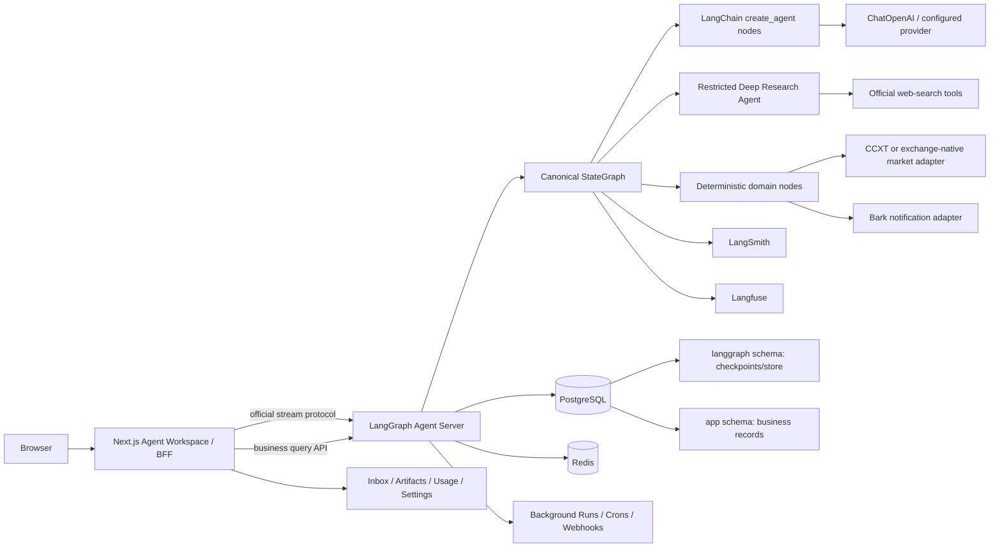

# Crypto Intelligence Agent V2 产品与架构设计

> 分类：Approved normative（2026-07-13 用户批准；冲突解释以 `13`/`14` 为准）
>
> 日期：2026-07-12
>
> 范围：只定义最终产品和技术设计，不包含实现代码

## 1. 执行摘要

V2 要解决的不是 V1 某个局部 Bug，也不是用 LangGraph 原样重写 V1。最终目标是一个可商业化、多用户、支持实时对话与长任务的加密市场智能 Agent 工作空间。人工分析预警是第一条必须跑通的价值链，但架构必须同时容纳研究、持续监控、结果复盘、场景比较和 Agent 协作，避免主流程跑通后再次推倒形成 V3。

V2 采用以下总方案：

1. 使用 LangGraph 构建唯一的 canonical graph，承担状态、分支、并发、重试、Checkpoint、Interrupt 和流式事件。
2. 使用 LangChain `create_agent`、官方 Tool、Structured Output 和 Middleware 实现标准 Agent Harness。
3. 使用 Deep Agents 承担只读、受预算限制的 Web Research；不赋予风险裁决、数据库写入、通知或文件系统权限。
4. 使用 LangGraph Agent Server 作为 Agent Runtime 和流式协议服务，Next.js 通过官方 React SDK 连接。
5. 使用 PostgreSQL 分离 LangGraph Checkpoint Schema 与产品业务 Schema；产品前端永远不直接读取 Checkpoint 表。
6. 同时接入 LangSmith 和 Langfuse：LangSmith 负责 LangChain/LangGraph 原生追踪、Dataset 和回归评测，Langfuse负责生产成本、时延、会话、用户维度分析及可选自托管。
7. 最终数据模型从第一天支持多用户，但第一阶段采用固定开发账号，避免鉴权阻断 Agent 主流程。
8. 保留 V1 中经过验证的交易事实、风险门禁和人工提醒规则，删除 V1 自研编排、模型客户端、Tool Executor、Shadow Runtime 和兼容切换机制。
9. 使用官方事件体系贯通 Agent、Agent Server 和 React：Python Agent Event Streaming v3、Graph `astream/stream_mode`、Protocol v2 command/event、`@langchain/react` v1 scoped selectors，不建立产品私有事件 Runtime。
10. 将 Thread、Task、Run、Subagent、Artifact、Interrupt、Checkpoint 和 Event Projection 作为第一等产品对象，支持后台运行、断线重连、消息排队、分支重跑和任务收件箱。
11. 从第一天保留 workspace、权限、配额、用量、订阅、集成和审计边界，但分阶段启用，不让商业后台阻断首条真实用户主流程。

## 2. 问题定义

### 2.1 V1 已确认的问题

V1 没有 LangChain、LangGraph 或 SQLAlchemy 依赖，却同时存在以下自定义控制面：

- `workflow/`
- `orchestration/`
- `agent_swarm/`
- `research_pipeline/`
- `skills/`
- `telemetry/`
- 多套直接 `httpx` 模型客户端
- 多套 SQLite Journal、Eval 和 Outcome Store
- 前后端大量 fallback、兼容 schema 和业务投影

这些模块分别实现了官方框架已经提供的状态机、Tool 协议、并发、重试、模型接入、Structured Output、追踪和恢复能力，导致：

- 同一请求存在多套运行状态和 ID。
- 异常可能先被自定义 Runner 吞掉，框架级重试无法生效。
- 真实模型输出、Web Search 和交易事实没有天然进入统一状态与业务记录。
- 前端只能通过复杂 fallback 猜测后端返回的对象形状。
- 主流程、候选 sidecar、shadow audit 和 eval 路径难以判断谁拥有最终权威。
- 测试很多，但 hosted production、真实通知和成熟 outcome 仍未闭环。

### 2.2 V2 要达到的结果

一次人工分析请求必须形成一条可观察、可恢复、可查询、可解释的完整链路：

```text
用户请求
  -> 身份和参数校验
  -> 真实交易数据快照
  -> Web Research 与来源证据
  -> 结构化模型分析
  -> 确定性证据门禁
  -> 确定性风险门禁
  -> 产品决策结果
  -> 业务持久化
  -> 可选通知
  -> 前端实时展示和历史回看
```

任何节点失败都必须留下明确状态、可读错误和可恢复 Checkpoint，不能退回另一套 legacy workflow，也不能用空对象、占位 JSON 或 generic success 掩盖失败。

## 3. 产品范围

### 3.1 第一条必须跑通的主流程

用户在 `/analyze` 选择或输入：

- 交易标的，首批支持 `BTC-USDT-SWAP`、`ETH-USDT-SWAP`、`SOL-USDT-SWAP`。
- 分析周期，例如 `1h`、`4h`、`12h`、`24h`。
- 可选关注问题 `query_text`。
- 是否在允许时发送通知。

系统返回并持久化：

- 本次运行状态与阶段进度。
- 交易所原生行情、指数价、标记价、资金费率、持仓量、盘口和数据新鲜度。
- Web Search 查询、来源 URL、发布时间、抓取时间、摘要、可信度和与标的的关联。
- Agent 的结构化分析，不只保存一段最终文本。
- 最终方向、动作、置信度、入场区间、止损、止盈、失效条件和观察窗口。
- 确定性风险规则命中、阻断原因和降级原因。
- 模型、Provider、Prompt Version、Tool 使用、Token、时延和成本。
- 通知内容、发送结果和错误。
- 用户反馈和后续真实 outcome。

### 3.2 最终产品模式

同一个 Agent 工作空间支持以下产品模式。它们共享 Thread/Task/Run/Artifact/Event 模型，不各自创建一套后端流程：

| 模式 | 用户价值 | 运行形态 |
| --- | --- | --- |
| `interactive_chat` | 追问行情、事件、证据和历史结论 | 前台短任务，可连续对话 |
| `market_analysis` | 生成可执行但必须人工决策的结构化市场分析 | 首条 canonical main flow |
| `deep_research` | 多来源、可引用、可中断的专题研究 | 长任务、subagent、artifact |
| `scheduled_monitor` | 周期检查事件、价格和风险条件 | cron/background run |
| `alert_inbox` | 聚合待确认、已触发、失败和降级提醒 | 异步任务与通知收件箱 |
| `outcome_review` | 对历史判断进行成熟窗口复盘与评分 | 后台采集 + 产品报告 |
| `scenario_compare` | 从 checkpoint 分支比较不同假设、时间窗或提示 | fork/time travel |

首轮实现只需完整交付 `market_analysis`，但接口、数据模型和 UI 导航不得把其他模式封死。

### 3.3 最终产品页面

一级导航按用户目的收敛，避免让普通用户先理解 Thread/Task/Run 等运行时对象：

- `/`：Home，展示市场简报、Watchlist、活跃任务、待处理事项和最近报告。
- `/work`：统一工作区，可发起 Chat、Market Analysis、Deep Research 和 Scenario Compare；内部包含 Thread 列表、Task 状态、对话时间线和 Artifact Inspector。
- `/monitors`：价格、事件、thesis 和数据源健康监控，包含频率、有效期、静默时段和触发历史。
- `/inbox`：Interrupt、审批、提醒、后台完成、失败恢复和配额告警。
- `/library`：分析/研究/比较 Artifact、Outcome 和收藏证据。
- `/settings`：个人偏好、可控 Memory、通知、隐私、Workspace、成员、用量、订阅和集成。
- `/admin`：授权角色管理系统健康、配额和审计。
- `/login`：后续启用，第一阶段不阻断主流程。

`/threads/[threadId]`、`/tasks/[taskId]`、`/runs/[runId]` 和 `/artifacts/[artifactId]` 保留为深链接和诊断/详情路由，不作为全部一级导航。个人用户只有一个 Workspace 时默认隐藏 Workspace 切换器。

### 3.4 核心产品对象

| 对象 | 定义 | 关键关系 |
| --- | --- | --- |
| `Workspace` | 租户、成员、权限、配额和订阅边界 | 拥有用户、Thread、Integration |
| `Thread` | 用户长期上下文与可恢复会话 | 包含多个 Task 和 Run |
| `Task` | 用户可理解的工作单元，可前台或后台执行 | 可产生多个 Run、Artifact、Interrupt |
| `Run` | 一次不可变 Agent/Graph 执行尝试 | 关联 checkpoint、trace、usage |
| `Subagent` | 一次被委派的产品级专家任务 | 通过 call ID 和 namespace 归属 Run |
| `Artifact` | 报告、证据集、比较结果、结构化结论 | 可版本化、引用、导出和分支 |
| `Interrupt` | 等待人工决定的正式运行状态 | 可 approve/reject/edit/respond |
| `Checkpoint` | 官方 Runtime 的可恢复执行快照 | 支持 resume、fork、time travel |
| `EventProjection` | 官方流事件映射出的产品状态或时间线 | 不替代业务记录和 checkpoint |

### 3.5 明确非目标

- 不自动下单、撤单、平仓、转账或提现。
- 不接收交易所私钥、交易 Key 或提现 Key。
- 不允许模型绕过确定性风险门禁。
- 不向普通用户承诺或展示模型私有 chain-of-thought；仅展示 Provider 明确返回且符合政策的 reasoning block/summary。
- 不执行模型生成的任意 HTML、JavaScript 或 JSX；Generative UI 只能选择版本化、受控、可审计的产品组件。
- 在适用司法辖区、风险披露、杠杆/个性化输出边界未经产品与法律评审前，不对外宣称为正式投资建议产品；“manual-only”或免责声明不能替代该评审。
- 不把 LangSmith、Langfuse 或 LangGraph Studio 当作普通用户产品页面。
- 不为了“最终版”同时实现计费、邀请、团队协作和企业 SSO；这些能力保留数据与接口钩子，主链通过后再启用。

## 4. 官方框架事实与版本基线

以下版本是 2026-07-11 从 PyPI/NPM 官方注册表读取的快照，实施时必须重新核验并锁定：

| 包 | 当前版本 | 设计结论 |
| --- | ---: | --- |
| `langchain` | `1.3.13` | 使用 1.x stable API |
| `langgraph` | `1.2.9` | 使用 1.x LTS runtime |
| `deepagents` | `0.6.12` | pre-1.0，只放受限研究域 |
| `langchain-openai` | `1.3.5` | OpenAI / OpenAI-compatible 模型接入 |
| `langgraph-checkpoint-postgres` | `3.1.0` | 自管 Runtime 时的生产 Checkpointer |
| `langsmith` | `0.10.2` | Trace、Dataset、Evaluation |
| `langfuse` | `4.14.0` | 生产 LLM Observability |
| `@langchain/react` | `1.0.26` | 前端 `useStream` 主接口 |
| `@langchain/langgraph-sdk` | `1.9.25` | Thread、Run、Store 和流式协议 SDK |
| `@langchain/core` | `1.2.2` | 前端消息和类型基础 |
| `@langchain/protocol` | `0.0.18` | Protocol v2 类型仍为 pre-1.0，必须随 Server/SDK 锁定并做 schema contract test |

官方当前对三层的定义：

- LangChain 是 Agent Framework，提供模型、消息、Tool、Agent Loop、Structured Output 和 Middleware。
- LangGraph 是 Agent Runtime，提供 Durable Execution、Streaming、HITL、Persistence 和低层编排。
- Deep Agents 是 Agent Harness，在 LangChain/LangGraph 上增加 Planning、Subagent、Filesystem 和上下文管理。

LangChain 与 LangGraph 1.0 是 LTS。Deep Agents 官方仍标记为 pre-1.0，因此不能成为本项目唯一且不可替换的最终控制面。

## 5. 架构方案比较

### 5.1 方案 A：LangGraph Agent Server + Next.js BFF，推荐

组成：

- Python LangGraph 应用包。
- LangGraph Agent Server 负责 Thread、Run、Checkpoint、Store、Streaming 和 Interrupt API。
- Agent Server 官方 custom routes 提供产品业务查询和配置 API。
- Next.js Server Routes/BFF 代理浏览器请求，注入服务端凭据和用户身份。
- PostgreSQL 保存 Checkpoint 与产品数据，使用不同 schema。
- Redis 用于 Agent Server 流式与任务协调。

优点：

- 最大程度使用官方 Runtime、SDK 和协议。
- 不需要自己实现 SSE、Run 恢复、Thread History、Interrupt Resume。
- 可直接使用 `langgraph dev`、Studio、官方 React SDK 和 LangSmith Deployment。
- 代码最少，排障路径与官方文档一致。

风险：

- 生产部署依赖 LangSmith Deployment 或 Agent Server 对应许可与运行方式。
- custom routes 必须严格限制，不能再次演化成第二套 FastAPI 应用。

裁决：采用。

### 5.2 方案 B：独立 FastAPI + 独立 Agent Server

优点：业务 API 与 Agent Runtime 边界最清楚。

缺点：需要两套服务鉴权、Trace 传播、部署和错误处理；对当前产品规模属于不必要复杂度。

裁决：不作为第一实现。只有在业务 API 明显超出 Agent Server custom routes 的职责后，通过 ADR 决定拆分。

### 5.3 方案 C：把 CompiledGraph 嵌入自建 FastAPI

优点：纯 OSS 控制和部署自由度高。

缺点：需要自己实现或适配 Streaming Protocol、Thread/Run API、断线恢复、Interrupt 和前端 Adapter，最容易再次出现 V1 式自研控制面。

裁决：禁止作为默认实现。只有 Agent Server 的部署或许可不能满足项目约束时，才能通过 ADR 启用，并且前端仍必须使用官方 `AgentServerAdapter` 接口。

## 6. 总体架构



## 7. Canonical Graph 设计

### 7.1 Graph 原则

- 全系统只允许一个生产主图。
- 顶层拓扑必须显式，不能隐藏在自定义 Runner 的 `run()` 中。
- Agent 负责分析和生成候选结果，确定性节点负责事实校验、风险和副作用授权。
- 节点正常失败要抛出可分类异常，让 LangGraph RetryPolicy 生效。
- 不能吞异常后返回 `status="failed"` 的伪成功对象。
- Checkpoint 用于执行恢复；产品业务表用于查询和审计，两者不能混用。

### 7.2 Graph State

状态使用 `TypedDict` 或 Pydantic-compatible 类型，只保存节点间真正需要的数据：

```text
AnalysisState
  identity             ActorContext
  request              AnalysisRequest
  run_context          RunContextIds
  market_snapshot      MarketSnapshot | null
  research_bundle      ResearchBundle | null
  specialist_findings  list[SpecialistFinding]
  decision_draft       DecisionDraft | null
  evidence_verdict     EvidenceVerdict | null
  risk_verdict         RiskVerdict | null
  final_result         FinalAnalysisResult | null
  notification_plan    NotificationPlan | null
  progress_events      append-only StageEvent reducer
  warnings             append-only warning reducer
  errors               append-only ClassifiedError reducer
```

禁止放入 State：

- 完整网页正文。
- Provider 原始 HTTP Response。
- 大型盘口序列。
- UI 组件专用文案。
- LangSmith/Langfuse 完整 Trace 对象。
- V1 compatibility artifact。

大对象进入对象存储或业务证据表，State 只保存稳定 ID、摘要和校验后的结构。

### 7.3 节点和所有权

| 顺序 | 节点 | 类型 | 责任 |
| --- | --- | --- | --- |
| 1 | `bootstrap_run` | 确定性 | 注入开发/生产身份、生成 ID、建立业务运行记录 |
| 2 | `validate_request` | 确定性 | symbol、horizon、query、通知参数校验 |
| 3 | `collect_market_snapshot` | Tool/确定性 | 获取交易所原生实时数据、计算 freshness，并幂等提交 Market projection |
| 4 | `research_events` | Deep Agent 子图 | Web Search、来源阅读、事件时间线，并幂等提交 Evidence projection |
| 5 | `analyze_market` | `create_agent` | 输出 Structured Analysis，并幂等提交 Agent Output projection |
| 6 | `validate_evidence` | 确定性 | 形成 EvidenceVerdict，并提交不可变规则投影 |
| 7 | `apply_risk_policy` | 确定性 | 形成 RiskVerdict，并提交不可变规则投影 |
| 8 | `build_final_result` | 确定性 | 合并产品结果和 Artifact draft |
| 9 | `commit_final_artifact` | 确定性副作用 | 在事务中提交最终 Artifact、Decision、Run 状态和通知 Outbox planned 记录 |
| 10 | `complete_run` | 确定性 | 固化状态、观测引用和结束时间；通知由独立 Outbox worker 投递 |

渐进持久化是节点完成契约的一部分，不是最后一个大而全的 `persist_result`。每个外部成本阶段先把完整业务 payload 写入 Product DB/Object Storage，再把稳定 ID 和摘要放入 Graph State；这样 Checkpoint 恢复和 reconciliation 才有可补写的数据来源。

### 7.4 并行和子 Agent

产品架构允许按任务动态发现和展示 subagent，但不为了“多 Agent”数量堆角色。`research_events` 的初始角色集为：

- `news_researcher`：新闻、公告和事件时间线。
- `macro_researcher`：宏观日历、政策和跨市场背景。
- `source_critic`：来源冲突、时效和证据不足检查。

Deep Agents 可以并行调度这些 subagents，并通过 `stream.subagents` 暴露产品级委派过程，但最终返回统一 `ResearchBundle`。交易所行情、风险门禁和最终持久化不作为 subagent。

如果后续需要技术面、衍生品和流动性并行分析，应优先使用 LangGraph `Send` 或显式并行节点，而不是新增线程池、PoolRunner 或另一套 Agent Swarm。

Research subgraph 默认使用 per-invocation persistence，`checkpointer=None` 继承父 Graph checkpointer。禁止默认使用 `checkpointer=True` 的 per-thread subgraph；只有明确需要跨调用子 Agent 记忆时才能启用，并同时禁止同一 subgraph 并行调用、固定 namespace 并增加专项恢复测试。

### 7.5 Deep Agents 权限

研究 Agent 默认只允许：

- 官方 Web Search Tool。
- 受控 URL Fetch/Reader Tool。
- 读取本次运行的只读证据上下文。

默认禁止：

- 本地文件系统 `write_file`、`edit_file`、`delete`。
- Shell、REPL 和任意代码执行。
- 数据库写入。
- 通知发送。
- 交易所私有 API。
- 最终 `allowed`、action、leverage 和 notification policy 裁决。

`create_deep_agent` 自带 Filesystem、Subagent、Summarization、Patch Tool Calls 等默认栈，不能通过“没有显式传 filesystem tool”推断相关 Tool 已关闭。实施必须二选一：

1. 使用锁定版本支持的 HarnessProfile 关闭 general-purpose subagent，显式配置 deny-all FilesystemPermission；接受 filesystem tools 仍可能存在于 Harness，但任何调用都必须被拒绝，并在启动测试中断言最终 Tool、subagent 和权限清单。
2. 如果生产要求完全不暴露 filesystem Tool，改用可完全定制的 `create_agent` Research Harness。

任何未匹配权限规则默认允许的配置都不通过安全门禁。

Middleware 按 Agent 角色装配，不能全局无差别堆叠：

| Agent 角色 | 必须/优先使用 | 明确限制 |
| --- | --- | --- |
| Conversation/Planning Agent | Todo、Summarization、Context Editing、Model/Tool Call Limit、Retry、PII、必要时 HITL | 只有被建模为 `create_agent` 时适用；不直接持有交易副作用 Tool |
| Research Agent | Todo、Summarization、Context Editing、Tool Retry、Model Retry、Call Limit、来源校验 | 禁止 Shell/Filesystem 写入和风险裁决 |
| Decision Agent | Structured Output、窄范围 Model Retry、PII | 无 Tool；不静默 Model Fallback；不使用自评 Rubric 代替风险规则 |
| Evaluation Sidecar | Rubric Middleware 可选，固定迭代上限 | 只产出质量信号，不改变最终 RiskVerdict |

`LLMToolEmulator` 只用于测试。`ShellToolMiddleware` 和代码执行永久禁用。若采用 Deep Agents，受保护的 `FilesystemMiddleware` 只能以 deny-all 权限存在；若无法证明 deny-all，则必须改用 `create_agent` Research Harness。自定义 Middleware 只能实现租户权限、用量计量、证据引用校验等领域不变量，并使用官方 hook。

顶层 Coordinator 是 `StateGraph`，持久化、通知和集成是确定性 Graph Node，不属于 AgentMiddleware 拦截范围。它们分别使用 Graph `RetryPolicy`、`interrupt()`、Runtime Context、事务 Outbox 和幂等键。只有将副作用显式建模为 Agent Tool 时，才允许使用 Tool/HITL Middleware。

### 7.6 模型和 Web Search

统一使用 LangChain Model API，不得直接 `httpx.post()` 调模型接口。

OpenAI-compatible Provider 使用 `ChatOpenAI` 的 `base_url`、`api_key`、`model` 和 timeout/retry 配置。启动时执行 capability probe，确认：

- Tool calling。
- Structured output。
- Streaming。
- Responses API / built-in `web_search`，如果声明启用。

Web Search 顺序：

1. Provider 真正支持 OpenAI Responses built-in `{"type": "web_search"}` 时，直接通过 `ChatOpenAI.bind_tools` 使用。
2. Provider 不支持时，显式配置 LangChain 官方集成工具，例如 Tavily；不能静默伪装成 built-in web search。
3. Provider 均不可用时，`research_events` 失败或降级为明确的 `research_unavailable`，不能生成伪搜索结果。

交易价格、标记价、指数价、资金费率、持仓量和盘口必须来自交易所原生接口或 CCXT 等成熟交易库，Web Search 只能补充事件与研究上下文，不能替代执行事实。

## 8. 确定性业务门禁

以下 V1 业务语义迁移到 V2，但实现必须重写为纯领域函数或确定性 Graph Node：

- `manual_execution_required=true`。
- `auto_order_enabled=false`。
- 禁止配置交易和提现 Key。
- symbol 一致性。
- 行情来源必须满足 `exchange_native`。
- mark/index/order book freshness。
- 事件证据 TTL。
- action、entry、stop-loss、take-profit、leverage 和 risk ratio schema。
- 多个 confidence cap 取最低值。
- 数据缺失、来源冲突和过期时 fail-closed。
- Worker/Research Agent 不能直接授权最终动作。
- 通知失败不反向改变 RiskVerdict。
- 历史结论和旧新闻不能作为当前 live evidence。

风险规则必须是可单元测试、无网络、无数据库、无模型依赖的纯函数。模型可以解释规则，但不能修改规则结果。

## 9. 多用户与默认开发身份

### 9.1 第一阶段开发模式

使用官方 Auth Hook 的开发实现或 BFF 注入固定身份：

```text
AUTH_MODE=development
DEV_TENANT_ID=00000000-0000-0000-0000-000000000001
DEV_USER_ID=00000000-0000-0000-0000-000000000001
DEV_USER_EMAIL=dev@local.invalid
DEV_USER_ROLES=member
```

浏览器不需要登录即可运行主链，但后端每次运行仍必须得到完整 `ActorContext`。任何缺失 `tenant_id` 或 `user_id` 的业务写入都必须失败。

开发身份是本地测试能力，不是弱化版生产鉴权，必须同时满足：

- BFF 和 Agent Server 只绑定 loopback；Host、Forwarded Host 或 Origin 出现非本机地址时启动或请求失败。
- `environment` 只能是 `local` 或 `test`；preview、staging、production 配置检测到 development auth 时启动失败。
- 固定身份默认仅为 `member`，没有 owner、operator、admin、跨租户和成员管理权限。
- 真实通知、管理员路由、跨租户修复和生产 Integration 在 development auth 下默认关闭。
- 集成测试额外提供两个不同 tenant/user 和一个显式 operator fixture，不能只用单一高权限账号证明授权。
- 容器启动测试和 hosted negative smoke 必须证明开发身份无法被误部署。

### 9.2 正式鉴权钩子

正式模式实现同一接口：

```text
IdentityProvider.authenticate(request) -> ActorContext
IdentityProvider.authorize(actor, action, resource) -> decision
```

推荐后续使用 LangGraph Agent Server 的 `Auth` authenticate/authorization handlers：

- authenticate 返回 `identity`。
- Thread 是 Run 的授权父资源；Run admission 在 `threads.create_run` 校验权限、entitlement 和预算。
- Thread handler 添加 `owner` / `tenant_id` metadata 并返回查询 filter；Run 的读取/列表继承父 Thread 权限。
- Store handler 必须把 namespace 强制改写为 `(tenant_id, user_id, purpose, ...)`，不能信任客户端 namespace，也不能只依赖 metadata filter。
- Crons 和 Assistants 使用官方 resource authorization handler。Custom routes 不存在 `@auth.on.custom_routes` 资源钩子，必须在 auth-first 完成身份认证后，由路由代码显式调用 `IdentityProvider.authorize(actor, action, resource)`；未匹配 action 默认拒绝。
- Next.js BFF 只转发用户 Session，不把 LangSmith API Key 暴露到浏览器。

生产 Auth Provider 可以是 Auth.js、Clerk、Keycloak 或企业 OIDC，但不能改变 Graph State、业务表和 API 中的身份字段。

### 9.3 多租户不变量

- 所有产品业务表含 `tenant_id`。
- 所有用户资源含 `user_id` 或 owner。
- 所有 Graph Thread/Run Metadata 含 `tenant_id`、`user_id`、`environment`。
- LangSmith/Langfuse Metadata 只保存内部不可逆 ID，不默认保存邮箱和 API Key。
- 数据库 Repository 所有读取必须显式接收 ActorContext。
- 管理员跨租户操作必须有独立 action 和审计记录。

## 10. 持久化设计

### 10.1 三类存储

1. LangGraph Checkpointer
   - 保存 Thread State、Checkpoint、Interrupt 和 Durable Execution 信息。
   - 使用 Agent Server 托管持久化或官方 PostgreSQL Checkpointer。
   - 不作为产品查询数据库。
2. LangGraph Store
   - 只保存用户明确允许的跨 Thread Agent memory 和偏好摘要。
   - Namespace 必须包含 tenant/user。
   - 模型、通知、隐私、Workspace、entitlement、Watchlist 和 Monitor 配置属于 Product Journal，禁止把 Store 当设置数据库。
3. Product Journal
   - 保存用户可查询的业务运行、证据、模型输出、风险、通知和 outcome。
   - 使用 SQLAlchemy 2.x + Alembic。

### 10.2 PostgreSQL 隔离边界

- 逻辑边界固定：`langgraph` 由官方 Runtime 管理，`app` 由 Alembic 管理，产品 Repository 永远不能查询 checkpoint 内部表。
- 本地开发默认允许同 PostgreSQL 实例的不同 schema 和不同数据库账号。
- 生产使用同实例不同 schema、同集群不同 database 或独立实例，必须由部署 ADR 根据 Agent Server 形态、许可、权限、备份、故障域、扩缩容和数据驻留决定。
- `observability` 可选，仅保存 Trace ID 映射和导出状态，不复制完整 Trace。

### 10.3 产品表

| 表 | 作用 |
| --- | --- |
| `tenants` | 租户钩子，开发期只有一个默认租户 |
| `users` | 用户钩子，开发期只有一个默认用户 |
| `agent_runs` | 通用不可变执行尝试，保存 Agent Server run ID、状态、attempt lineage、durability、heartbeat 和时间 |
| `analysis_results` | `market_analysis` 模式的请求、结构化业务结果和完成范围，不兼任通用 Run |
| `market_snapshots` | 本次运行使用的交易事实和 freshness |
| `evidence_items` | Web/公告/事件来源和摘要 |
| `agent_outputs` | Agent 名称、结构化输出、可读摘要、模型与 Prompt Version |
| `decision_results` | 最终产品决策和 RiskVerdict |
| `rule_hits` | 确定性规则命中记录 |
| `notification_attempts` | Bark 请求、结果和错误 |
| `run_feedback` | 用户反馈、修正和标注 |
| `outcomes` | 成熟窗口后的真实结果与评测字段 |
| `audit_events` | 权限、配置和管理员动作审计 |
| `workspaces` / `memberships` | 多租户、角色、成员和 entitlement 边界 |
| `agent_threads` / `agent_tasks` | 产品会话、工作单元、状态和父子关系；Task 可包含多个 Run |
| `task_commands` | 需要跨刷新/设备保证的 submit/respond/cancel/retry/fork 命令及幂等状态 |
| `product_event_projections` | 可分页的稳定生命周期、Tool、Subagent、Artifact 摘要和最后 sequence，不保存逐 token wire frame |
| `artifacts` / `artifact_versions` | 报告、研究结果、比较和版本历史 |
| `interrupt_inbox` | 用户可查询的待处理人工动作投影，权威状态仍在 LangGraph |
| `schedules` / `delivery_endpoints` | 计划任务、通知与外部集成配置 |
| `watchlists` / `watchlist_items` | 用户关注的资产、主题和默认分析上下文 |
| `monitor_definitions` / `monitor_triggers` | thesis、条件、频率、有效期、静默时段和触发历史 |
| `portfolio_contexts` | 用户手动或只读导入的持仓上下文，不含交易权限 |
| `usage_ledger` | 模型、搜索、存储和任务用量，不可变计量记录 |
| `entitlements` / `subscription_refs` | 套餐能力和外部计费系统引用，不在 Agent 内计算价格 |

### 10.4 模型输出保存要求

每次模型调用至少保存：

- `run_id`、`node_name`、`agent_name`。
- provider、model、Prompt Version。
- 结构化输出 JSON。
- 面向用户的安全文本摘要。
- 输入证据引用 ID。
- token、cost、latency。
- status、error type。
- LangSmith Run ID。
- Langfuse Trace/Observation ID。

原始 Prompt/Response 的保存由隐私策略控制。默认产品 API 不返回原始 payload。

Protocol v2 的每个 token/event frame 不逐条写入产品数据库。官方协议负责在线顺序、重放和去重；业务库保存稳定产品结果、关键生命周期/Tool/Subagent 摘要、最后已投影 sequence、Artifact、usage 和审计事件。需要完整技术回放时使用 LangGraph checkpoint、LangSmith/Langfuse trace 和受保留策略约束的事件归档。

React v1 当前没有公开 replay-gap callback，因此产品不能依赖客户端识别 gap。页面始终先读取业务 snapshot 和分页 `product_event_projections` 重建稳定历史，再挂载官方 `useStream` hydration/live stream 覆盖最新运行状态。合并优先级固定为：Committed Product Record > 最新业务 Projection > Agent Server hydration/current State > 实时未提交 UI projection。不得自己解析 sequence 或实现 reconnect reducer，也不得用空时间线或 JSON dump 掩盖历史缺口。

## 11. API 与前端交互

### 11.1 官方协议优先

前端使用三层官方事件能力：

1. Python 进程内：Agent Harness 优先使用 `agent.astream_events(..., version="v3")` 获取 typed events；StateGraph 需要 state/task/subgraph projection 时使用 `graph.astream(..., stream_mode=["updates", "messages", "custom", "tasks"], subgraphs=True)`；业务进度通过官方 stream writer/custom mode 发送。
2. Agent Server Protocol v2：`POST /threads/{thread_id}/commands` 启动后台命令，`POST /threads/{thread_id}/stream/events` 按 channel/namespace 订阅；断线通过 `since` sequence replay 恢复。
3. React：`@langchain/react` v1 的根 `useStream` 作为唯一状态权威，组件使用 selector hooks 读取 scoped 数据。

JavaScript 对应方法是 `streamEvents(..., { version: "v3" })`。Python 使用 snake_case `stream_events/astream_events`；实施说明必须按语言引用正确接口名。

Protocol v2 event stream 是 POST-only，浏览器原生 `EventSource` 无法自动完成该协议的 resume。必须使用官方 SDK/Transport 处理 sequence、replay、ordering、deduplication 和 WebSocket 切换。

根 Stream 必须支持 `submit()`、`stop()`、`disconnect()`、`respond()`、`respondAll()`、thread history、submission queue、multitask strategy 和 `forkFrom`。`disconnect()` 只断开 UI 订阅，`stop()` 默认取消服务端当前 Run，两者不得复用同一按钮或状态文案。

`useSubmissionQueue` 是前端内存队列，刷新或切换 Thread 后不能作为 durable source of truth。Agent Server worker queue 只保证已经创建的 Run 后台执行，不是持久 pending-message queue。需要跨页面/跨设备保证但尚未派发的输入进入 Product `task_commands` admission queue，由一个受控 dispatcher 负责顺序、租约、幂等、取消和派发到官方 Server command；该层是明确的产品基础设施，不得扩张成第二个 Agent Runtime。运行中直接追加消息仍使用官方 multitask strategy，并以锁定 SDK 行为为准。

禁止自行实现：

- EventSource 重连状态机。
- 另一套 run polling loop。
- 自定义 message/tool-call 拼装协议。
- 在 React Context 中复制一份 Graph 状态机。
- 自定义 subagent polling、namespace parser、event sequence store 或 reconnect dedup reducer。

### 11.2 官方事件 Channel 与产品投影

Agent Server channel 集合不得由业务代码手写冻结。实施时从锁定的 Agent Server OpenAPI、`@langchain/protocol` 和 React/SDK types 生成/校验 contract；当前文档与发布包对 `checkpoints` 等 channel 可能存在差异，因此未知官方 channel 必须安全忽略或进入诊断，不得导致产品崩溃。产品扩展只通过版本化 transformer/middleware 注册：

```text
custom:task_progress
custom:artifact
custom:evidence
custom:usage
custom:notification
custom:quality
```

- `useExtension` 消费最新 typed snapshot，例如进度和当前 Artifact。
- `useChannel` 只消费有界内存 channel；分页历史由 Product `product_event_projections` API 提供。
- `useChannelEffect` 执行 analytics/logging side effect，避免无意义 rerender。
- `useMessages`、`useToolCalls`、`useValues` 结合 `SubagentDiscoverySnapshot` 懒订阅展开的 subagent。
- 普通用户 UI 使用 `stream.subagents` 展示产品级委派；`stream.subgraphs` 仅用于诊断 Graph 结构。

Custom channel 只能补充业务投影，不能重新定义 message、tool、lifecycle、interrupt 或 checkpoint 协议。

### 11.3 Next.js BFF

生产浏览器不能直接持有 LangSmith API Key。Next.js BFF 负责：

- 读取用户 Session 或开发身份。
- 转发 LangGraph 官方协议。
- 注入 Authorization 和 correlation headers。
- CSRF、速率限制和同源策略。
- 将 Agent Server 错误映射为稳定产品错误码。

BFF 不负责重写 Graph 业务状态，不创建第二份 Run Store。

Agent Server custom routes 统一挂载 `/app/*`，内部运维路由使用 `/internal/*`。生产保证 auth-first 完成身份认证，但业务 AuthZ 必须在每个路由显式执行；不能依赖不存在的 custom-route resource handler。CI 禁止覆盖 `/threads`、`/runs`、`/assistants`、`/store` 等 Agent Server 系统路径；未使用的系统能力和暴露路由必须按部署配置关闭。

### 11.4 UI 状态

统一状态枚举：

```text
queued
running
waiting_human
succeeded
blocked
failed
cancelled
```

运行状态和展示状态必须分开。React v1 公共 API 只保证 `error/isLoading/isThreadLoading/hydrationPromise` 等状态，不能虚构 `connected/reconnecting/offline` SDK 字段。出现 stream error 时页面显示“实时连接不可用，任务可能仍在后台运行”，并从 Product Task API 查询权威状态；`streaming/optimistic/hydrating` 不得写入业务 Run 状态。

页面必须实时显示：

- 当前阶段。
- 已完成阶段。
- 正在等待的外部数据或用户动作。
- 可取消/可重试状态。
- 部分成功与完整成功的区别。
- 失败节点、可读原因和恢复动作。

### 11.5 产品投影

Graph State 和 Provider Payload 不直接作为页面 DTO。后端提供稳定产品视图：

- `RunListItemView`
- `RunProgressView`
- `AnalysisSummaryView`
- `EvidenceView`
- `ModelAnalysisView`
- `RiskDecisionView`
- `NotificationView`

诊断信息必须在角色受控的 `/runs/[id]?mode=diagnostic` 中展示，并默认折叠、脱敏。普通页面禁止显示 Python repr、对象字典或原始 JSON。

### 11.6 C 端 Agent 交互能力

- Markdown 必须安全渲染并过滤危险 URL/HTML。
- Tool 使用 typed card 展示输入摘要、运行状态、结果、错误和审批，不显示原始 JSON 墙。
- Reasoning 默认折叠，只展示 Provider 返回且允许展示的 reasoning 内容或摘要。
- Structured Output 允许渐进渲染成确定性业务组件。
- Artifact 使用独立工作区、版本和引用，不塞进消息气泡。
- Generative UI 只能从白名单组件注册表选择 props，不允许任意代码执行。
- 支持 optimistic submit、Suspense hydration、附件与图片/音频/视频/文件投影。
- 支持编辑消息后从 checkpoint fork、重新生成、分支对比和时间线回退。

## 12. Human-in-the-loop

第一阶段人工触发分析本身已经是一个人机边界，因此鉴权和 HITL 不能阻断主链。以下场景才使用 LangGraph `interrupt()` 或 `HumanInTheLoopMiddleware`：

- 用户要求修改模型生成的关注问题后继续。
- 后续发送高敏感外部通知前需要人工确认。
- 管理员执行跨租户修复或数据重放。
- 将来增加任何具有资金或外部写副作用的 Tool。

Interrupt Payload 必须是稳定 JSON Schema。根 `stream.interrupts` 只用于根 namespace；完整 Thread 或 subagent interrupt 必须从官方 Thread snapshot 获取并保留 `interruptId + namespace`。前端通过官方 `respond()` 提交 `approve`、`edit` 或 `reject`；同一 checkpoint 的多个 Interrupt 使用一次 `respondAll()`，不能逐个恢复后让其余 interrupt 失效。需要同时修正业务状态时使用原子的 `respond(response, { update })`，不能先写数据库再恢复 Graph。产品 `interrupt_inbox` 只保存可查询投影，不能模拟或替代 Graph 中断。

调用 `interrupt()` 的节点恢复时会从节点函数开头重新执行。Interrupt 前禁止非幂等副作用；外部调用、随机数、当前时间读取和数据库写入应拆成独立幂等节点或 `@task`。同一节点内 interrupt 顺序不可随版本任意改变，也不能用无限 `while + interrupt()` 作为通用输入校验器。

HITL 不局限于原对话页：用户可以在 `/inbox` 处理后台任务的 approve/edit/respond/reject，处理后原 Thread 继续运行并通过事件流同步到所有打开页面。

`ignore` 只允许忽略普通提醒，不适用于尚未解决的 Interrupt。Interrupt 动作固定为：

- `approve/edit/respond`：带 `interrupt_id + namespace + checkpoint/version` 原子恢复。
- `reject`：恢复 Graph 并产生明确 blocked/cancelled 业务结果。
- `cancel_task`：通过官方取消语义终止 Task 当前 Run，并记录新的状态转换。
- `dismiss`：只隐藏非阻塞 Inbox 通知，不改变 Graph。
- `expire`：由服务端策略触发；必须向 Graph 提交预定义 timeout response 或取消 Run，禁止只把 Inbox 行改成 expired。

多标签页/多设备响应使用 `(interrupt_id, checkpoint_id, response_version)` 幂等键和 optimistic concurrency。第一个成功响应获胜；后续请求返回稳定 `INTERRUPT_ALREADY_RESOLVED`，前端刷新最新状态，不重复执行副作用。

## 13. 长任务、计划任务与异步协作

- `run.start`、`input.respond` 等 command 创建后台 Run；页面关闭或 `disconnect()` 不等于取消。
- Protocol v2 `run.start` / React `submit()` 当前不暴露 per-run durability，因此普通 UI Run 接受并记录 Agent Server 的有效默认值，基线为 `async`。只有通过已验证支持 durability 的传统 Run API 或服务端内部调用面创建的后台任务，才允许显式选择 `sync/exit`。副作用安全依赖事务 Outbox、幂等和已持久业务投影，不能假装 UI submit 可以在副作用前切换 `sync`。
- 使用官方 background runs、crons 和 webhooks 实现 deep research、scheduled monitor、outcome collection 和完成通知。
- 同一 Thread 在运行中再次收到用户消息时，必须显式选择 submission queue/multitask strategy，不允许页面静默丢弃或创建隐藏 Thread。仅客户端排队的消息必须明确提示刷新可能丢失；需要持久保证的输入先写 Product `task_commands`，由受控 dispatcher 创建官方 Server command/Run。Agent Server worker queue 只执行已创建 Run。
- 用户可以同时运行多个 Task；workspace entitlement 控制并发数、搜索次数、模型等级和保留期。
- 每个长任务必须立即确认已接收，持续发布阶段、subagent、证据和 Artifact 进度，并在失败时给出恢复入口。
- 所有 Run 显式设置 multitask strategy、cancel action 和 on-disconnect 行为；后台任务禁止因浏览器断开自动 cancel。
- Cron 明确 stateful/stateless、timezone、结束时间、Thread/Artifact 保留和失败策略。
- Agent Server webhook 只作为非关键完成提示。可靠业务投递进入 Product Outbox，由 V2 提供签名、重放保护、重试、DLQ、幂等键和投递审计。

## 14. LangSmith 与 Langfuse

### 14.1 职责划分

LangSmith：

- LangChain/LangGraph 自动 Trace。
- Graph/Node/Tool/Model 调试。
- Dataset、Experiment 和离线回归。
- Online Evaluator 和 release gate。
- Thread 级 Agent 调试成本与行为分析。
- Studio 调试和 Graph 可视化。

Langfuse：

- 生产 Trace、Session、User、Cost 和 Latency Dashboard。
- 运维监控、采样、Masking、Retention。
- Prompt 使用情况和版本运营分析，但不成为第二 Prompt 发布源。
- 同步后的用户反馈/人工标注视图和可选自托管；原始反馈权威在 Product DB。
- 跨服务 OpenTelemetry 关联。

### 14.2 最小接入方式

- LangSmith 使用官方环境变量自动追踪 LangChain/LangGraph。
- Langfuse 使用官方 `CallbackHandler` 作为 invocation callback。
- 非 LangChain 业务步骤只在确有价值时建立少量 root/domain span。
- 禁止每个 Graph Node 手工同时创建 LangSmith Run 和 Langfuse Observation。
- Prompt 发布源、Langfuse Callback 或统一 OTel fan-out 必须通过 ADR 二选一，避免双写和重复 generation。
- 采样、masking、export queue、flush timeout 和 exporter failure 在一个 Observability bootstrap 中集中配置。

### 14.3 ID 契约

```text
tenant_id      产品租户
user_id        产品用户
thread_id      LangGraph 会话/分析 Thread
run_id         单次 Graph Run / agent_runs 主键
business_id    analysis_results 或其他模式结果主键
request_id     HTTP/BFF 关联 ID
langsmith_id   LangSmith root run
langfuse_id    Langfuse trace
```

所有子 Run 必须传播 `thread_id` metadata，否则 LangSmith 无法正确聚合 Thread token 和 cost。Langfuse 使用同一 `thread_id` 作为 `session_id`，使用内部 `user_id` 作为 user ID。

### 14.4 隐私、采样与降级

- API Key、Authorization、Bark Key、Cookie、交易凭据禁止进入 Trace。
- 使用 LangChain `PIIMiddleware`、LangSmith conditional tracing 和 Langfuse 当前推荐的 OTel masking（实施时核对 `mask_otel_spans`），不使用已废弃/legacy mask 入口。
- Langfuse head sampling 不能在 Run 结束后补回 failed/blocked Trace，因此必须二选一：100% 采集后用 retention 控成本；或接受 Langfuse 只做统计采样，并由 Product Audit/LangSmith 全量保留 failed、blocked、负反馈和安全事件。
- 两个观测平台不可用时主流程继续运行，后台异步上报失败只记告警。
- “零保留”按 Checkpoint、Store、业务表、Artifact、日志、备份和观测平台分别定义；关闭 Trace I/O 不能被描述成删除全部业务数据。完整矩阵见 `08-production-governance-and-nonfunctional.md`。

## 15. 错误和恢复策略

### 15.1 分类

- `ValidationError`：请求错误，不重试。
- `AuthenticationError`：生产鉴权错误，开发身份模式不出现。
- `ProviderCapabilityError`：Provider 不支持声明能力，不重试，启动或请求前失败。
- `MarketDataTemporaryError`：限次退避重试。
- `MarketDataInvalidError`：数据不完整/过期，fail-closed。
- `SearchTemporaryError`：限次重试，最终明确 research unavailable。
- `ModelTemporaryError`：官方 ModelRetryMiddleware。
- `StructuredOutputError`：官方 Structured Output 修复/重试，超过预算失败。
- `EvidenceGateBlocked`：业务 blocked，不是系统 failed。
- `RiskGateBlocked`：业务 blocked，不是系统 failed。
- `PersistenceError`：事务回滚，可从 Checkpoint 恢复。
- `NotificationError`：发生在 Outbox worker，记录 failed/unknown，不改变已有决策或 Graph Run 终态。

### 15.2 恢复

- 所有外部副作用节点必须幂等。
- `persist_result` 使用 `run_id` 唯一键和数据库事务。
- 通知不由 Graph 直接发送；`commit_final_artifact` 与 Outbox `planned` 在同一事务创建 deterministic message key，独立 worker 使用租约和 fencing token 投递。
- Interrupt Resume 保持同一 `thread_id` 和 checkpoint 连续性，但由新的 command 产生新的可追踪 `run_id`。产品 Task 不变，业务运行记录必须通过 `resume_of_run_id` 关联恢复尝试，不能覆盖原 Run，也不能创建用户不可见的隐藏 Task。
- 用户主动 Retry 默认创建新 Run，并记录 `retry_of_run_id`。
- Agent Server/worker 崩溃后由 reconciliation worker 检查 Product `running` Run 与官方活跃 Run/Checkpoint。仍可恢复时创建新的 resume Run；不可恢复时将旧 Run 标为 `orphaned_failed` 并提供用户 Retry，不允许永久显示 running。
- `agent_runs` 保存 `last_heartbeat_at`、`recovery_deadline_at` 和官方 run/checkpoint 引用；恢复 SLA 和 orphan threshold 在环境 SLO 中冻结。
- Fork 语义固定：编辑/重新生成可在同一 Thread 从 checkpoint 产生新的 Run 和 canonical continuation；需要长期并列比较时创建新 Task，并默认创建新 Thread lineage，引用而不复制不可变事实/Artifact。

## 16. 代码结构目标

V2 实现批准后建议形成以下最小结构，不复制 V1 包：

```text
backend/
  pyproject.toml
  langgraph.json
  src/crypto_alert_v2/
    graph.py                 # 唯一顶层 StateGraph
    state.py                 # Graph State 和 reducers
    context.py               # ActorContext / Runtime Context
    agents.py                # create_agent/create_deep_agent factories
    middleware.py            # 官方 middleware 组装
    tools/
      market.py              # 交易所事实 tools
      research.py            # 官方 web search/fetch tools
      notification.py        # Bark tool，仅确定性节点调用
    domain/
      models.py              # 业务 Pydantic models
      evidence_policy.py     # 纯函数
      risk_policy.py         # 纯函数
    persistence/
      models.py              # SQLAlchemy business tables
      repository.py          # Actor-aware repository
      projections.py         # Checkpoint/lifecycle -> 幂等产品投影
      outbox.py              # 通知/Webhook 事务 Outbox
    api/
      routes.py              # Agent Server custom business routes
      auth.py                # dev/prod auth hook
    observability.py         # LangSmith/Langfuse 一次性装配
frontend/
  src/
    app/
    features/home/
    features/work/
    features/monitors/
    features/inbox/
    features/library/
    features/settings/
    lib/langgraph/
    lib/api/
  tests/e2e/
docs/v2/
```

单文件超过约 400 行必须说明原因；不能为了行数机械拆分 pass-through 文件。

## 17. 测试与评测

### 17.1 测试金字塔

- 领域单元测试：风险、证据、新鲜度、数据一致性、通知授权。
- Graph Contract Test：节点、边、状态 reducer、blocked/failed/retry/interrupt。
- Agent Contract Test：FakeChatModel/recorded provider，验证 Tool 和 Structured Output。
- Repository Integration：PostgreSQL、租户隔离、事务和幂等。
- Agent Server Integration：真实 Thread、Run、Stream、Resume、History API。
- Frontend Component：Zod/View Model、状态切换和可访问性。
- Playwright E2E：真实 Next.js + Agent Server + PostgreSQL/Redis，外部 Provider 可控。
- Gated Real-provider Test：真实行情、真实 Web Search、真实模型、真实 Bark。
- LangSmith Dataset Regression：已知场景、badcase、对抗样本。
- Outcome Evaluation：成熟窗口后的 hit、Brier、PnL、MFE、MAE 与 no-trade baseline。

### 17.2 Playwright 必测状态

- 首屏和移动端布局。
- 长时间运行和逐阶段流式更新。
- Tool call 进行中、成功、失败。
- Structured Output 到业务组件的真实渲染。
- Interrupt approve/edit/reject。
- 多 Interrupt 的 `respondAll()` 与原子 `respond(..., { update })`。
- 浏览器刷新和断线重连。
- 页面断开但后台 Run 继续，重连后 sequence replay 无重复内容。
- Submission queue、运行中追加消息和多个并行 Task。
- Subagent 卡片懒订阅、嵌套 subagent、局部失败和折叠状态。
- Artifact 渐进更新、版本切换、checkpoint fork 和分支比较。
- Markdown sanitization、Tool card、reasoning 折叠和受控 Generative UI。
- 图片、音频、视频和文件附件在支持的设备/浏览器正确降级。
- 同一用户跨页面状态同步。
- 两个开发用户 fixture 的数据隔离。
- blocked 与 failed 不混淆。
- 普通页面无 raw JSON、密钥和内部异常。
- 长文本、空证据、来源冲突和通知失败。

## 18. V1 迁移与删除边界

### 18.1 迁移业务语义，不迁移实现

迁移：

- DecisionPlan/RiskVerdict 业务字段。
- 交易事实来源等级和 freshness。
- 风险规则与 confidence cap。
- manual-only 和 notification decoupling。
- business summary/result review 的用户价值字段。
- outcome 和 no-trade baseline 评测语义。

### 18.2 明确废弃

- `workflow/legacy_*`
- `LegacyPlanRunnerAdapter`
- `agent_swarm/*`
- `orchestration/*`
- V1 `research_pipeline` executor/planner/runtime
- V1 `SkillExecutor`、ToolBudget 和 registry/facade
- 多套直接 `httpx` 模型客户端
- candidate sidecar / controlled shadow / legacy fallback
- V1 自建 checkpoint、线程池和重试控制面
- 前端对 V1 raw payload 的大量 fallback schema

### 18.3 数据兼容

- V1 SQLite 保持只读归档。
- 如需历史展示，执行一次性 ETL 到 V2 legacy import tables 或离线归档，不永久双写。
- V1 Trace 不转换成可 Resume 的 LangGraph Checkpoint。
- V1 URL 可以通过只读 legacy 页面或 redirect 保留，但不进入 V2 主运行时。

## 19. 分阶段交付但不降低最终目标

阶段是工程顺序，不是缩小产品范围：

1. Framework Skeleton：官方 Graph/Agent/Event/SDK、开发身份和最小工作空间。
2. Main Flow：真实行情、Web Research、Structured Output、风险门禁、持久化。
3. Agent UX：流式消息、Tool、Subagent、Artifact、HITL、历史、移动端和错误恢复。
4. Async Runtime：后台 Run、queue、rejoin、cron、webhook、Inbox 和任务中心。
5. Observability & Eval：LangSmith、Langfuse、Dataset、反馈和 release gate。
6. Commercial Foundation：正式 Auth、workspace、entitlement、usage、quota、subscription reference 和 integrations。
7. Production Proof：公网 HTTPS、真实通知、真实 visual gate、成熟 outcome 和恢复演练。

任何阶段不能宣称“V2 完成”。只有 `03-v2-delivery-checklist.md` 全部满足后，才能称为最终可交付版本。

## 20. 关键验收标准

- 一次真实人工请求可以从浏览器跑到真实模型、真实交易数据、真实 Web Search、数据库和通知。
- 前端实时展示模型分析、证据和风险结果，不出现 JSON-first 页面。
- 模型输出、Tool 调用摘要、证据、风险命中和通知完整入库。
- 重启 Agent Server 后可以恢复 waiting/running Thread。
- 页面关闭后长任务继续执行，重连后官方协议完成重放、排序和去重。
- Coordinator、subagent、Tool、Artifact、Interrupt 和业务结果在前端均有可读、可交互的正式组件。
- 用户可以编辑/重生成并从 checkpoint 创建可追踪分支，不破坏原运行历史。
- 开发身份不阻断主链，正式身份启用后不改变业务契约。
- 同一租户不同用户互不可见，跨租户查询被后端拒绝。
- 观测平台故障不阻断业务请求。
- 无自动交易能力和交易/提现密钥。
- 代码中不存在第二套 Agent Runtime、Tool Protocol、Streaming State Machine 或 Checkpoint Store。
- workspace 配额和 entitlement 能限制并发、模型、搜索、存储与保留期，且不能仅依赖前端隐藏。
- 每轮实现都有中文说明、适当中文注释和可复现验证证据。
- `08-production-governance-and-nonfunctional.md` 的部署、数据权威、Outbox、重试、观测、保留、安全、SLO 和 Outcome 门禁全部满足。

## 21. 官方来源

### LangChain / LangGraph / Deep Agents

- [Frameworks, runtimes, and harnesses](https://docs.langchain.com/oss/python/concepts/products)
- [LangChain Agents](https://docs.langchain.com/oss/python/langchain/agents)
- [LangChain Middleware](https://docs.langchain.com/oss/python/langchain/middleware)
- [Prebuilt Middleware](https://docs.langchain.com/oss/python/langchain/middleware/built-in)
- [Structured Output](https://docs.langchain.com/oss/python/langchain/structured-output)
- [OpenAI integration and Responses web search](https://docs.langchain.com/oss/python/integrations/chat/openai)
- [LangGraph Overview](https://docs.langchain.com/oss/python/langgraph/overview)
- [LangGraph Persistence](https://docs.langchain.com/oss/python/langgraph/persistence)
- [LangGraph Interrupts](https://docs.langchain.com/oss/python/langgraph/interrupts)
- [LangGraph Streaming](https://docs.langchain.com/oss/python/langgraph/streaming)
- [LangChain Event Streaming](https://docs.langchain.com/oss/javascript/langchain/event-streaming)
- [Deep Agents Event Streaming](https://docs.langchain.com/oss/javascript/deepagents/event-streaming)
- [Deep Agents Subagent Frontend Streaming](https://docs.langchain.com/oss/javascript/deepagents/frontend/subagent-streaming)
- [Deep Agents Overview](https://docs.langchain.com/oss/python/deepagents/overview)
- [Deep Agents Customization](https://docs.langchain.com/oss/python/deepagents/customization)
- [Deep Agents Permissions](https://docs.langchain.com/oss/python/deepagents/permissions)
- [Versioning and API stability](https://docs.langchain.com/oss/python/versioning)

### Agent Server / Frontend / Auth

- [Agent Server](https://docs.langchain.com/langsmith/agent-server)
- [Protocol v2 Command](https://docs.langchain.com/langsmith/agent-server-api/streaming/protocol-v2-command)
- [Protocol v2 Event Stream](https://docs.langchain.com/langsmith/agent-server-api/streaming/protocol-v2-event-stream-sse)
- [Background Runs](https://docs.langchain.com/langsmith/background-run)
- [Cron Jobs](https://docs.langchain.com/langsmith/cron-jobs)
- [Human-in-the-loop using server API](https://docs.langchain.com/langsmith/add-human-in-the-loop)
- [Resource-level authorization](https://docs.langchain.com/langsmith/resource-auth)
- [LangGraph JS SDK](https://github.com/langchain-ai/langgraphjs/tree/main/libs/sdk)
- [Official React SDK](https://github.com/langchain-ai/langgraphjs/tree/main/libs/sdk-react)
- [Agent Chat UI reference application](https://github.com/langchain-ai/agent-chat-ui)

### LangSmith

- [Tracing quickstart](https://docs.langchain.com/langsmith/observability-quickstart)
- [Metadata and tags](https://docs.langchain.com/langsmith/add-metadata-tags)
- [Threads](https://docs.langchain.com/langsmith/threads)
- [Conditional tracing](https://docs.langchain.com/langsmith/conditional-tracing)
- [Data storage and privacy](https://docs.langchain.com/langsmith/data-storage-and-privacy)

### Langfuse

- [LangChain and LangGraph integration](https://langfuse.com/integrations/frameworks/langchain)
- [Deep Agents integration](https://langfuse.com/integrations/frameworks/langchain-deepagents)
- [OpenTelemetry integration](https://langfuse.com/integrations/native/opentelemetry)
- [Masking](https://langfuse.com/docs/observability/features/masking)
- [Sampling](https://langfuse.com/docs/observability/features/sampling)
- [Sessions](https://langfuse.com/docs/observability/features/sessions)
- [Distributed trace IDs](https://langfuse.com/docs/observability/features/trace-ids-and-distributed-tracing)

## 22. 需要用户批准的默认选择

本设计已经给出推荐默认值，用户可在开始实现前修改：

1. 生产 Agent Runtime 默认使用 LangSmith Deployment/Agent Server；保留通过 ADR 切换自管 Runtime 的权利。
2. Web Search 优先使用 Provider built-in Responses web search；不支持时显式使用 Tavily 官方集成。
3. 第一阶段使用固定开发账号；正式 Auth 在主链稳定后接入，但所有多租户字段和授权钩子第一天存在。
4. Deep Agents 只用于研究域，最终风险和副作用保持确定性 LangGraph Node。
5. V1 只读归档，不做长期双写兼容。
6. `@langchain/react` v1 是前端唯一 Runtime 状态源；视觉组件在实施前以 ADR 选择 AI Elements 或 assistant-ui，不引入第二套 Agent 状态 Runtime。
7. 首条交付是 `market_analysis`，但 Thread/Task/Artifact/Event/Commercial 数据边界按最终产品建立，其他模式分阶段启用。
