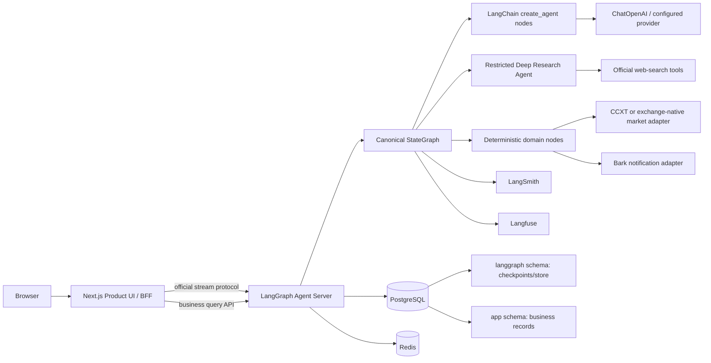

# Crypto Manual Alert V2 产品与架构设计

> 状态：Draft for Review
>
> 日期：2026-07-11
>
> 范围：只定义最终产品和技术设计，不包含实现代码

## 1. 执行摘要

V2 要解决的不是 V1 某个局部 Bug，而是控制面重复、主流程不清晰、真实模型与数据结果没有成为产品内容、前端依赖大量兼容投影、生产证明长期无法闭环的问题。

V2 采用以下总方案：

1. 使用 LangGraph 构建唯一的 canonical graph，承担状态、分支、并发、重试、Checkpoint、Interrupt 和流式事件。
2. 使用 LangChain `create_agent`、官方 Tool、Structured Output 和 Middleware 实现标准 Agent Harness。
3. 使用 Deep Agents 承担只读、受预算限制的 Web Research；不赋予风险裁决、数据库写入、通知或文件系统权限。
4. 使用 LangGraph Agent Server 作为 Agent Runtime 和流式协议服务，Next.js 通过官方 React SDK 连接。
5. 使用 PostgreSQL 分离 LangGraph Checkpoint Schema 与产品业务 Schema；产品前端永远不直接读取 Checkpoint 表。
6. 同时接入 LangSmith 和 Langfuse：LangSmith 负责 LangChain/LangGraph 原生追踪、Dataset 和回归评测，Langfuse负责生产成本、时延、会话、用户维度分析及可选自托管。
7. 最终数据模型从第一天支持多用户，但第一阶段采用固定开发账号，避免鉴权阻断 Agent 主流程。
8. 保留 V1 中经过验证的交易事实、风险门禁和人工提醒规则，删除 V1 自研编排、模型客户端、Tool Executor、Shadow Runtime 和兼容切换机制。

## 2. 问题定义

### 2.1 V1 已确认的问题

V1 没有 LangChain、LangGraph 或 SQLAlchemy 依赖，却同时存在以下自定义控制面：

- `workflow/`
- `orchestration/`
- `agent_swarm/`
- `research_pipeline/`
- `skills/`
- `telemetry/`
- 多套直接 `httpx` 模型客户端
- 多套 SQLite Journal、Eval 和 Outcome Store
- 前后端大量 fallback、兼容 schema 和业务投影

这些模块分别实现了官方框架已经提供的状态机、Tool 协议、并发、重试、模型接入、Structured Output、追踪和恢复能力，导致：

- 同一请求存在多套运行状态和 ID。
- 异常可能先被自定义 Runner 吞掉，框架级重试无法生效。
- 真实模型输出、Web Search 和交易事实没有天然进入统一状态与业务记录。
- 前端只能通过复杂 fallback 猜测后端返回的对象形状。
- 主流程、候选 sidecar、shadow audit 和 eval 路径难以判断谁拥有最终权威。
- 测试很多，但 hosted production、真实通知和成熟 outcome 仍未闭环。

### 2.2 V2 要达到的结果

一次人工分析请求必须形成一条可观察、可恢复、可查询、可解释的完整链路：

```text
用户请求
  -> 身份和参数校验
  -> 真实交易数据快照
  -> Web Research 与来源证据
  -> 结构化模型分析
  -> 确定性证据门禁
  -> 确定性风险门禁
  -> 产品决策结果
  -> 业务持久化
  -> 可选通知
  -> 前端实时展示和历史回看
```

任何节点失败都必须留下明确状态、可读错误和可恢复 Checkpoint，不能退回另一套 legacy workflow，也不能用空对象、占位 JSON 或 generic success 掩盖失败。

## 3. 产品范围

### 3.1 第一条必须跑通的主流程

用户在 `/analyze` 选择或输入：

- 交易标的，首批支持 `BTC-USDT-SWAP`、`ETH-USDT-SWAP`、`SOL-USDT-SWAP`。
- 分析周期，例如 `1h`、`4h`、`12h`、`24h`。
- 可选关注问题 `query_text`。
- 是否在允许时发送通知。

系统返回并持久化：

- 本次运行状态与阶段进度。
- 交易所原生行情、指数价、标记价、资金费率、持仓量、盘口和数据新鲜度。
- Web Search 查询、来源 URL、发布时间、抓取时间、摘要、可信度和与标的的关联。
- Agent 的结构化分析，不只保存一段最终文本。
- 最终方向、动作、置信度、入场区间、止损、止盈、失效条件和观察窗口。
- 确定性风险规则命中、阻断原因和降级原因。
- 模型、Provider、Prompt Version、Tool 使用、Token、时延和成本。
- 通知内容、发送结果和错误。
- 用户反馈和后续真实 outcome。

### 3.2 最终产品页面

- `/`：用户工作台，展示最近运行、待处理、失败、通知和数据源健康度。
- `/analyze`：新建分析，实时展示 Graph 阶段、Agent 输出和错误恢复。
- `/runs`：当前用户的运行历史、筛选和状态。
- `/runs/[runId]`：业务结果、证据、模型分析、风险门禁、通知和诊断入口。
- `/settings`：用户级模型、数据源、通知、隐私与观测设置。
- `/admin`：后续启用，管理用户、配额、系统健康和审计。
- `/login`：后续启用，第一阶段不阻断主流程。

### 3.3 明确非目标

- 不自动下单、撤单、平仓、转账或提现。
- 不接收交易所私钥、交易 Key 或提现 Key。
- 不允许模型绕过确定性风险门禁。
- 不把 LangSmith、Langfuse 或 LangGraph Studio 当作普通用户产品页面。
- 不为了“最终版”同时实现计费、邀请、团队协作和企业 SSO；这些能力保留数据与接口钩子，主链通过后再启用。

## 4. 官方框架事实与版本基线

以下版本是 2026-07-11 从 PyPI/NPM 官方注册表读取的快照，实施时必须重新核验并锁定：

| 包 | 当前版本 | 设计结论 |
| --- | ---: | --- |
| `langchain` | `1.3.13` | 使用 1.x stable API |
| `langgraph` | `1.2.9` | 使用 1.x LTS runtime |
| `deepagents` | `0.6.12` | pre-1.0，只放受限研究域 |
| `langchain-openai` | `1.3.5` | OpenAI / OpenAI-compatible 模型接入 |
| `langgraph-checkpoint-postgres` | `3.1.0` | 自管 Runtime 时的生产 Checkpointer |
| `langsmith` | `0.10.2` | Trace、Dataset、Evaluation |
| `langfuse` | `4.14.0` | 生产 LLM Observability |
| `@langchain/react` | `1.0.26` | 前端 `useStream` 主接口 |
| `@langchain/langgraph-sdk` | `1.9.25` | Thread、Run、Store 和流式协议 SDK |
| `@langchain/core` | `1.2.2` | 前端消息和类型基础 |

官方当前对三层的定义：

- LangChain 是 Agent Framework，提供模型、消息、Tool、Agent Loop、Structured Output 和 Middleware。
- LangGraph 是 Agent Runtime，提供 Durable Execution、Streaming、HITL、Persistence 和低层编排。
- Deep Agents 是 Agent Harness，在 LangChain/LangGraph 上增加 Planning、Subagent、Filesystem 和上下文管理。

LangChain 与 LangGraph 1.0 是 LTS。Deep Agents 官方仍标记为 pre-1.0，因此不能成为本项目唯一且不可替换的最终控制面。

## 5. 架构方案比较

### 5.1 方案 A：LangGraph Agent Server + Next.js BFF，推荐

组成：

- Python LangGraph 应用包。
- LangGraph Agent Server 负责 Thread、Run、Checkpoint、Store、Streaming 和 Interrupt API。
- Agent Server 官方 custom routes 提供产品业务查询和配置 API。
- Next.js Server Routes/BFF 代理浏览器请求，注入服务端凭据和用户身份。
- PostgreSQL 保存 Checkpoint 与产品数据，使用不同 schema。
- Redis 用于 Agent Server 流式与任务协调。

优点：

- 最大程度使用官方 Runtime、SDK 和协议。
- 不需要自己实现 SSE、Run 恢复、Thread History、Interrupt Resume。
- 可直接使用 `langgraph dev`、Studio、官方 React SDK 和 LangSmith Deployment。
- 代码最少，排障路径与官方文档一致。

风险：

- 生产部署依赖 LangSmith Deployment 或 Agent Server 对应许可与运行方式。
- custom routes 必须严格限制，不能再次演化成第二套 FastAPI 应用。

裁决：采用。

### 5.2 方案 B：独立 FastAPI + 独立 Agent Server

优点：业务 API 与 Agent Runtime 边界最清楚。

缺点：需要两套服务鉴权、Trace 传播、部署和错误处理；对当前产品规模属于不必要复杂度。

裁决：不作为第一实现。只有在业务 API 明显超出 Agent Server custom routes 的职责后，通过 ADR 决定拆分。

### 5.3 方案 C：把 CompiledGraph 嵌入自建 FastAPI

优点：纯 OSS 控制和部署自由度高。

缺点：需要自己实现或适配 Streaming Protocol、Thread/Run API、断线恢复、Interrupt 和前端 Adapter，最容易再次出现 V1 式自研控制面。

裁决：禁止作为默认实现。只有 Agent Server 的部署或许可不能满足项目约束时，才能通过 ADR 启用，并且前端仍必须使用官方 `AgentServerAdapter` 接口。

## 6. 总体架构



## 7. Canonical Graph 设计

### 7.1 Graph 原则

- 全系统只允许一个生产主图。
- 顶层拓扑必须显式，不能隐藏在自定义 Runner 的 `run()` 中。
- Agent 负责分析和生成候选结果，确定性节点负责事实校验、风险和副作用授权。
- 节点正常失败要抛出可分类异常，让 LangGraph RetryPolicy 生效。
- 不能吞异常后返回 `status="failed"` 的伪成功对象。
- Checkpoint 用于执行恢复；产品业务表用于查询和审计，两者不能混用。

### 7.2 Graph State

状态使用 `TypedDict` 或 Pydantic-compatible 类型，只保存节点间真正需要的数据：

```text
AnalysisState
  identity             ActorContext
  request              AnalysisRequest
  run_context          RunContextIds
  market_snapshot      MarketSnapshot | null
  research_bundle      ResearchBundle | null
  specialist_findings  list[SpecialistFinding]
  decision_draft       DecisionDraft | null
  evidence_verdict     EvidenceVerdict | null
  risk_verdict         RiskVerdict | null
  final_result         FinalAnalysisResult | null
  notification_result  NotificationResult | null
  progress_events      append-only StageEvent reducer
  warnings             append-only warning reducer
  errors               append-only ClassifiedError reducer
```

禁止放入 State：

- 完整网页正文。
- Provider 原始 HTTP Response。
- 大型盘口序列。
- UI 组件专用文案。
- LangSmith/Langfuse 完整 Trace 对象。
- V1 compatibility artifact。

大对象进入对象存储或业务证据表，State 只保存稳定 ID、摘要和校验后的结构。

### 7.3 节点和所有权

| 顺序 | 节点 | 类型 | 责任 |
| --- | --- | --- | --- |
| 1 | `bootstrap_run` | 确定性 | 注入开发/生产身份、生成 ID、建立业务运行记录 |
| 2 | `validate_request` | 确定性 | symbol、horizon、query、通知参数校验 |
| 3 | `collect_market_snapshot` | Tool/确定性 | 获取交易所原生实时数据并计算 freshness |
| 4 | `research_events` | Deep Agent 子图 | Web Search、来源阅读、事件时间线和证据摘要 |
| 5 | `analyze_market` | `create_agent` | 基于已验证行情和研究证据输出结构化分析 |
| 6 | `validate_evidence` | 确定性 | 来源、时间、标的、一致性和完整度门禁 |
| 7 | `apply_risk_policy` | 确定性 | 风险硬阻断、confidence cap、杠杆/价格/TTL 校验 |
| 8 | `build_final_result` | 确定性 | 将候选结果和门禁裁决合并成产品结果 |
| 9 | `persist_result` | 确定性副作用 | 事务写入业务记录、模型输出、证据和决策 |
| 10 | `notify_if_allowed` | 确定性副作用 | 仅在授权且配置完整时发送 Bark |
| 11 | `complete_run` | 确定性 | 固化状态、观测引用和结束时间 |

### 7.4 并行和子 Agent

第一版不为了“多 Agent”数量而增加角色。`research_events` 内最多配置：

- `news_researcher`：新闻、公告和事件时间线。
- `macro_researcher`：宏观日历、政策和跨市场背景。
- `source_critic`：来源冲突、时效和证据不足检查。

Deep Agents 可以并行调度这些 subagents，但返回统一 `ResearchBundle`。交易所行情、风险门禁和最终持久化不作为 subagent。

如果后续需要技术面、衍生品和流动性并行分析，应优先使用 LangGraph `Send` 或显式并行节点，而不是新增线程池、PoolRunner 或另一套 Agent Swarm。

### 7.5 Deep Agents 权限

研究 Agent 默认只允许：

- 官方 Web Search Tool。
- 受控 URL Fetch/Reader Tool。
- 读取本次运行的只读证据上下文。

默认禁止：

- 本地文件系统 `write_file`、`edit_file`、`delete`。
- Shell、REPL 和任意代码执行。
- 数据库写入。
- 通知发送。
- 交易所私有 API。
- 最终 `allowed`、action、leverage 和 notification policy 裁决。

强制配置 LangChain 官方 Middleware：

- `ModelCallLimitMiddleware`
- `ToolCallLimitMiddleware`
- `ModelRetryMiddleware`
- `ToolRetryMiddleware`
- `PIIMiddleware`
- `SummarizationMiddleware`，仅长研究需要
- `HumanInTheLoopMiddleware`，仅未来高风险外部动作需要

### 7.6 模型和 Web Search

统一使用 LangChain Model API，不得直接 `httpx.post()` 调模型接口。

OpenAI-compatible Provider 使用 `ChatOpenAI` 的 `base_url`、`api_key`、`model` 和 timeout/retry 配置。启动时执行 capability probe，确认：

- Tool calling。
- Structured output。
- Streaming。
- Responses API / built-in `web_search`，如果声明启用。

Web Search 顺序：

1. Provider 真正支持 OpenAI Responses built-in `{"type": "web_search"}` 时，直接通过 `ChatOpenAI.bind_tools` 使用。
2. Provider 不支持时，显式配置 LangChain 官方集成工具，例如 Tavily；不能静默伪装成 built-in web search。
3. Provider 均不可用时，`research_events` 失败或降级为明确的 `research_unavailable`，不能生成伪搜索结果。

交易价格、标记价、指数价、资金费率、持仓量和盘口必须来自交易所原生接口或 CCXT 等成熟交易库，Web Search 只能补充事件与研究上下文，不能替代执行事实。

## 8. 确定性业务门禁

以下 V1 业务语义迁移到 V2，但实现必须重写为纯领域函数或确定性 Graph Node：

- `manual_execution_required=true`。
- `auto_order_enabled=false`。
- 禁止配置交易和提现 Key。
- symbol 一致性。
- 行情来源必须满足 `exchange_native`。
- mark/index/order book freshness。
- 事件证据 TTL。
- action、entry、stop-loss、take-profit、leverage 和 risk ratio schema。
- 多个 confidence cap 取最低值。
- 数据缺失、来源冲突和过期时 fail-closed。
- Worker/Research Agent 不能直接授权最终动作。
- 通知失败不反向改变 RiskVerdict。
- 历史结论和旧新闻不能作为当前 live evidence。

风险规则必须是可单元测试、无网络、无数据库、无模型依赖的纯函数。模型可以解释规则，但不能修改规则结果。

## 9. 多用户与默认开发身份

### 9.1 第一阶段开发模式

使用官方 Auth Hook 的开发实现或 BFF 注入固定身份：

```text
AUTH_MODE=development
DEV_TENANT_ID=00000000-0000-0000-0000-000000000001
DEV_USER_ID=00000000-0000-0000-0000-000000000001
DEV_USER_EMAIL=dev@local.invalid
DEV_USER_ROLES=owner,operator
```

浏览器不需要登录即可运行主链，但后端每次运行仍必须得到完整 `ActorContext`。任何缺失 `tenant_id` 或 `user_id` 的业务写入都必须失败。

### 9.2 正式鉴权钩子

正式模式实现同一接口：

```text
IdentityProvider.authenticate(request) -> ActorContext
IdentityProvider.authorize(actor, action, resource) -> decision
```

推荐后续使用 LangGraph Agent Server 的 `Auth` authenticate/authorization handlers：

- authenticate 返回 `identity`。
- authorization handler 给 Thread、Run 和 Store Resource 添加 `owner` / `tenant_id` metadata。
- 查询和更新自动增加 owner filter。
- Next.js BFF 只转发用户 Session，不把 LangSmith API Key 暴露到浏览器。

生产 Auth Provider 可以是 Auth.js、Clerk、Keycloak 或企业 OIDC，但不能改变 Graph State、业务表和 API 中的身份字段。

### 9.3 多租户不变量

- 所有产品业务表含 `tenant_id`。
- 所有用户资源含 `user_id` 或 owner。
- 所有 Graph Thread/Run Metadata 含 `tenant_id`、`user_id`、`environment`。
- LangSmith/Langfuse Metadata 只保存内部不可逆 ID，不默认保存邮箱和 API Key。
- 数据库 Repository 所有读取必须显式接收 ActorContext。
- 管理员跨租户操作必须有独立 action 和审计记录。

## 10. 持久化设计

### 10.1 三类存储

1. LangGraph Checkpointer
   - 保存 Thread State、Checkpoint、Interrupt 和 Durable Execution 信息。
   - 使用 Agent Server 托管持久化或官方 PostgreSQL Checkpointer。
   - 不作为产品查询数据库。
2. LangGraph Store
   - 保存跨 Thread 的用户偏好、允许的长期记忆和 Agent 记忆。
   - Namespace 必须包含 tenant/user。
3. Product Journal
   - 保存用户可查询的业务运行、证据、模型输出、风险、通知和 outcome。
   - 使用 SQLAlchemy 2.x + Alembic。

### 10.2 PostgreSQL Schema

- `langgraph.*`：由官方 Runtime 管理。
- `app.*`：由 Alembic 管理。
- `observability.*`：可选，仅保存 Trace ID 映射和导出状态，不复制完整 Trace。

### 10.3 产品表

| 表 | 作用 |
| --- | --- |
| `tenants` | 租户钩子，开发期只有一个默认租户 |
| `users` | 用户钩子，开发期只有一个默认用户 |
| `analysis_runs` | 请求、状态、Thread/Run ID、阶段和时间 |
| `market_snapshots` | 本次运行使用的交易事实和 freshness |
| `evidence_items` | Web/公告/事件来源和摘要 |
| `agent_outputs` | Agent 名称、结构化输出、可读摘要、模型与 Prompt Version |
| `decision_results` | 最终产品决策和 RiskVerdict |
| `rule_hits` | 确定性规则命中记录 |
| `notification_attempts` | Bark 请求、结果和错误 |
| `run_feedback` | 用户反馈、修正和标注 |
| `outcomes` | 成熟窗口后的真实结果与评测字段 |
| `audit_events` | 权限、配置和管理员动作审计 |

### 10.4 模型输出保存要求

每次模型调用至少保存：

- `run_id`、`node_name`、`agent_name`。
- provider、model、Prompt Version。
- 结构化输出 JSON。
- 面向用户的安全文本摘要。
- 输入证据引用 ID。
- token、cost、latency。
- status、error type。
- LangSmith Run ID。
- Langfuse Trace/Observation ID。

原始 Prompt/Response 的保存由隐私策略控制。默认产品 API 不返回原始 payload。

## 11. API 与前端交互

### 11.1 官方协议优先

前端使用：

- `@langchain/react` v1 `useStream`。
- `@langchain/langgraph-sdk` Thread/Run API。
- 官方 SSE/WebSocket Transport。
- `interrupts` + `respond()` 完成 approve/edit/reject。
- Thread History、Checkpoint Fork、Submission Queue 只在产品需要时启用官方接口。

禁止自行实现：

- EventSource 重连状态机。
- 另一套 run polling loop。
- 自定义 message/tool-call 拼装协议。
- 在 React Context 中复制一份 Graph 状态机。

### 11.2 Next.js BFF

生产浏览器不能直接持有 LangSmith API Key。Next.js BFF 负责：

- 读取用户 Session 或开发身份。
- 转发 LangGraph 官方协议。
- 注入 Authorization 和 correlation headers。
- CSRF、速率限制和同源策略。
- 将 Agent Server 错误映射为稳定产品错误码。

BFF 不负责重写 Graph 业务状态，不创建第二份 Run Store。

### 11.3 UI 状态

统一状态枚举：

```text
queued
running
waiting_human
succeeded
blocked
failed
cancelled
```

页面必须实时显示：

- 当前阶段。
- 已完成阶段。
- 正在等待的外部数据或用户动作。
- 可取消/可重试状态。
- 部分成功与完整成功的区别。
- 失败节点、可读原因和恢复动作。

### 11.4 产品投影

Graph State 和 Provider Payload 不直接作为页面 DTO。后端提供稳定产品视图：

- `RunListItemView`
- `RunProgressView`
- `AnalysisSummaryView`
- `EvidenceView`
- `ModelAnalysisView`
- `RiskDecisionView`
- `NotificationView`

诊断信息必须在角色受控的 `/runs/[id]?mode=diagnostic` 中展示，并默认折叠、脱敏。普通页面禁止显示 Python repr、对象字典或原始 JSON。

## 12. Human-in-the-loop

第一阶段人工触发分析本身已经是一个人机边界，因此鉴权和 HITL 不能阻断主链。以下场景才使用 LangGraph `interrupt()` 或 `HumanInTheLoopMiddleware`：

- 用户要求修改模型生成的关注问题后继续。
- 后续发送高敏感外部通知前需要人工确认。
- 管理员执行跨租户修复或数据重放。
- 将来增加任何具有资金或外部写副作用的 Tool。

Interrupt Payload 必须是稳定 JSON Schema，前端通过官方 `respond()` 提交 `approve`、`edit` 或 `reject`。不能用自定义数据库 `pending_action` 表模拟 Graph 中断。

## 13. LangSmith 与 Langfuse

### 13.1 职责划分

LangSmith：

- LangChain/LangGraph 自动 Trace。
- Graph/Node/Tool/Model 调试。
- Dataset、Experiment 和离线回归。
- Online Evaluator 和 release gate。
- Thread 级成本与行为分析。
- Studio 调试和 Graph 可视化。

Langfuse：

- 生产 Trace、Session、User、Cost 和 Latency Dashboard。
- 运维监控、采样、Masking、Retention。
- Prompt 使用情况和版本运营分析。
- 用户反馈、人工标注和可选自托管。
- 跨服务 OpenTelemetry 关联。

### 13.2 最小接入方式

- LangSmith 使用官方环境变量自动追踪 LangChain/LangGraph。
- Langfuse 使用官方 `CallbackHandler` 作为 invocation callback。
- 非 LangChain 业务步骤只在确有价值时建立少量 root/domain span。
- 禁止每个 Graph Node 手工同时创建 LangSmith Run 和 Langfuse Observation。

### 13.3 ID 契约

```text
tenant_id      产品租户
user_id        产品用户
thread_id      LangGraph 会话/分析 Thread
run_id         单次 Graph Run
business_id    analysis_runs 主键
request_id     HTTP/BFF 关联 ID
langsmith_id   LangSmith root run
langfuse_id    Langfuse trace
```

所有子 Run 必须传播 `thread_id` metadata，否则 LangSmith 无法正确聚合 Thread token 和 cost。Langfuse 使用同一 `thread_id` 作为 `session_id`，使用内部 `user_id` 作为 user ID。

### 13.4 隐私、采样与降级

- API Key、Authorization、Bark Key、Cookie、交易凭据禁止进入 Trace。
- 使用 LangChain `PIIMiddleware`、LangSmith conditional tracing 和 Langfuse mask function。
- 生产正常成功请求可以采样，失败、blocked、用户负反馈和 release candidate 全量保留。
- 两个观测平台不可用时主流程继续运行，后台异步上报失败只记告警。
- 对零保留租户关闭输入输出记录，只保留时延、状态和匿名 Metadata。

## 14. 错误和恢复策略

### 14.1 分类

- `ValidationError`：请求错误，不重试。
- `AuthenticationError`：生产鉴权错误，开发身份模式不出现。
- `ProviderCapabilityError`：Provider 不支持声明能力，不重试，启动或请求前失败。
- `MarketDataTemporaryError`：限次退避重试。
- `MarketDataInvalidError`：数据不完整/过期，fail-closed。
- `SearchTemporaryError`：限次重试，最终明确 research unavailable。
- `ModelTemporaryError`：官方 ModelRetryMiddleware。
- `StructuredOutputError`：官方 Structured Output 修复/重试，超过预算失败。
- `EvidenceGateBlocked`：业务 blocked，不是系统 failed。
- `RiskGateBlocked`：业务 blocked，不是系统 failed。
- `PersistenceError`：事务回滚，可从 Checkpoint 恢复。
- `NotificationError`：记录失败，不改变已有决策。

### 14.2 恢复

- 所有外部副作用节点必须幂等。
- `persist_result` 使用 `run_id` 唯一键和数据库事务。
- `notify_if_allowed` 使用 idempotency key，恢复时不能重复通知。
- Interrupt Resume 继续同一 Thread/Run 语义，不创建隐藏的新业务运行。
- 用户主动 Retry 默认创建新 Run，并记录 `retry_of_run_id`。

## 15. 代码结构目标

V2 实现批准后建议形成以下最小结构，不复制 V1 包：

```text
backend/
  pyproject.toml
  langgraph.json
  src/crypto_alert_v2/
    graph.py                 # 唯一顶层 StateGraph
    state.py                 # Graph State 和 reducers
    context.py               # ActorContext / Runtime Context
    agents.py                # create_agent/create_deep_agent factories
    middleware.py            # 官方 middleware 组装
    tools/
      market.py              # 交易所事实 tools
      research.py            # 官方 web search/fetch tools
      notification.py        # Bark tool，仅确定性节点调用
    domain/
      models.py              # 业务 Pydantic models
      evidence_policy.py     # 纯函数
      risk_policy.py         # 纯函数
    persistence/
      models.py              # SQLAlchemy business tables
      repository.py          # Actor-aware repository
    api/
      routes.py              # Agent Server custom business routes
      auth.py                # dev/prod auth hook
    observability.py         # LangSmith/Langfuse 一次性装配
frontend/
  src/
    app/
    features/analysis/
    features/runs/
    features/settings/
    lib/langgraph/
    lib/api/
  tests/e2e/
docs/v2/
```

单文件超过约 400 行必须说明原因；不能为了行数机械拆分 pass-through 文件。

## 16. 测试与评测

### 16.1 测试金字塔

- 领域单元测试：风险、证据、新鲜度、数据一致性、通知授权。
- Graph Contract Test：节点、边、状态 reducer、blocked/failed/retry/interrupt。
- Agent Contract Test：FakeChatModel/recorded provider，验证 Tool 和 Structured Output。
- Repository Integration：PostgreSQL、租户隔离、事务和幂等。
- Agent Server Integration：真实 Thread、Run、Stream、Resume、History API。
- Frontend Component：Zod/View Model、状态切换和可访问性。
- Playwright E2E：真实 Next.js + Agent Server + PostgreSQL/Redis，外部 Provider 可控。
- Gated Real-provider Test：真实行情、真实 Web Search、真实模型、真实 Bark。
- LangSmith Dataset Regression：已知场景、badcase、对抗样本。
- Outcome Evaluation：成熟窗口后的 hit、Brier、PnL、MFE、MAE 与 no-trade baseline。

### 16.2 Playwright 必测状态

- 首屏和移动端布局。
- 长时间运行和逐阶段流式更新。
- Tool call 进行中、成功、失败。
- Structured Output 到业务组件的真实渲染。
- Interrupt approve/edit/reject。
- 浏览器刷新和断线重连。
- 同一用户跨页面状态同步。
- 两个开发用户 fixture 的数据隔离。
- blocked 与 failed 不混淆。
- 普通页面无 raw JSON、密钥和内部异常。
- 长文本、空证据、来源冲突和通知失败。

## 17. V1 迁移与删除边界

### 17.1 迁移业务语义，不迁移实现

迁移：

- DecisionPlan/RiskVerdict 业务字段。
- 交易事实来源等级和 freshness。
- 风险规则与 confidence cap。
- manual-only 和 notification decoupling。
- business summary/result review 的用户价值字段。
- outcome 和 no-trade baseline 评测语义。

### 17.2 明确废弃

- `workflow/legacy_*`
- `LegacyPlanRunnerAdapter`
- `agent_swarm/*`
- `orchestration/*`
- V1 `research_pipeline` executor/planner/runtime
- V1 `SkillExecutor`、ToolBudget 和 registry/facade
- 多套直接 `httpx` 模型客户端
- candidate sidecar / controlled shadow / legacy fallback
- V1 自建 checkpoint、线程池和重试控制面
- 前端对 V1 raw payload 的大量 fallback schema

### 17.3 数据兼容

- V1 SQLite 保持只读归档。
- 如需历史展示，执行一次性 ETL 到 V2 legacy import tables 或离线归档，不永久双写。
- V1 Trace 不转换成可 Resume 的 LangGraph Checkpoint。
- V1 URL 可以通过只读 legacy 页面或 redirect 保留，但不进入 V2 主运行时。

## 18. 分阶段交付但不降低最终目标

阶段是工程顺序，不是缩小产品范围：

1. Framework Skeleton：官方 Graph/Agent/SDK、开发身份和最小页面。
2. Main Flow：真实行情、Web Research、Structured Output、风险门禁、持久化。
3. Product UI：流式、历史、详情、可读投影、移动端和错误恢复。
4. Observability & Eval：LangSmith、Langfuse、Dataset、反馈和 release gate。
5. Production Auth：正式 Provider、租户隔离和角色诊断入口。
6. Production Proof：公网 HTTPS、真实通知、真实 visual gate、成熟 outcome。

任何阶段不能宣称“V2 完成”。只有 `03-v2-delivery-checklist.md` 全部满足后，才能称为最终可交付版本。

## 19. 关键验收标准

- 一次真实人工请求可以从浏览器跑到真实模型、真实交易数据、真实 Web Search、数据库和通知。
- 前端实时展示模型分析、证据和风险结果，不出现 JSON-first 页面。
- 模型输出、Tool 调用摘要、证据、风险命中和通知完整入库。
- 重启 Agent Server 后可以恢复 waiting/running Thread。
- 开发身份不阻断主链，正式身份启用后不改变业务契约。
- 同一租户不同用户互不可见，跨租户查询被后端拒绝。
- 观测平台故障不阻断业务请求。
- 无自动交易能力和交易/提现密钥。
- 代码中不存在第二套 Agent Runtime、Tool Protocol、Streaming State Machine 或 Checkpoint Store。
- 每轮实现都有中文说明、适当中文注释和可复现验证证据。

## 20. 官方来源

### LangChain / LangGraph / Deep Agents

- [Frameworks, runtimes, and harnesses](https://docs.langchain.com/oss/python/concepts/products)
- [LangChain Agents](https://docs.langchain.com/oss/python/langchain/agents)
- [LangChain Middleware](https://docs.langchain.com/oss/python/langchain/middleware)
- [Prebuilt Middleware](https://docs.langchain.com/oss/python/langchain/middleware/built-in)
- [Structured Output](https://docs.langchain.com/oss/python/langchain/structured-output)
- [OpenAI integration and Responses web search](https://docs.langchain.com/oss/python/integrations/chat/openai)
- [LangGraph Overview](https://docs.langchain.com/oss/python/langgraph/overview)
- [LangGraph Persistence](https://docs.langchain.com/oss/python/langgraph/persistence)
- [LangGraph Interrupts](https://docs.langchain.com/oss/python/langgraph/interrupts)
- [LangGraph Streaming](https://docs.langchain.com/oss/python/langgraph/streaming)
- [Deep Agents Overview](https://docs.langchain.com/oss/python/deepagents/overview)
- [Deep Agents Customization](https://docs.langchain.com/oss/python/deepagents/customization)
- [Deep Agents Permissions](https://docs.langchain.com/oss/python/deepagents/permissions)
- [Versioning and API stability](https://docs.langchain.com/oss/python/versioning)

### Agent Server / Frontend / Auth

- [Agent Server](https://docs.langchain.com/langsmith/agent-server)
- [Human-in-the-loop using server API](https://docs.langchain.com/langsmith/add-human-in-the-loop)
- [Resource-level authorization](https://docs.langchain.com/langsmith/resource-auth)
- [LangGraph JS SDK](https://github.com/langchain-ai/langgraphjs/tree/main/libs/sdk)
- [Official React SDK](https://github.com/langchain-ai/langgraphjs/tree/main/libs/sdk-react)
- [Agent Chat UI reference application](https://github.com/langchain-ai/agent-chat-ui)

### LangSmith

- [Tracing quickstart](https://docs.langchain.com/langsmith/observability-quickstart)
- [Metadata and tags](https://docs.langchain.com/langsmith/add-metadata-tags)
- [Threads](https://docs.langchain.com/langsmith/threads)
- [Conditional tracing](https://docs.langchain.com/langsmith/conditional-tracing)
- [Data storage and privacy](https://docs.langchain.com/langsmith/data-storage-and-privacy)

### Langfuse

- [LangChain and LangGraph integration](https://langfuse.com/integrations/frameworks/langchain)
- [Deep Agents integration](https://langfuse.com/integrations/frameworks/langchain-deepagents)
- [OpenTelemetry integration](https://langfuse.com/integrations/native/opentelemetry)
- [Masking](https://langfuse.com/docs/observability/features/masking)
- [Sampling](https://langfuse.com/docs/observability/features/sampling)
- [Sessions](https://langfuse.com/docs/observability/features/sessions)
- [Distributed trace IDs](https://langfuse.com/docs/observability/features/trace-ids-and-distributed-tracing)

## 21. 需要用户批准的默认选择

本设计已经给出推荐默认值，用户可在开始实现前修改：

1. 生产 Agent Runtime 默认使用 LangSmith Deployment/Agent Server；保留通过 ADR 切换自管 Runtime 的权利。
2. Web Search 优先使用 Provider built-in Responses web search；不支持时显式使用 Tavily 官方集成。
3. 第一阶段使用固定开发账号；正式 Auth 在主链稳定后接入，但所有多租户字段和授权钩子第一天存在。
4. Deep Agents 只用于研究域，最终风险和副作用保持确定性 LangGraph Node。
5. V1 只读归档，不做长期双写兼容。
